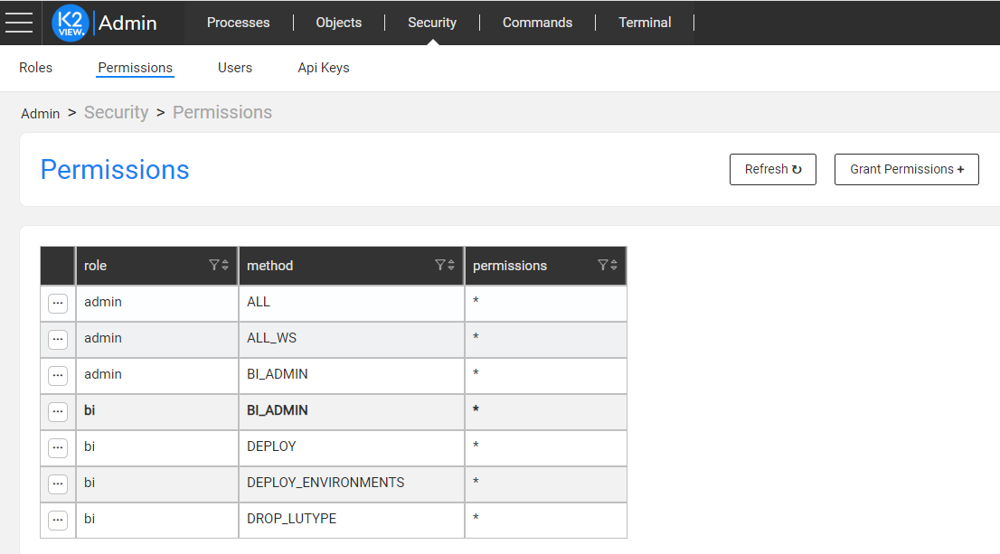
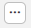

# Restrict Access to BI Admin

To prevent access to sensitive information in a Production environment, carry out these two actions: 

a) Remove the **WebReports.xml** file (keeping the encrypted file only).

b) Remove the **Admin.aspx** file or replace it with a static error page to disable the direct URL to **BI Admin** module.

c) Restrict the user access to the **BI Admin** module from the Web Framework.

[Click for more information about the ExagoBI security checklist.](https://exagobi.com/support/administrators/deployment/security-checklist/)

Restrict the access to the **BI Admin** module by doing one of the following:

- Run the [REVOKE command](/articles/17_fabric_credentials/02_fabric_credentials_commands.md#additional-commands)

  Or

- Via the Web Framework by opening **Admin** > **Security** > **Permissions**, and selecting a Role:

Then click the  icon and click **Revoke Resources**.

