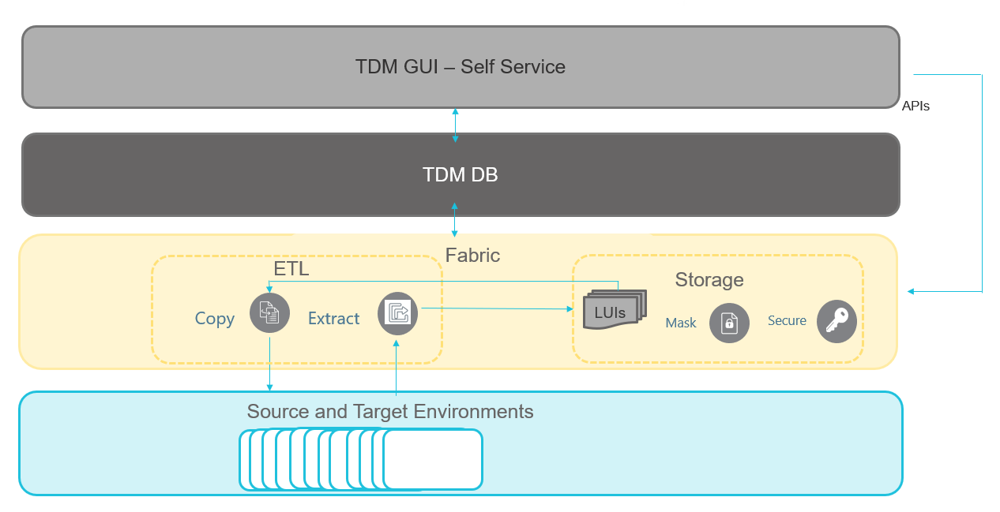
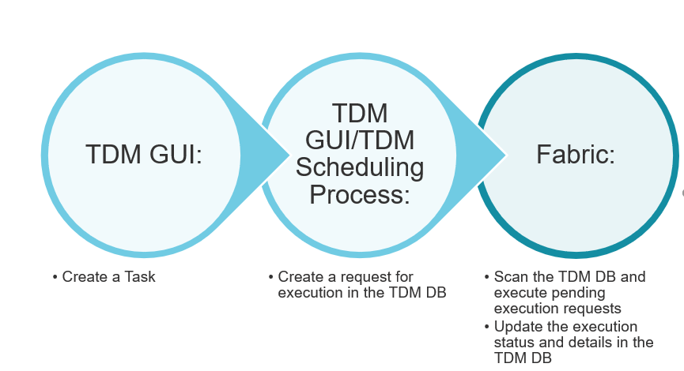

# TDM Architecture

## TDM Components

K2view TDM product consists of the following components:

- TDM GUI (Self-Service)
- TDM DB
- Fabric

### TDM GUI
- This web application serves as the self-service for the following activities:
  - TDM setup, define Business Entities, TDM environments,  Roles and Permissions. 
  - Create and execute TDM tasks to provision the selected subset of entities or Reference tables to the selected environment. 

### TDM GUI

- TDM DB - the TDM settings and TDM tasks are kept in the TDM PostgreSQL DB. Both TDM components - TDM GUI and Fabric - connects the TDM DB to get or update the TDM settings or the TDM tasks.

### Fabric

Fabric serves as a staging DB of the provisioned entities as well as the ETL layer to extract the data from the data sources and load it to the target environment.

#### Fabric as a Staging Repository

- When running a TDM task, the data of the selected entities is stored and synchronized according in Fabric to the LUs definitions. Fabric creates and maintains a separate [MicroDB](/articles/01_fabric_overview/02_fabric_glossary.md#mdb--microdb) on each entity (LUI). This provides several advantages:

  - Encapsulation of all data of a single business entity (like a customer) in one place so that consumers can ask any question about data usually residing in many different data sources.
  - Security: individual encryption at MicroDB or field levels.
  - Masking capabilities. Fabric enables masking the sensitive data when storing the entity.
  - Flexibly Sync policy based on business needs:
    - The entities can be extracted and stored in Fabric in advance. Then every request to copy these entities to various of target environments, can get the data from Fabric without accessing the source systems to avoid a business impact on the source systems.
    - Alternatively, Fabric can synchronize the data from the source systems to get the most up-to-date data of the entities when required.
  - Support Data Flux tasks: a user can keep different versions of a selected list of entities. For example- save a version of a customer's list every two hours to backup the data during the functional tests. Each version is kept as a separate LUI.

  #### Reference Tables

- Reference or Operational tables that need to be copied "as is" can be extracted from the source environment and saved into Cassandra under the k2view_tdm [keyspace](/articles/02_fabric_architecture/06_cassandra_keyspaces_for_fabric.md). These tables can be later copied into selected target environments.

  Click for more information about TDM Reference Handling.

#### Fabric ETL Capabilities

- Fabric ETL capabilities are used to extract the data from the data sources and load the data to the selected target environments. 
- [Broadway](/articles/19_Broadway/01_broadway_overview.md) is the Fabric module that is used to design data movement, its transformation and the orchestration of business flows. Featuring a powerful user interface for creating and debugging business and data flows, Broadway also provides a high-performance execution engine that can be activated by Fabric. Broadway supports a wide range of data sources as well as data transformation logics such as replacing sequences to avoid a collision with the target environment, or masking of a sensitive data before loading it to the target environment.
- This way the TDM can manipulate the provisioned data if needed.

## TDM  - Data Provisioning Flow

- In general, the data provisioning can be divided to two main parts:

  - Data provisioning request - the request is created by a [TDM task](/articles/101_test_data_management/02_tdm_glossary.md#task). The TDM task is created by the user via the TDM GUI and is saved in the TDM DB. The TDM task specifies that **what and when** for the data request: 
    - What: which Business Entity to be provisioned (Customer, Employee, Order, Product ...),  what are the source and target environments, what is the subset of entities, Sync mode, etc.
    - When: when the task needs to be executed, execute by request, or set scheduling parameters to execute the task periodically.     
  - Task execution. A task can be executed manually by the user via the TDM GUI, or can be executed periodically by the **TDM Scheduler** process based on a predefined scheduling parameters. 

- The diagram below displays the process of the TDM task creation and execution:

  

  

- Fabric runs a [batch process](/articles/20_jobs_and_batch_services/11_batch_process_overview.md) to execute pending execution requests: 

  - Extract tasks - the selected entities need to be extracted from the source environment and migrated into Fabric. The batch process initiates a [Sync](/articles/14_sync_LU_instance/01_sync_LUI_overview.md) of the selected entities into Fabric. 
  - Load task - the batch process initiates a [Broadway flow](/articles/19_Broadway/02a_broadway_flow_overview.md) which [gets the entities](/articles/02_fabric_architecture/04_fabric_commands.md#get-lui-commands) from Fabric, transforms the data if needed, and loads the entities to the selected target environment.

- A dedicated Fabric process checks for completed executions, and updated the TDM DB accordingly with the execution status and statistics. In addition Fabric gets the information and statistics of executed tasks into Fabric TDM LU.

  
  
