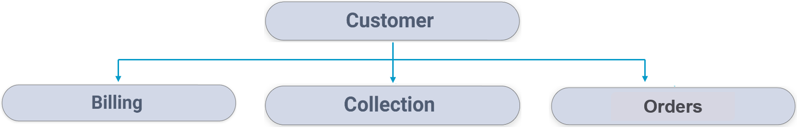

# TDM Demo Project - Setup and Implementation Guidelines

### Data Bases Setup

The TDM demo project is based on PostgreSQL databases:

1. Source CRM.
2. Target CRM.
3. Source Billing.
4. Target Billing.
5. Source Ordering.
6. Target Ordering.
7. Source Collection.
8. Target Collection.

The target DBs are empty and the source DBs are populated with customers.

#### Creating the Demo DBs in the Local PostgreSQL DB

1. Download the sql script and the backup files.

2. Create the DBs in PG: 

3. Do go the script's directory and open a **powershell** window:

   - Run the following command to the the script and create the DB users and schemas on the PostgreSQL DB:

     & "[PostgreSQL DB exe file full path]" -Upostgres --host [PG ip address] --port [DB port] -f "create_resources.sql"

     Example: 

	& "C:\Program Files\PostgreSQL\9.6\bin\psql.exe" -Upostgres --host localhost --port 5432 -f "create_resources.sql"

3. Download the DB's backup files.
4. Open **pgAdmin 4** and start restoring the databases from backup files.

### Fabric Implementation

1. Open the Fabric Studio and create a new project.
2. Download the TDM Demo project export file and  import it to your project.
3. Edit the interfaces if needed.
4. If the **k2masking** keyspace does not exist in the DB interface defined for caching the masked values, create it using the **masking-create-cache-table.flow** from the library of Broadway examples or using the installation SQL script provided as part of the Masking library. After creating the **k2masking** keyspace, run the **update_tdm_sequence_mapping.sql** script on Cassandra DB to recreate **TDM_SEQ_MAPPING** table with the correct structure.
5. Deploy the LUs, Web-Services, and the Environments to Fabric. Note, that you must deploy the environments before running data viewer, since the main Target LU table sets the TAR environment to be the active environment.

###  TDM GUI Definitions

1. Create a Customer Business Entity that includes the following LU’s structure:

 

2. Create the following products:  

   - CRM product. Attach Customer LU to this product.
   - BILLING product. Attach the Billing LU to this product.  Add two product versions to the BILLING product: PROD and DEV.
   - ORDERS product. Attach the Orders LU to this product.

3. Create the following environments:

   - SRC:

     - Set  **Environment Type** setting to **Source**.
     - Set  **Fabric Environment Name** setting to **SRC**.
     - Add the products to this environment.
  - Set the version of the BILLING product to PROD.
   
- TAR:
  
     - Set  **Environment Type** setting to **Both** to enable running Data Flux tasks on this environment.
     - Set  **Fabric Environment Name** setting to **TAR**.
     - Add the products to this environment.
     - Set the version of the BILLING product to DEV.

​     

See instructions on how to work with the TDM GUI in the following link:
https://github.com/k2view-academy/K2View-Academy/blob/Academy_6.4/articles/TDM/tdm_gui/README.md

Now you are ready to create and execute TDM tasks based on the TDM Demo implementation.