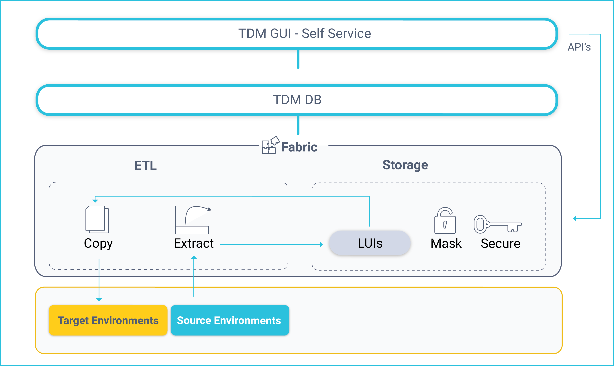
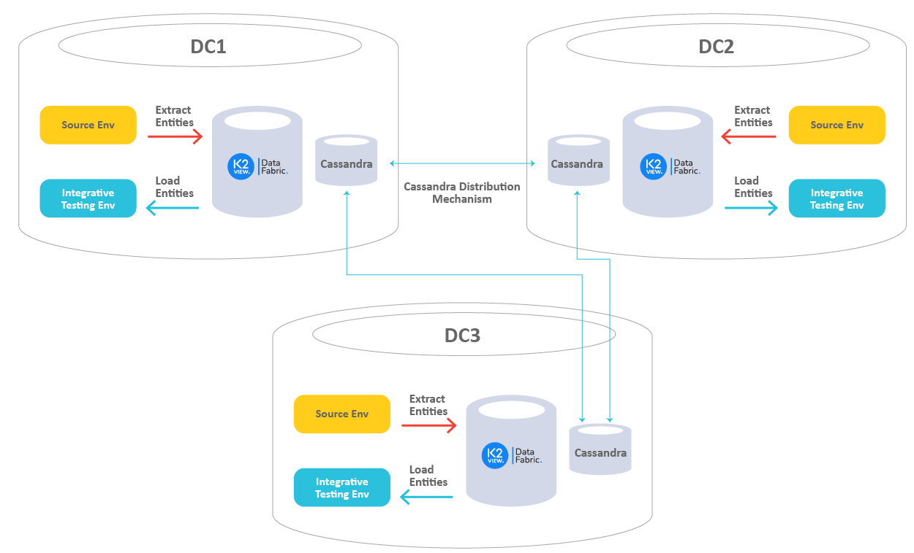
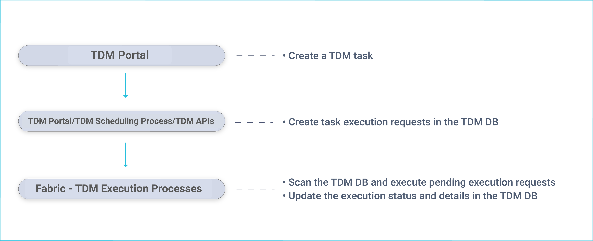

# TDM Architecture

## TDM Components

The K2View TDM has the following components:

- TDM GUI (self-service).
- TDM DB.
- Fabric.

### TDM GUI
The TDM web application is pre-integrated in [Fabric Web Framework](/articles/30_web_framework/02_preintegrated_apps_overview.md) and offers self-service implementation of the following activities:
- TDM definitions, setting TDM Business Entities, environments, roles and permissions. 
- Creation and execution of TDM tasks that provide a selected subset of entities or Reference tables to the selected environment. 

### TDM DB

TDM settings and tasks are kept in the TDM PostgreSQL DB. Both the TDM GUI and Fabric connect to the TDM DB to get or update TDM settings or tasks.

### Fabric

Fabric acts as a staging DB for the provisioned entities and ETL layer for extracting data from data sources and loading it to the target environment.

In addition, the TDM back-end APIs and processes are defined and executed in Fabric. The TDM back-end APIs and processes are included in the [TDM library](/articles/TDM/tdm_implementation/04_fabric_tdm_library.md).

#### Fabric as a Staging Repository

When running a TDM task, data from the selected entities is stored and synchronized in Fabric according to the definitions of its LUs. Fabric creates and maintains a separate [MicroDB](/articles/01_fabric_overview/02_fabric_glossary.md#mdb--microdb) for each entity ([LUI](/articles/01_fabric_overview/02_fabric_glossary.md#lui)). This has several advantages:

-  Convenience - Encapsulating the data of a business entity into one place so that it can be queried by consumers (many business entities have data residing in multiple data sources). 
-  Security - Individual encryption on MicroDB or field levels allows more robust security.
-  Masking capabilities -  masking sensitive data when storing entities.
-  Flexibility - Flexible [sync](/articles/14_sync_LU_instance/01_sync_LUI_overview.md) policies based on business needs, including:
   - Extracting and storing an entity's data in Fabric in advance so that requests to load it into target environments can be implemented without accessing source systems. 
   - Synchronizing data from source systems to get the most updated data on entities when required.
  - Version control - Support for [Data Flux](/articles/TDM/tdm_overview/02_tdm_glossary.md#data-flux) tasks, maintaining different versions of a selected list of entities. For example, saving a version of a customer's list every two hours to back up the data during functional tests. Each version is kept as a separate LUI.

  #### Reference Tables

Reference or Operational tables that need to be copied as-is can be extracted from the source environment and saved into Cassandra under the k2view_tdm [keyspace](/articles/02_fabric_architecture/06_cassandra_keyspaces_for_fabric.md). These tables can be later loaded into selected target environments.

[Click here for more information about TDM Reference Handling](05_tdm_reference_processes.md).

#### Fabric ETL Capabilities

- [Fabric ETL](/articles/02_fabric_architecture/01_fabric_architecture_overview.md#33-fabric-etl-layer) capabilities are used to extract data from data sources and load it into selected target environments. 
- [Broadway](/articles/19_Broadway/01_broadway_overview.md) is a Fabric module used to design data movement, its transformation and the orchestration of business flows. Featuring a powerful user interface for creating and debugging business and data flows, Broadway also provides a high-performance execution engine that can be activated by Fabric. Broadway supports a wide range of data sources as well as data transformation logic such as:
  -  Replacing sequences to avoid a collision with the target environment.
  -  Masking sensitive data before loading it to the target environment. 

### TDM - Multi DCs Architecture

The organization's systems and environments can be located in different locations.  This topography requires a data transmission between distant locations.

**Example:**

- The CRM and Billing Production systems are located in NY (DC1).
- The Ordering and Ticketing Production systems are located in TX (DC2).
- The testing environments are located in NY, TX, and CA (DC3). 
- The testing environments in CA need to get the CRM and Billing data from NY, and the Ordering and Ticketing data from TX.

One of the main challenges when  running a data transmission over the network is the performance of the data transmission. Getting data from a distant location may be time-consuming.

K2view TDM architecture ensures an efficient and quick data transmission between different locations. The following diagram describes the TDM architecture in a multi DCs topography:

- Each Data Center (DC) has its own Fabric and Cassandra nodes. 
- The data is extracted from the source **locally on each DC** and is stored in Fabric. Fabric uses Cassandra as a Storage later for the entities.
- The data is distributed automatically by Cassandra between DC’s.
- The data **load** is executed in the **target’s DC** and accesses the entities in the **local Fabric nodes**. 

## TDM  - Data Provisioning Flow

In general, data provisioning can be divided into two main sections:
-   Data provisioning requests created by a [TDM task](/articles/TDM/tdm_overview/02_tdm_glossary.md#task). The TDM task is created by a user via the TDM GUI and is saved in the TDM DB. The TDM task specifies the **what** and **when** details of the data request: 
    - **What**, Business Entity to be provisioned like customer, employee, order, product, source and target environments, subset of entities and general request parameters like Sync mode.
    - **When**, When the task needs to be executed. Execute by request or by setting scheduling parameters to execute the task periodically.     
-   Task execution, a task can be executed manually via the **TDM GUI** or periodically via the **TDM Scheduler** process based on predefined scheduling parameters. 

The following diagram displays the TDM task creation and [execution processes](03_task_execution_processes.md):

  

  

Fabric runs a [batch process](/articles/20_jobs_and_batch_services/11_batch_process_overview.md) that executes pending execution requests: 
-  Extract tasks, the selected entities are extracted from the source environment and migrated into Fabric. The batch process initiates a [Sync](/articles/14_sync_LU_instance/01_sync_LUI_overview.md) of the selected entities into Fabric. 
-  Load task,  the batch process initiates a [Broadway flow](/articles/19_Broadway/02a_broadway_flow_overview.md) which [retrieves the LUIs](/articles/02_fabric_architecture/04_fabric_commands.md#get-lui-commands) from Fabric, transforms the data if needed and loads the entities to the selected target environment.

A dedicated Fabric process checks for completed executions and updates the TDM DB accordingly on the execution's status and statistics. In addition, Fabric receives information and statistics on executed tasks and saves them in the Fabric TDM LU.

  
