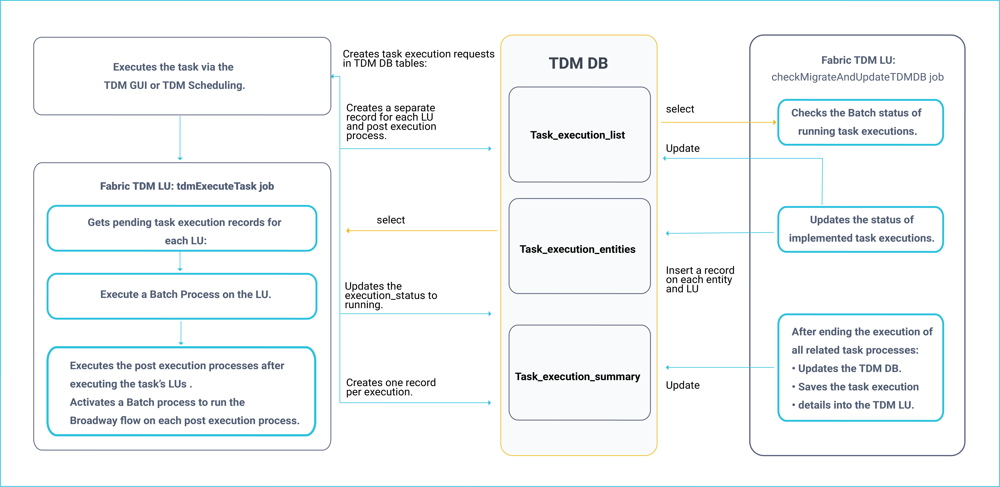
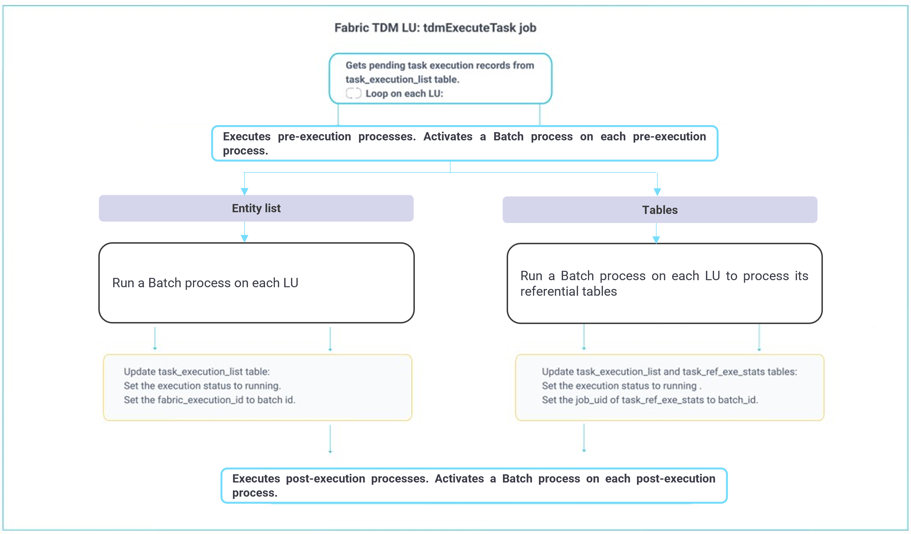

# Task Execution Processes

This article describes the task execution's steps and the TDM processes of each step.

The Task Execution process consists of the following steps:

1. Creating a task execution request.
2. Initiating a Batch process on each task's LU and implementing post execution processes in asynchronous mode.
3. Updating the status of the completed processes.

A [Task Execution process](/articles/TDM/tdm_gui/26_task_execution.md) can be initiated either from the TDM GUI, a direct call to the [start task execution API](/articles/TDM/tdm_gui/TDM_Basic_Task_Execution_APIs_Flow/04_execute_task_API.md), or via a [TDM Scheduling](/articles/TDM/tdm_gui/22_task_execution_timing_tab.md) process.  

A task can include Entities and/or Reference tables, both of which can have post-execution processes. For example, sending a mail to a user after a task has been executed. 

The following diagram displays the task execution process:

## Main TDM Task Execution Process: tdmExecuteTask Job

This job runs every 10 seconds and scans the [task_execution_list](02_tdm_database.md#task_execution_list) in the TDM DB table to get pending task execution requests.

Each task execution gets a unique **task_execution_id** identifier. A task execution may include several LUs and post execution processes, each with a separate record in the task_execution_list. All records related to a given task execution have the same **task_execution_id**. 

The task execution order of the related task's components is as follows:

1. Run the LUs (from parent to child). Process all related entities on each LU before moving to its child LU. Click for more information about the [execution order of the hierarchical LUs](/articles/TDM/tdm_overview/03_business_entity_overview.md#task-execution-of-hierarchical-business-entities).

2. Run the post execution processes after the execution of the LUs ends. Post execution processes are executed according to their [execution order](/articles/TDM/tdm_gui/04_tdm_gui_business_entity_window.md#post-execution-processes-tab) as defined in the task's BE. 

The following diagram describes the main TDM Task Execution process:

The execution is implemented in an asynchronous  mode. The **tdmExecuteTask** job starts the execution on each LU or post execution process and a separate **checkMigrateAndUpdateTDMDB** job checks and updates the execution status of each process.

Both jobs must be executed in parallel. 

**Example:**

1. Execute a task with **Customer** and **Billing LUs** and with a post execution process that sends a mail when the task execution ends. The Customer is the parent LU of Billing. 
2. Three records are created in the task_execution_list on this task. All have the same task_execution_id.
3. The **tdmExecuteTask** job executes the Batch process on the **Customer LU**. 
4. The **checkMigrateAndUpdateTDMDB** job updates the status of **Customer LU** when the execution is completed.
5. The **tdmExecuteTask** job starts executing **Billing LU** since **Customer**, its parent LU, is marked as completed.
6. The **checkMigrateAndUpdateTDMDB** job updates the status of **Billing LU** when the execution is completed.
7. The **tdmExecuteTask** job can start executing the **post execution process** after the execution of all the task's LUs.

## checkMigrateAndUpdateTDMDB Job

This job runs every 10 seconds and checks the execution status of the running process. It selects records from the **task_execution_list** in the TDM DB table where the execution_status is **running**.

The execution status is checked  as follows:

1. Check the execution status or all related Reference tables in [task_exe_ref_stats](02_tdm_database.md#task_ref_exe_stats) in the TDM DB table.
2. Check the batch status based on the **batch_id** populated in **task_execution_list.fabric_execution_id** column by the tdmExecuteTask job. 

When the process is completed, the following TDM DB tables are updated:

- **task_execution_list**, update the execution_status and additional data.
- [task_execution_entities](02_tdm_database.md#task_execution_entities), populate each entity or Reference table and its status. Set the **id_type** to **ENTITY** or **REFERENCE** according the entity or Reference table data type.
- [task_exe_error_detailed](02_tdm_database.md#task_exe_error_detailed), populate the execution errors in Extract tasks. Note that the execution errors of Load tasks are reported to this table by the **PopulateTableErrors** Actor.

### Handling Completed Task Executions

A task execution is complete when it does not have pending or running executions. The **checkMigrateAndUpdateTDMDB** job handles completed task executions as follows:

1. Updates the execution summary in the TDM DB tables.
2. Synchronizes the task execution details to Fabric. 

#### Updating Execution Summary TDM Tables

Updates the following TDM DB tables:

- [task_execution_summary](02_tdm_database.md#task_execution_summary)
- [task_exe_error_summary](02_tdm_database.md#task_exe_error_summary)

#### Sync the Task Execution ID to TDM LU

The TDM LU holds the execution details of each task execution. The TDM's **instance ID** is the **task_execution_id** generated by the TDM GUI for each task execution.

A completed task execution is synchronized into the TDM LU. The execution information and the TDM execution reports are extracted from the TDM LUI data.

