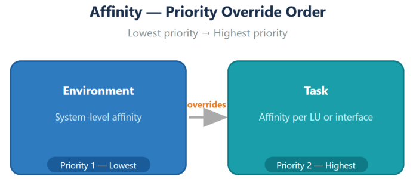
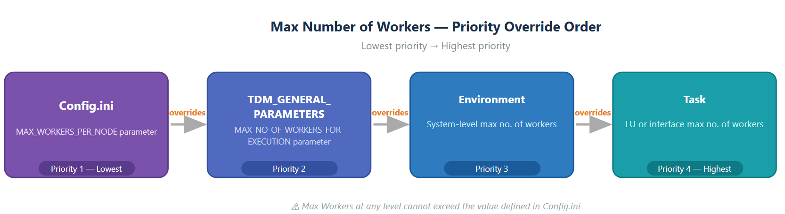

# Affinity and Worker Configuration for Task Execution

- Starting with **TDM 9.5**, TDM supports configuring **affinity** and/or **number of workers** at both the **TDM environment level** and the **task level**. These settings provide greater control over resource allocation and workload distribution.

- This feature applies to:

  - Entity-based tasks
  - Table-level tasks

  ## Affinity Configuration

- *Affinity* refers to Fabric assigning a job or a batch process to a specific handling node within a Fabric cluster. This is particularly handy when specific nodes are reserved for specific tasks or need to be dedicated to time-consuming or heavy processing executions. 

  Click [here](Task affinity can include either a DC name or a cluster Logical ID.md) for more information about the batch affinity.

- Task execution affinity can be specified using either a **DC name** or a **cluster Logical ID**.

- An affinity can be defined either on the [Environment system](/articles/TDM/tdm_gui/11_environment_products_tab.md#affinity-and-maximum-number-of-workers) or on the **Task level**. 

- The following diagram illustrates the priority order used by task execution to determine affinity:

### Task Level Affinity Configuration  

An affinity can be set on both task types - [entity-level](/articles/TDM/tdm_gui/14b_task_source_component_entities.md#system--logical-units-tab---affinity-and-max-number-of-workers) and [table-level](/articles/TDM/tdm_gui/14c_task_source_component_tables.md). The affinity can be set either on the Source or the Target component in the task. The table below describes which affinity is taken - source or target - for each task type and processed data:

  <table>
    <thead>
      <tr>
        <th>Processed Data</th>
        <th>Task Type</th>
        <th>Source Affinity</th>
        <th>Target Affinity</th>
        <th>Task Exec. Affinity</th>
      </tr>
    </thead>
    <tbody>
      <tr>
        <td>Entities, Tables, Entities &amp; Tables</td>
        <td>All types</td>
        <td>Undefined</td>
        <td>Undefined</td>
        <td>No affinity is set</td>
      </tr>
      <tr>
        <td>Entities, Tables, Entities &amp; Tables</td>
        <td>Extract</td>
        <td>Defined</td>
        <td>N/A</td>
        <td>Runs on source affinity</td>
      </tr>
      <tr>
        <td>Entities</td>
        <td>Load / Delete / Reserve only</td>
        <td>N/A</td>
        <td>Defined</td>
        <td>Runs on target affinity</td>
      </tr>
      <tr>
        <td>Entities</td>
        <td>Extract &amp; Load</td>
        <td>Defined</td>
        <td>Defined</td>
        <td>The batch process runs on the target env affinity.
The get LUI runs on the source env affinity (remote get)</td>
      </tr>
      <tr>
        <td>Entities</td>
        <td>Extract &amp; Load</td>
        <td>Undefined</td>
        <td>Defined</td>
        <td>No affinity is set on the batch process.
The get LUI runs on the source affinity (remote get)</td>
      </tr>
      <tr>
        <td>Entities</td>
        <td>Extract &amp; Load</td>
        <td>Undefined</td>
        <td>Undefined</td>
        <td>No affinity is set on the batch process or the get LUI</td>
      </tr>
      <tr>
        <td>Tables</td>
        <td>Extract &amp; Load</td>
        <td>N/A</td>
        <td>Defined</td>
        <td>The extract + load batch process runs on the target env affinity</td>
      </tr>
      <tr>
        <td>Tables</td>
        <td>Extract &amp; Load</td>
        <td>Undefined</td>
        <td>Undefined</td>
        <td>No affinity is set</td>
      </tr>
      <tr>
        <td>Tables</td>
        <td>Extract &amp; Load &amp; Delete</td>
        <td>N/A</td>
        <td>Defined</td>
        <td>The extract + load and the delete batch processes run on the Task target affinity</td>
      </tr>
      <tr>
        <td>Tables</td>
        <td>Extract &amp; Load / Extract &amp; Load &amp; Delete</td>
        <td>N/A</td>
        <td>Undefined</td>
        <td>No affinity is set</td>
      </tr>
    </tbody>
  </table>

## Workers Configuration

The **maximum number of workers** allocated per Fabric node for batch process execution is controlled by the  [Fabric config.ini file](/articles/20_jobs_and_batch_services/12_batch_sync_commands.html) parameter: **`MAX_WORKERS_PER_NODE`**. This value also serves as the **default number of workers** when running a batch process.

Starting with **TDM 9.5**, you can define a **different default number of workers** for TDM task execution. The effective value is determined based on the following configuration levels (listed from lowest to highest priority):

- **TDM DB – General Parameters**
   A new parameter, **`MAX_NO_OF_WORKERS_FOR_EXECUTION`**, has been added to the **`TDM_GENERAL_PARAMETERS`** table.
  - When set to **-1**, the parameter is ignored.
  - When set to a value **greater than 0**, it is used as the default number of workers for TDM task executions.
- **Environment**
   You can configure the **maximum number of workers per system** in the [Environment](/articles/TDM/tdm_gui/11_environment_products_tab.md).
- **Task**
   You can define the **maximum number of workers** at the task level, either on the **Source** component or the **Target** component.
   This setting is supported for both:
  - [Entity-level tasks](/articles/TDM/tdm_gui/14b_task_source_component_entities.md#system--logical-units-tab---affinity-and-max-number-of-workers)
  - [Table-level tasks](/articles/TDM/tdm_gui/14c_task_source_component_tables.md)

The following diagram illustrates the priority order used to determine the effective maximum number of workers during task execution:

The table below shows whether the task execution uses the source or target value for the number of workers, depending on the task type and the data being processed:

</head>
<body>
  

  <table>
    <thead>
      <tr>
        <th>Task Type</th>
        <th>Source No. of Workers</th>
        <th>Target No. of Workers</th>
        <th>Task Exec. No. of Workers</th>
      </tr>
    </thead>
    <tbody>
      <tr>
        <td>All types</td>
        <td>Undefined</td>
        <td>Undefined</td>
        <td>Default no. of workers</td>
      </tr>
      <tr>
        <td>Extract</td>
        <td>Undefined</td>
        <td>N/A</td>
        <td>Default no. of workers</td>
      </tr>
      <tr>
        <td>Extract</td>
        <td>Defined</td>
        <td>N/A</td>
        <td>Source no. of workers</td>
      </tr>
      <tr>
        <td rowspan="2">Load / Delete / Reserve only &amp; Extract &amp; Load</td>
        <td>N/A</td>
        <td>Undefined</td>
        <td>Default no. of workers</td>
      </tr>
      <tr>
        <td>N/A</td>
        <td>Defined</td>
        <td>Target no. of workers</td>
      </tr>
    </tbody>
  </table>
  

</body>
</html>

