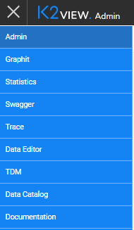
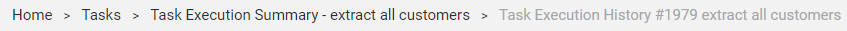

# TDM GUI Overview

The TDM GUI is a web-based application that helps users to easily control and manage test data. It has 2 main functions:

- TDM administrative activities - defines TDM Business Entities, environments, roles and permissions.
- TDM copy activities - creates and executes TDM tasks that provide a selected subset of entities or Reference tables to a selected environment.

TDM settings and tasks are saved in the [TDM PostgreSQL DB](/articles/TDM/tdm_architecture/02_tdm_database.md). Each TDM activity, created by a user via the TDM GUI, updates the TDM DB. 

The TDM GUI uses APIs to connect to the TDM DB in order to retrieve and update TDM settings and tasks.

## TDM GUI - Login

The TDM GUI application is pre-integrated with the [Fabric Web Framework](/articles/30_web_framework/02_preintegrated_apps_overview.md). The user logs into the Fabric Web Framework and **Fabric authenticates the user**.  

Fabric works with several authentication providers. Each authenticator is responsible for user's authentication, and provides a user-ID and his roles. The following are authentication providers, supported by Fabric:

- **Fabric** - for console, WS and web access, using its repository. This is Fabric's default authentication method. 
- **LDAP** server - for console, WS and web access. Done via LDAP integration. 
- **ADLDAP** (Active Directory) server - for console, WS and web access. Done via LDAP integration. 
- **SAML** server - for web and WS access. Done via SAML IDP integration. 

[Click for more information about Fabric's User Identification and Access Management](/articles/26_fabric_security/07_user_IAM_overview.md).

You can click the Web Framework app menu , and select the TDM option in order to log into the TDM GUI.

 

## TDM GUI Navigation - General

### TDM Navigation Tabs

The following tabs are displayed when selecting the TDM option in the applications menu and opening the TDM application:

​                             

To move between sections, click the required tab.

## TDM Breadcrumbs 

The TDM GUI uses breadcrumbs as a graphical control element to aid navigation across user interfaces whereby users can track their position in the TDM screens. For example, to display the details of a given task's execution: 

- Click **Task Execution Summary - lo111s** to display the executions list of **lo111** task. 
- Click **Tasks** to display all TDM tasks.

### TDM Soft Delete

A Delete activity generally changes the status of a selected object to **Inactive** and does not delete the object from the TDM DB. The object remains in the TDM DB and its history can be displayed in the TDM GUI.

Inactive objects cannot be repaired.

