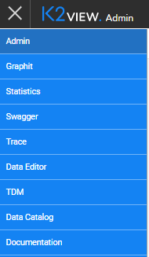
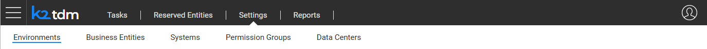

# TDM Portal Overview

The TDM Portal is a web-based application that helps users to easily control and manage test data. It has 2 main functions:

- TDM administrative activities - this function defines TDM Business Entities, system, environments, permissions and reports.
- TDM copy activities - this function creates and executes TDM tasks that provide a selected subset of entities or tables to a selected environment.

TDM settings and tasks are saved in the [TDM PostgreSQL DB](/articles/TDM/tdm_architecture/02_tdm_database.md). Each TDM activity, created by a user via the TDM Portal, updates the TDM DB. 

The TDM Portal uses APIs to connect to the TDM DB in order to retrieve and update TDM settings and tasks.

## TDM Portal - Login

The TDM Portal application is pre-integrated with the [Fabric Web Framework](/articles/30_web_framework/02_preintegrated_apps_overview.md). The user logs into the Fabric Web Framework and **Fabric authenticates the user**.  

Fabric works with several authentication providers. Each authenticator is responsible for authenticating a user, and provides a user-ID and the user's roles. The following are authentication providers, supported by Fabric:

- **Fabric** - for console, WS and web access, using its repository. This is Fabric's default authentication method. 
- **LDAP** server - for console, WS and web access. Done via LDAP integration. 
- **ADLDAP** (Active Directory) server - for console, WS and web access. Done via LDAP integration. 
- **SAML** server - for web and WS access. Done via SAML IDP integration. 

[Click for more information about Fabric's User Identification and Access Management](/articles/26_fabric_security/07_user_IAM_overview.md).

To log into the TDM Portal, click the Web Framework app menu , and select the TDM option.

## TDM Portal - Home Page

After logging in, the TDM Portal opens on the **Manage Your Tasks** home page, which displays the available TDM tasks:

The home page has the following areas:

- **Task Groups panel** (left) – lists the task groups. Click a group to display its tasks in the main area. The panel has two tabs:
  - **All groups** – displays all task groups available to the user.
  - **My created tasks** – displays only tasks created by the logged-in user.
- **Task cards area** (main) – displays the tasks of the selected group as cards. Each card shows the task name, task ID, and task type icon. Click a task card to open the task.
- **Search bar** – search for a task by name across all groups.
- **New task** and **New group** buttons (top right) – available to users with task creation permissions.

## TDM Portal Navigation

### TDM Navigation Tabs

The following tabs are displayed at the top of the TDM Portal:

- **Tasks** – opens the home page. Contains two sub-tabs:
  - **Task Management** – displays the **Manage Your Tasks** home page for creating and managing tasks.
  - **Execution Dashboard** – displays the execution status of TDM tasks.
- **Reserved Entities** – displays the list of entities currently reserved in TDM environments.
- **Settings** – contains TDM administrative settings. Available to Admin and Owner users.
- **Reports** – displays [TDM usage reports](TDM_Dashboard_User_Guide.md). Available to Admin and Environment Owner users.

The Settings tab contains the following sub-tabs:

### Masking-Only Mode

- A *Masking-only* mode has been added to the TDM Portal in TDM 9.3. When no [Business Entities (BEs)](04_tdm_gui_business_entity_window.md) are implemented, the TDM Portal now automatically operates in *Masking-only* mode, which supports table-level tasks exclusively. 

- To enable the full functionality with BE-based tasks: 

  - Deploy at least one Logical Unit (LU) to Fabric to activate the Business Entities tab.

  - Define at least one Business Entity (BE) to enable the creation of BE-based tasks.

## TDM Portal Navigation - Back Button

The TDM Portal uses a **Back** button to navigate between screens. Click the **Back** button to return to the previous screen.

### TDM Delete

A Delete activity generally changes the status of a selected object to **Inactive** and does not delete the object from the TDM DB. The object remains in the TDM DB and its history can be displayed in the TDM Portal.

Inactive objects cannot be repaired.

