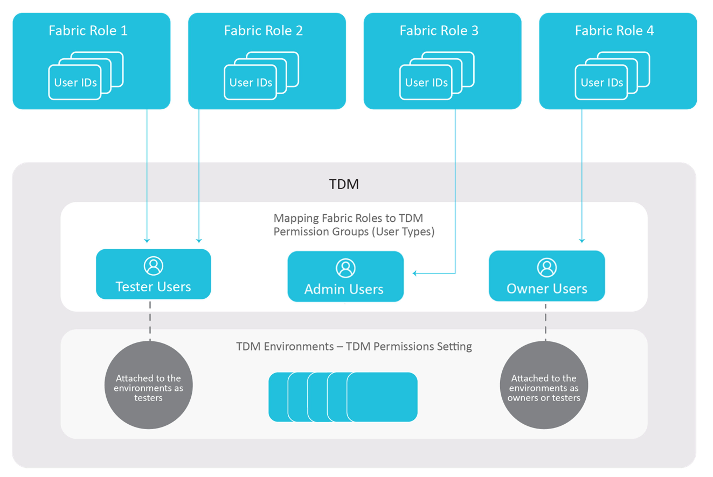

# TDM GUI - Permission Groups (User Types)

There are three main types of TDM users, each with different permissions for different activities:
- Admin
- Owner
- Tester User

Each type is called a **Permission Group**. 

All TDM windows can be accessed by all users in View mode. However, only authorized users with the relevant permissions can update TDM definitions.

Below are more detailed descriptions of the Permission Groups: 

## Admin 

An Admin can execute all activities in the TDM GUI application. 

Admins usually also define the [TDM implementation in Fabric](/articles/TDM/tdm_implementation/03_tdm_fabric_implementation_flow.md). They can execute all activities in the TDM GUI and are responsible for the following activities:

- Create, edit or delete [systems](05_tdm_gui_product_window.md).
- Create, edit or delete [Business Entities](04_tdm_gui_business_entity_window.md) and attach Logical Units or post-execution processes to each Business Entity.
- Create, edit or delete [environments](07_tdm_gui_environment_overview.md).
- Attach [environment owners](08_environment_window_general_information.md#environment-owners) to each environment.
- Define [permission sets](10_environment_roles_tab.md) in each environment and define permissions per permission set.

## Owner 

An Owner can be assigned to a specific TDM testing environment. Admins can define one or several Environment Owners for each testing environment. 

Environment Owners can execute the following activities in their environment:

- Edit the environment details.
- Add or remove [systems](11_environment_products_tab.md) from the environment.
- Set [environment variables](12_environment_globals_tab.md).
- Create, edit or delete [permission sets](10_environment_roles_tab.md) and define permissions per permission set.
- Attach users to TDM environment's permission sets.

Environment Owners cannot add or delete an environment and cannot add or remove Environment Owners from the environment.

## Tester User

A Tester User can create and execute TDM tasks based on their TDM environment's permission set. 

## Permission Groups Mapping

### How does TDM Identify the User Type (Permission Group)? 

The TDM GUI application is pre-integrated with [Fabric Web Framwork](/articles/30_web_framework/02_preintegrated_apps_overview.md). The user logs into the Fabric Web Framework and **Fabric authenticates the user**. The TDM GUI application gets the **user id** and the user's **Fabric roles** from the user's session. 

The users are defined and each user can be attached to one or several user groups in the organization. 

The user groups are defined in the organization's service provider and must be defined in advance in Fabric as [Fabric roles](/articles/17_fabric_credentials/02_fabric_credentials_commands.md#create-role). 

Our assumption is a **one-to-one relation between a user group and a Fabric role**.

[Click for more information about Fabric's User Identification and Access Management](/articles/26_fabric_security/07_user_IAM_overview.md).

The mapping of each Fabric role to a TDM Permission Group is done by the [Permission Groups Mapping](02a_permission_group_mapping_window.md) TDM window and is kept in the [permission_groups_mapping TDM DB table](/articles/TDM/tdm_architecture/02_tdm_database.md#permission_groups_mapping).

The TDM GUI application **identifies the user type (Permission Group) by its Fabric roles**.

The following diagram illustrates the mapping between Fabric roles and TDM permission groups:

**Example:**

- User id **johnD123** is a tester and is attached to **testers1** and **testers2** Fabric roles.

- User id **clarkG** is a tester and it attached to **testers1** Fabric role.

- User id **janeR1** is a team leader and is attached to **testingTeamLeaders** Fabric role.

- User **leo10** is the TDM administrator and is attached to **testingAdmin** Fabric role. 

- Each group has a Fabric role with the same name as the Fabric role.

- The testesr1, testesr2, testingTeamLeaders, and testingAdmin Fabric roles are mapped to TDM Permission Groups as follows:

  <table width="900pxl">
  <tbody>
  <tr>
  <td><strong>Fabric Role Name</strong></td>
  <td><strong>TDM Permission Group</strong></td>
  </tr>
  <tr>
  <td>testesr1</td>
  <td>Tester</td>
  </tr>
  <tr>
  <td>testers2</td>
  <td>Tester</td>
  </tr>
  <tr>
  <td>testingTeamLeaders</td>
  <td>Owner</td>
  </tr>
  <tr>
  <td>testingAdmin</td>
  <td>Admin</td>
  </tr>
  </table>

- User id **johnD123** logs in to the Fabric Web Framework and is authenticated by Fabric. This user connects the TDM GUI application.

- The TDM gets the following attributes from the user session:

  - User id:  **johnD123**
  - User's Fabric roles: **testers1** and **testers2**.

- The TDM checks the Permission Group of **testers1** and **testers2** Fabric roles. Their Permission Group is **Tester**.

- Therefore **johnD123** is a **Tester user** and is allowed to create and execute extract or load tasks on [their TDM environments](/articles/TDM/tdm_gui/07_tdm_gui_environment_overview.md). 

  

