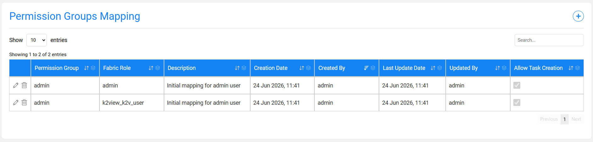
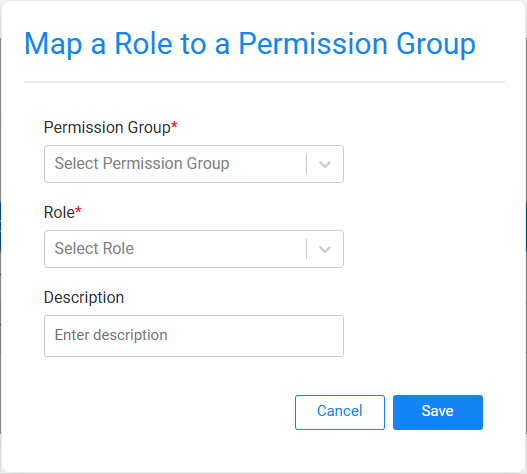

# Permission Groups Mapping Window

The **Permission Groups Mapping** window displays the mapping between Fabric roles and the [TDM Permission Groups](02_tdm_gui_user_types.md). 

The relation between Fabric roles and TDM Permission Groups is many-to-one, i.e. one or multiple Fabric role(s) can be mapped into a given TDM Permission Group.

This mapping must be added by the TDM Portal setup activities and is saved in [permission_groups_mapping TDM DB table](/articles/TDM/tdm_architecture/02_tdm_database.md#permission_groups_mapping).

### Who Can Map a Fabric Role to a TDM Permissions Group?

Only [Admin users](02_tdm_gui_user_types.md#admin) can add, remove, or edit a mapping of a Fabric role to a permission group.

The TDMDB creation script inserts an initial record to **permission_groups_mapping TDM DB table** to map Fabric **admin role** to the **Admin** TDM Permission Group. This enables an admin user (attached to Fabric admin role) to populate the initial TDM Permission Groups mapping in the TDM Portal:



The Permission Groups Mapping window includes an **Allow Task Creation** column, which indicates whether users mapped to a Tester permission group can create TDM tasks. See [Tester](02_tdm_gui_user_types.md#tester) for more information about the two types of Testers.

Note that if Fabric is set to authenticate using SAML, LDAP, or AD/LDAP, you must add the following record to **permission_groups_mapping** TDM DB table **before the first log in** to the TDM Portal:

```
insert into public.permission_groups_mapping (
	description,
	fabric_role,
	permission_group,
	created_by,
	updated_by,
	creation_date,
	update_date
) values ('Initial mapping for admin user', '<admin group name>', 'admin', 'admin', 'admin', NOW(), NOW());
```

Click for more information about [Fabric User IAM Configuration](/articles/26_fabric_security/13_user_IAM_configuration.md).

### How to Add a New Permission Group Mapping?

- Click the  icon on the right corner of the Permission Groups Mapping window. A popup window is opened:





- Select a Permission Group and a Fabric Role from the dropdown lists of the **Permission Group** and **Role** settings.

- Check the **Allow Task Creation** checkbox to allow the mapped users to create TDM tasks. This setting applies to Tester permission groups and determines whether the mapped users can create and assign tasks to other testers, or can only execute pre-created tasks.

- The **Description** setting is an optional setting and can be populated by free text.

- Save the changes.


### Edit a Permission Group Mapping

Click the **Edit** icon next to the Permission Group mapping record. A pop-up window opens, allowing you to edit the **Permission Group**, **Role**, **Allow Task Creation**, or **Description** as needed. Save the changes when finished.

### Delete a Permission Group Mapping

Click the **Trash** icon next to the Permission Group mapping record to delete the mapping. This action permanently removes the record from the `permission_groups_mapping` table in the TDM database.


Note that a delete or edit of a permission group mapping can remove the users of the related Fabric roles from their TDM environments.


[](02_tdm_gui_user_types.md)[](03_tdm_gui_data_centers_window.md)
