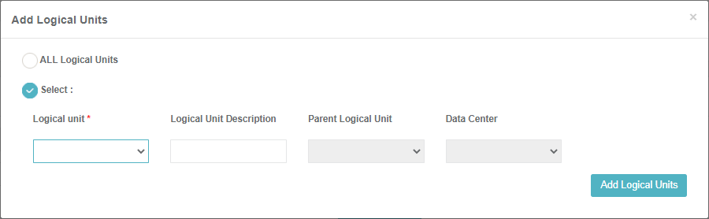
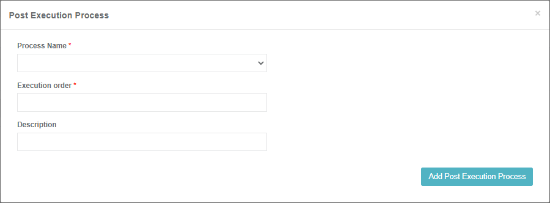

# Business Entity Windows 

A [Business Entity](/articles/TDM/tdm_overview/03_business_entity_overview.md) (BE) represents the main entity of the data to be provisioned by TDM. A BE can have multiple [LUs](/articles/03_logical_units/01_LU_overview.md) with a flat or  hierarchical structure. For example, a Customer BE can have Customer Care, Billing, Ordering and Usage LUs. Each LU can be attached to multiple BEs.

## Business Entities List Window  

The **Business Entities** window displays a list of all BEs defined in the TDM.  Only **Admin users** can create, edit or delete a BE. Other users can open BEs for view only purposes.

-   To create a new BE, click the **New Business Entity** icon.
-   To open a selected BE, click the **Name** value of the BE.
-   To delete a BE, click the  icon in the right corner of the Business Entity window.

## Business Entity Window    

The Business Entity window displays information about a selected BE. It has three main sections:

- General Information, holding the BE Name and Description fields.
- Logical Units tab.
- Post Execution Processes tab.

The following is an example of a Customer Business Entity window:

### General Information Section 

The General Information section holds the BE **Name** and **Description**. The Name setting is mandatory. Note that only one active BE can have a specific Name. An error is displayed when an attempt is made to create several BEs with the same name.

### Logical Units Tab 

To use a BE in a TDM task, it must have one or more LUs assigned.

#### How Do I Add an LU to a BE? 

1. Click **Add Logical Unit** to display the **Add Logical Units** dialog box:

2. Do either: 

   - Check **All Logical Units** to attach all LUs that are deployed to Fabric and that are not attached to the BE. The LUs are attached to the BE in a flat structure whereby the Parent LU is empty. When needed, the LUs can be edited to populate the Parent LU and the Data Center settings.

   - Check **Select** and select an LU from the **Logical Unit** dropdown list:

     - Click  or  to add or remove LUs to / from the BE. 
     - Populate the following optional settings for each selected LU:
       - **Logical Unit Description**.
       - **Parent Logical Unit**, set a parent LU to build a [hierarchy in the BE](/articles/TDM/tdm_overview/03_business_entity_overview.md). 
       - **Data Center**, which can be attached to each LU in a BE if the LU instances are saved under a specific Data Center (DC) in Fabric.
 3. Click **Add Logical Units** to add the selected LUs to the BE.

Notes:
 - Both Parent and Child LUs must be attached to the same BE.
 -  An LU can have 0-1 parents.
 -  An LU can have 0-N children.
  - Several levels of parent-child hierarchies can be defined in a BE. For examples, see the [Business Entity Overview](/articles/TDM/tdm_overview/03_business_entity_overview.md).

#### Editing LU Settings

Click  or  to edit or delete the LU from the BE. Note that the LU is deleted from the BE in the TDB DB. 

Click for more information about [TDM DB tables that hold the BE and LU relationship](06_be_product_tdmdb_tables.md).

### Post Execution Processes Tab

This tab enables adding post-execution processes that must run at the end of the task's execution after all the related LUs have been executed. For example, sending a mail to the tester to notify them that the execution of a task has ended. 

Post-execution processes are [Broadway flows] defined in Fabric by the TDM implementer. The relationship between a post-execution process and a BE is many to many. That is, a BE can have several post-execution processes, and a post-execution process can be attached to multiple BEs. 

The [task execution process] executes the [BATCH command](/articles/20_jobs_and_batch_services/15_batch_broadway_commands.md) on each post-execution process attached to the task's BE. The execution order is set according the execution order defined in the BE.

Unlike for LUs, post-execution processes are optional. A BE can be defined without any post-execution processes.

Note that the post execution processes must be populated in [trnPostProcessList](/articles/TDM/tdm_implementation/04_fabric_tdm_library.md#trnpostprocesslist) to be displayed by the BE window.

#### How Do I Add a Post-Execution Process to a BE? 

1. Open the **Post Execution Processes** tab and click **Add Post Execution Processes** to open the **Post Execution Process** dialog box.  

2. Click the **Process Name** and select a post-execution process from the dropdown list holding all post-execution processes deployed to Fabric.
3. Populate the **Execution Order** setting with a numeric value to set the execution order. Processes with Execution Order 1 run first followed by processes with Execution Order 2 etc. Note that an execution order can be set for several post-execution processes that are executed simultaneously.
4. Populate the **Description** (optional).
5. Click **Add Post Execution Process** to add the post-execution process to the BE.
6. Repeat steps 1-5 to attach additional post-execution processes if needed.

  

Click for more information about [BE TDM DB tables and the hold BE and post-execution processes relationship](06_be_product_tdmdb_tables.md).

 

  

