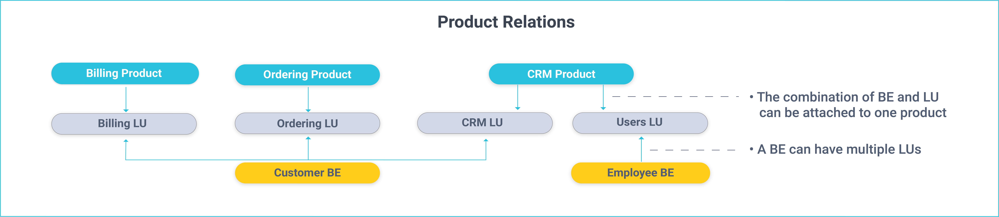
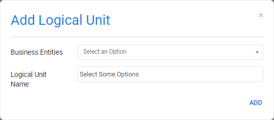

# System (Product) Windows

A TDM system (product) represents a system or application installed in a source or target environment. For example, the UAT1 environment contains CRM and Billing systems. Each system can have multiple data sources (interfaces). For example, the Billing system has the Billing and Usage DBs.

A TDM system has the following components:

- **Name**, a logical name that identifies the system. For example, CRM.
- **Versions**, the system's versions as defined in testing environments. For example, Production and Development.

- **Logical Units** (LUs).

## BE and LU System Relationship

Each BE and LU combination can be attached to one system only. However, a system can have LUs belonging to different BEs.

The following example displays the relationship between a BE, LU and a system:

## Systems List Window 

The **Systems** window displays a list of all systems defined in the TDM.  Only **Admin users** can create, edit, or delete a system. Other users can open systems for view only purposes.

-   To create a new system, click **Add System**.
-   To open a selected system, click its **Name**.
-   To delete a system, click  in the right corner of the System window.

## System Window

The System window displays information about a selected system. It has two main sections: 

- General Information.
- Logical Units.

### General Information

The General Information section has the following settings:

- Name, populated by the system name.

- Vendor and Description, optional settings.

- Versions, system's versions which enable the TDM implementation to support multiple versions of the system.

  -  Each system version may have a different data source structure. For example, a development environment may have new tables and fields that are not in the production environment. 
  - At least one version must be set for a system. Multiple system versions can also be set. 
  - The relevant system version must be selected when adding a system to an [Environment](11_environment_products_tab.md).

To add a version to a system, click  next to the Versions setting and enter the version's value which is the logical identifier of the system's version. For example 1, 1.5, dev or prod. The values must be aligned to the TDM Fabric implementation. 

  [Click for more information about supporting multiple system versions via TDM](/articles/TDM/tdm_implementation/13_tdm_implementation_supporting_different_product_versions.md).

### Logical Units

#### How Do I Add an LU to a System?

Click  to open the **Add Logical Unit** dialog box.

  

- The **Business Entities** setting displays a list of BEs with available LUs that are not attached to the system.

- The **Logical Unit Name** setting displays a list of available LUs that are not attached to the system and that belong to the selected BE.

  

#### How Do I Delete an LU from a System? 

Click  to delete the selected LU from the system.

  [Click for more information about product related TDM DB tables](/articles/TDM/tdm_gui/06_be_product_tdmdb_tables.md).

 
