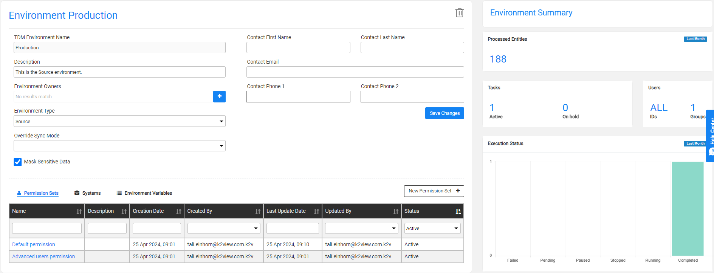

# TDM Environments Overview

The TDM can create tasks that are executed in TDM environments. Each environment must be defined in the following TDM components:

- Fabric, set the [interfaces connection details and Globals values](/articles/25_environments/01_environments_overview.md) for each environment. 
- TDM GUI, set the following for each environment:

  - [General information](08_environment_window_general_information.md) like environment name, contact person, environment type (source, target or both).
  - [Environment owners](08_environment_window_general_information.md#environment-owners), add environment owners to setup and maintain an environment.
  - [Environment systems](11_environment_products_tab.md), attached [TDM systems (products)](05_tdm_gui_product_window.md) to each environment.
  - [Environment permissions](10_environment_roles_tab.md), define the permission sets with TDM permissions for environments and attach [users](02_tdm_gui_user_types.md) to an environment to enable them to create TDM tasks for it.
  - [Environment Variables](12_environment_globals_tab.md), override Fabric Globals' values in a TDM environment.

Click to read more about [TDM environment setup in Fabric](/articles/TDM/tdm_implementation/tdm_fabric_implementation_environments_setup.md).

  ## Environments List Window

The **Environments** window displays a list of all environments defined in the TDM. Only **Admin users** can create, add or remove environment owners or delete an environment. Environment owners can edit their environment. Other users can open environments for view only purposes.

-   To create a new environment, click **New Environment**.
-   To open a selected environment, click the environment's **Name**.
-   To delete an environment, clickin the Environment window.

## Environment Window

The Environment window has the following sections:

- [General Information](08_environment_window_general_information.md).

- [Environment Summary](09_environment_window_summary_section.md).

- Environment tabs, [Permission Sets](10_environment_roles_tab.md), [Systems](11_environment_products_tab.md) and [Environment Variables](12_environment_globals_tab.md).

 The following is an example of an Environment window:

  

  
