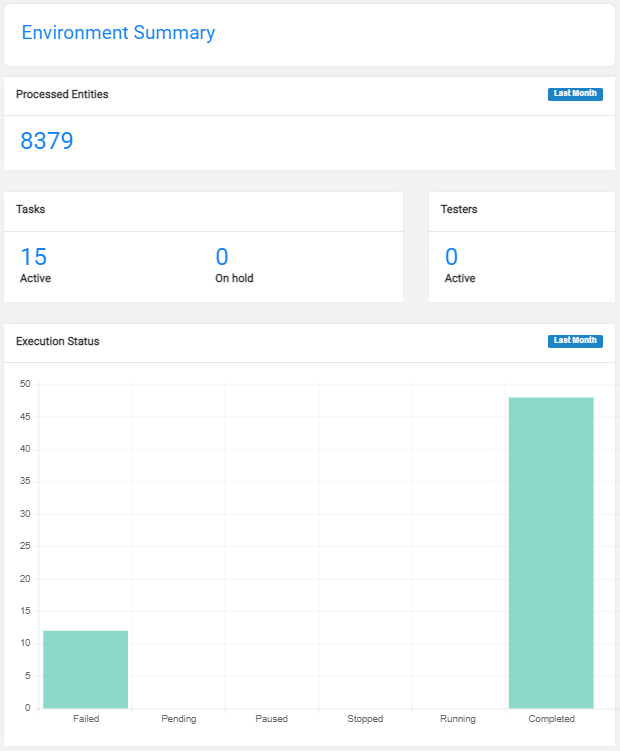

# Environment Window - Environment Summary Section

The Environment Summary section on the right side of the Environment window displays a summary of the environment and statistics on the tasks executed over the last month:

- Processed Entities, the number of entities processed by tasks executed on the environment over the last month. For example, last month two tasks were executed on ENV1: 
  - Task 1 copied 20 entities. 
  - Task 2 copied 100 entities.
  - The total number of processed entities on ENV1 = 120.
- Tasks, the number of active tasks on the environment per task execution status which can be either **Active** or **On hold**. 
- Users, the number of users (IDs in the figure) and user groups that are [attached to a role](10_environment_roles_tab.md#testers) in the environment.
- Execution Status, the number of tasks executed on an environment over last month per execution status. 

See the example below: 

The displayed data is view only and cannot be edited. 

 

  

