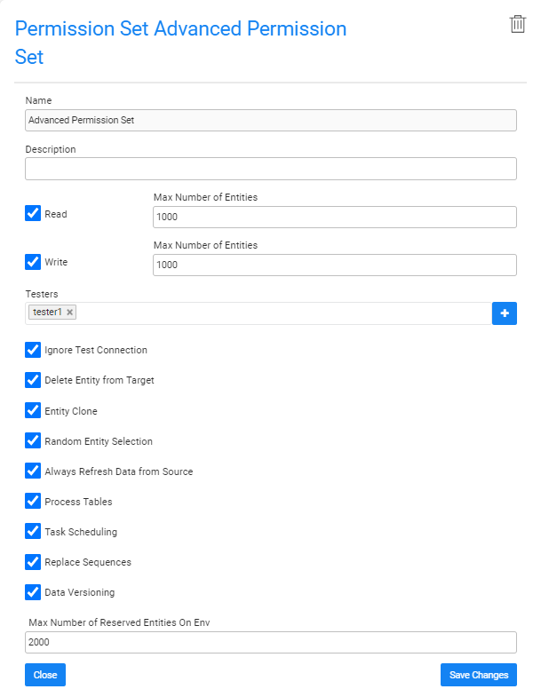
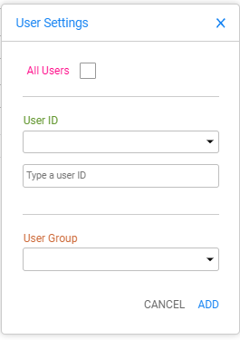

# Environment Roles Tab

TDM Environment Roles are set on an environment level and are assigned to testers. Roles define a list of permissions related to the creation and execution of TDM tasks in an environment. Testers can only create and execute a TDM task if they are assigned to a role that is assigned to the environment. 

A TDM Environment role is an **optional setting** in an environment and can be created, edited or deleted by an Admin user or the [Environment Owner](08_environment_window_general_information.md#environment-owners).  An environment without a role or without testers attached to a role, can be used only by Admin users or by  Environment Owners.

An environment's roles are displayed in the **Roles tab** in the Environment window:

- To create a new role, click **New Role**, populate the role's settings and then click **Add**.
- To open a role, click the **Name** of the role and then click **Save Changes**. 
- To delete a role, click the  icon in the right corner of the Role window.

## Role Window 

The Role window defines the TDM Environment role's permissions and the list of testers assigned to it as displayed in the following example:

The Role window has the following settings:

### Name

The name of the TDM Environment role. (Mandatory). Note that a specific name can be assigned to only one active role. An error is displayed when an attempt is made to create several roles with the same name. 

### **Description**

A description of the TDM Environment role. (Optional). 

### Read and Write and Number of Entities

- Read access can be granted on a source environment, i.e. the [environment type](08_environment_window_general_information.md#environment-type) is **Source** or **Both**. 

- Write access can be granted on a target environment, i.e. the environment type is **Source** or **Both**.

When an Environment Type is Both it can have both read and write access to both the source and target. The TDM Environment roles in these environments can have both read and write access or read or write only access.

  **Example:**

  - ENV1 can be a source or target environment. The environment has two roles: 
    - Role1, enables Read only access. Testers with this role can only select this environment as a source environment in a TDM task.
    - Role2, enables Write only access. Testers with this role can only select this environment as a target environment in a TDM task.
    - Role3, enables both Read and Write access. Testers with this role can select this environment as a source and/or target environment in a TDM task.

- The **Number of Entities** indicates the maximum number of entities processed by a task and must be set for each access type. The Number of Entities is set on both **Read** and **Write** access types.  A different number of entities can be set for each access type. 

  **Example:**
  - Read Number of Entities = 1000. Write Number of Entities = 10. 
  - The user attached to this role can run the following tasks on this environment:
    - Select the environment as a source environment and create a task on up to 1000 entities.
    - Select the environment as a target environment and create a task on up to 10 entities.

  Click for more information about [setting the number of entities on a TDM load task](17_load_task_regular_mode.md#number-of-entities). 

### Testers

- Attach testers to the TDM Environment role. The connection of a tester to a testing environment is established by connecting the tester to the environment's role.  

- A TDM Environment's role can be attached to selected testers, selected user group (Fabric roles), or to all TDM users.

Note that although an environment's role without testers is not usable, the **Testers** setting is optional and enables creating roles and then adding them to testers at a later stage.

#### Adding all TDM Users to the  TDM Environment Role

The **All** option is used to enable the role for all TDM users. To do so, click **Testers** and then select **ALL**.

Alternatively, click the  icon next to the Testers setting. A popup window is displayed:

Check the **All Users** checkbox.

#### Adding Selected TDM Users to the TDM Environment Role

1. Click **Testers** and select one of the displayed user IDs.
2. Alternatively, click the  icon to open the **User Settings** popup window. Select or type manually the user id. 
3. Click the ADD button.
4. Click **Testers** again and select another user, or type manually a user name,  if needed.

Adding Selected TDM Users to the TDM Environment Role

#### Adding Selected TDM User Groups to the TDM Environment Role

1. Click the  icon and to open the **User Settings** popup window. Select a user group from the list.
2. Click the ADD button.
3. Click again the  icon next to the  **Testers** and select another user group if needed.

#### TDM Environment Roles Assignments Priorities

1. First priority: assign a user ID to the TDM environment role.
2. Second priority: assign the user group to the  TDM environment role. All the group's users can work with the TDM environment based on the permissions of the TDM environment role assigned to their group.
3. Third priority: assign role to all users. A user is assigned to the TDM environment with the **ALL** role only if the user or their group is not specifically attached to another TDM environment role of the environment.

**Notes**

- A tester can be attached to only one TDM Environment role per environment and cannot be attached to different TDM Environment roles in the same environment.

- An owner user or group can be attached either to the Environment Owners or the TDM environment roles. In other words, an owner tester can be attached to a TDM environment as an owner or as a tester.

  

### Role Permissions

A list of permissions that can be assigned to a role. Check to grant one or more permissions to a role, as follows:

##### **Ignore Test Connection**  

TDM tests the connections of the source and target environments at the beginning of the task's execution.  If the connection  fails, the user is asked whether to ignore the failure and continue the execution or to stop the execution.  When unchecked, the task's execution stops when the connection fails without an option to ignore the failure and continue the execution.

##### **Delete Entity from Target** 

[Delete an entity](19_load_task_request_parameters_regular_mode.md#operation-mode) from the target's testing environment using a TDM Load task. This permission applies only when the role has **Write** access.

##### Create Synthetic Data 

[Create replicas](18_load_task_requested_entities_regular_mode.md#create-synthetic-entities) of a real entity in a testing environment using a TDM Load task. This permission applies only when the role has **Write** access.  

##### Random Entity Selection

[Randomly select entities](18_load_task_requested_entities_regular_mode.md#random-selection) for TDM load task. This permission applies only when the role has **Write** access.

##### Request up to Date Entities

Ask to sync the entities from the source when executing [extract](16_extract_task.md#request-parameters) or [load](19_load_task_request_parameters_regular_mode.md#override-sync-mode) tasks. 

##### Refresh Reference Data

Create TDM tasks to extract or load [Reference tables](24_task_reference_tab.md).

#####  Task scheduling 

Add [scheduling settings](22_task_execution_timing_tab.md) in the TDM task to automatically execute it based on the scheduling parameters.

##### Replace Sequences

[Replace the sequences](/articles/TDM/tdm_implementation/11_tdm_implementation_using_generic_flows.md#step-4---create-the-sequence-creation-flows) of the entities when loading them to the target environment. This permission applies only when the role has **Write** access.

##### Entity Versioning 

Create [Data Flux](15_data_flux_task.md) tasks.

  
