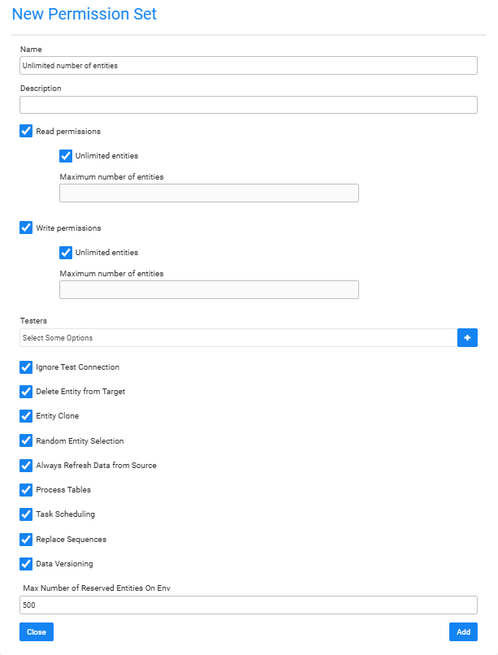
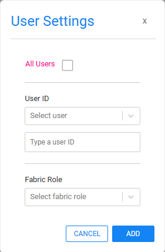

# Environment Permission Sets Tab

TDM environment permission sets can be added at the environment level and assigned to users or Fabric roles (user groups). Each permission set defines a list of permissions related to creating and executing TDM tasks within an environment. Testers can create and execute TDM tasks only if they are assigned to one of the environment's permission sets. 

A TDM environment permission set is an **optional configuration** within an environment and can be created, edited or deleted by either an Admin user or the [Environment Owner](08_environment_window_general_information.md#environment-owners). An environment without a permission set, or without testers assigned to a permission set, can only be used by Admin users or Environment Owners.

The permission sets of an environment are displayed in the **Permission Sets tab** of the Environment window:

- To create a new permission set, click **New Permission Set**, populate the permission set's settings and then click **Add**.
- To open a permission set, click the **Name** of the permission set and then click **Save Changes**. 
- To delete a permission set, click the  icon, located in the upper-right corner of the window.

## Permission Set Window 

The Permission Set window defines the TDM Environment permissions, and the list of testers assigned to the permission set, as shown in the following example:

The Permission Set window includes the following settings:

### Name

The name of the TDM environment permission set should be entered in this field (mandatory). Each active permission set should be assigned with a specified name. An error is displayed when an attempt is made to create multiple permission sets with the same name.

### **Description**

The description of the TDM environment permission set should be entered in this field (optional).

### Read and Write Permissions and Number of Entities

- Read access can be granted to a source environment, i.e., the [environment type](08_environment_window_general_information.md#environment-type) is **Source** or **Both**. 

- Write access can be granted to a target environment, i.e., the environment type is **Target** or **Both**.

- When the Environment Type is set to 'Both', it can have both read and write accesses. Therefore, the TDM environment permission sets in such environments can include read access, write access, or both.

 	 **Example:**

- ENV1 can be a source or target environment. The environment has 2 permission sets:

  - Set1, enables read-only access. Testers with this permission set can select this environment only as a source environment in a TDM task.
  - Set2, enables write-only access. Testers with this permission set can select this environment only as a target environment in a TDM task.

  - Set3, enables read and write accesses. Testers with this permission set can select this environment as a source and/or target in a TDM task.

#### Number of Entities

- This field needs to be set on each permission — read and write. TDM V9.3.0 introduces the option to grant permission for **Unlimited entities**. This feature allows users to process all entities that match the selected criteria in a task.

- The permission set can support one of the following options: allow processing an unlimited number of entities per task, or limit the user to a maximum number of entities per task.

- The **Maximum number of entities** field is populated when the Unlimited entities checkbox is unchecked; it indicates the maximum number of entities that can be processed by a task. This number can be set for each access type (read or write). A different number of entities can be set for each access type.

  **Example:**
  - Read Number of Entities = 1000. Write Number of Entities = 10. 
  - The user assigned to this permission set can run the following tasks on this environment:
    - Select the environment as a source environment and create a task for up to 1000 entities.
    - Select the environment as a target environment and create a task for up to 10 entities.

  Click for more information about [setting the number of entities on a TDM load task](15a_entity_subset.md). 

### Testers

- The **Testers** field is used for assigning users (testers) to a permission set. A tester gains access to a testing environment by being included in the environment's permission set.  

- A TDM environment permission set can be assigned to selected testers, selected Fabric roles (user groups), or all TDM users.

Note: Although an environment permission set without testers cannot be used, the **Testers** setting is optional — allowing permission sets to be created and assigned to testers at a later stage.

#### Adding all TDM Users to the TDM Environment Permission Set

To enable the permission set for all TDM users, click the **Testers** field and select the **ALL** option.

Alternatively, click the  icon next to the Testers field. The **User Settings** pop-up window appears (image below). Check the **All Users** checkbox:

#### Adding Selected TDM Users to the TDM Environment Permission Set

1. Click the **Testers** field and select one of the displayed user IDs.
2. Alternatively, click the  icon to open the **User Settings** pop-up window. Select a user ID from the drop-down list or manually type it. 
3. Click the ADD button.
4. Click the **Testers** field again and add another user in the same manner, or manually type a user ID, if needed.

#### Adding Selected TDM User Groups to the TDM Environment Permission Set

1. Click the  icon to open the **User Settings** pop-up window. Select a User Group from the drop-down list.
2. Click the ADD button.
3. Click again the  icon next to the **Testers** field and select another user group in the same manner, if needed.

#### TDM Environment Permission Set Assignment Priorities

1. First priority: Assign a user ID to the TDM environment permission set.
2. Second priority: Assign a user group to the TDM environment permission set. All users in the group can access the TDM environment according to the permissions defined in the TDM environment permission set assigned to their group.
3. Third priority: Assign a generic permission set for all users to serve as the default permission set. A user will be assigned to the TDM environment with the **ALL** permission set only if neither the user nor their group is specifically assigned to another TDM environment permission set for that environment.

**Notes**

- A tester user can be assigned to only one TDM environment permission set per environment and cannot be assigned to multiple TDM environment permission sets within the same environment.

- An owner user or group can be assigned to either the Environment Owners or a TDM environment permission set. In other words, an owner tester can be assigned to a TDM environment as either an owner user or a tester user.

  

### Permissions

A list of permissions that can be assigned to a permission set. Check the checkbox to grant one or more permissions to the permission set. The permissions are:

##### **Ignore Test Connection**  

TDM tests the connections to the source and target environments at the start of task execution. If the connection fails, the user is asked whether they wish to ignore the failure and continue or stop the execution. When this permission checkbox is unchecked, the task execution stops upon connection failure, with no option to ignore the failure and continue.

##### **Delete Entity from Target** 

Enables the user to check the Delete [task action](17a_task_target_component_entities.md#delete) checkbox on the task. This permission applies only when the permission set has **Write** access.

##### Entity Clone 

Permission to [create replicas](17a_task_target_component_entities.md#generate-clones-for-an-entity) of a real entity in a testing environment using a TDM Load task. This permission applies only when the permission set has **Write** access.  

##### Random Entity Selection

Permission to [randomly select entities](15a_entity_subset.md#random) for a TDM load task. This permission applies only when the permission set has **Write** access.

##### Refresh All Data from Source

Permission to sync entities from the source in order to refresh data in the task. 

##### Process Tables

Permission to create TDM tasks on [tables](14c_task_source_component_tables.md).

#####  Task Scheduling 

Permission to add [scheduling settings](22_task_execution_timing_tab.md) to a TDM task for automatic periodic execution.

##### Replace Sequences

Permission to [replace the sequences (IDs)](17a_task_target_component_entities.md#replace-ids-for-the-copied-entities) of entities when loading them into the target environment. This permission applies only when the permission set has **Write** access.

##### Data Versioning 

Permission to create a [snapshot (data Versioning)](15_data_flux_task.md) in the task.

#### Max Number of Reserved Entities on Env

This field presents the maximum number of entities that the user can [reserve on the environment](/articles/TDM/tdm_architecture/08_entity_reservation.md). Starting from TDM V8.1, it is possible to add a **Reserve only permission** to the user, i.e., the number of entities in the Write or Read permissions is zero, but the Max Number of Reserved Entities on Env is greater than zero. This permission set allows the user to reserve entities on the environment although they are not permitted to read or write on the environment.

## Environment Permissions Summary Table

<table width="900pxl">
<tbody>
<tr>
<td style="width: 103px;" width="100"><strong>Environment type</strong></td>
<td style="width: 121px;" width="121"><strong>Write permission</strong></td>
<td style="width: 163px;" width="169"><strong>Write - number of entities</strong></td>
<td style="width: 138px;" width="139"><strong>Read permission</strong></td>
<td style="width: 180px;" width="187"><strong>Read -&nbsp; number of entities</strong></td>
<td style="width: 182px;" width="189"><strong>Number of reserved entities&nbsp;</strong></td>
<td style="width: 249px;" width="250"><strong>Permitted activities</strong></td>
</tr>
<tr>
<td style="width: 103px;">Target</td>
<td style="width: 121px;">Y</td>
<td style="width: 163px;">&gt; 0</td>
<td style="width: 138px;">N/A</td>
<td style="width: 180px;">N/A</td>
<td style="width: 182px;">0</td>
<td style="width: 249px;">
<ul>
<li>Load</li>
</ul>
</td>
</tr>
<tr>
<td style="width: 103px;">Target</td>
<td style="width: 121px;">Y</td>
<td style="width: 163px;">&gt; 0&nbsp;</td>
<td style="width: 138px;">N/A</td>
<td style="width: 180px;">N/A</td>
<td style="width: 182px;">&gt; 0</td>
<td style="width: 249px;">
<ul>
<li>Load</li>
<li>Reserve</li>
</ul>
</td>
</tr>
<tr>
<td style="width: 103px;">Target</td>
<td style="width: 121px;">Y</td>
<td style="width: 163px;">0</td>
<td style="width: 138px;">N/A</td>
<td style="width: 180px;">N/A</td>
<td style="width: 182px;">&gt; 0</td>
<td style="width: 249px;">
<ul>
<li>Reserve</li>
</ul>
</td>
</tr>
<tr>
<td style="width: 103px;">Both</td>
<td style="width: 121px;">N</td>
<td style="width: 163px;">N/A</td>
<td style="width: 138px;">Y</td>
<td style="width: 180px;">0</td>
<td style="width: 182px;">&gt; 0</td>
<td style="width: 249px;">
<ul>
<li>Reserve</li>
</ul>
</td>
</tr>
<tr>
<td style="width: 103px;">Both</td>
<td style="width: 121px;">Y</td>
<td style="width: 163px;">0</td>
<td style="width: 138px;">Y</td>
<td style="width: 180px;">0</td>
<td style="width: 182px;">&gt; 0</td>
<td style="width: 249px;">
<ul>
<li>Reserve</li>
</ul>
</td>
</tr>
<tr>
<td style="width: 103px;">Both</td>
<td style="width: 121px;">Y</td>
<td style="width: 163px;">0</td>
<td style="width: 138px;">N</td>
<td style="width: 180px;">N/A</td>
<td style="width: 182px;">&gt; 0</td>
<td style="width: 249px;">
<ul>
<li>Reserve</li>
</ul>
</td>
</tr>
<tr>
<td style="width: 103px;">Both</td>
<td style="width: 121px;">N</td>
<td style="width: 163px;">N/A</td>
<td style="width: 138px;">Y</td>
<td style="width: 180px;">&gt; 0</td>
<td style="width: 182px;">0</td>
<td style="width: 249px;">
<ul>
<li>Extract</li>
</ul>
</td>
</tr>
<tr>
<td style="width: 103px;">Both</td>
<td style="width: 121px;">N</td>
<td style="width: 163px;">N/A</td>
<td style="width: 138px;">Y</td>
<td style="width: 180px;">&gt; 0</td>
<td style="width: 182px;">&gt; 0</td>
<td style="width: 249px;">
<ul>
<li>Extract</li>
<li>Reserve</li>
</ul>
</td>
</tr>
<tr>
<td style="width: 103px;">Both</td>
<td style="width: 121px;">Y</td>
<td style="width: 163px;">0</td>
<td style="width: 138px;">Y</td>
<td style="width: 180px;">&gt; 0</td>
<td style="width: 182px;">0</td>
<td style="width: 249px;">
<ul>
<li>Extract</li>
</ul>
</td>
</tr>
<tr>
<td style="width: 103px;">Both</td>
<td style="width: 121px;">Y</td>
<td style="width: 163px;">0</td>
<td style="width: 138px;">Y</td>
<td style="width: 180px;">&gt; 0</td>
<td style="width: 182px;">&gt; 0</td>
<td style="width: 249px;">
<ul>
<li>Extract</li>
<li>Reserve</li>
</ul>
</td>
</tr>
<tr>
<td style="width: 103px;">Both</td>
<td style="width: 121px;">Y</td>
<td style="width: 163px;">&gt; 0</td>
<td style="width: 138px;">Y</td>
<td style="width: 180px;">&gt; 0</td>
<td style="width: 182px;">&gt; 0</td>
<td style="width: 249px;">
<ul>
<li>Extract</li>
<li>Load</li>
<li>Reserve</li>
</ul>
</td>
</tr>
<tr>
<td style="width: 103px;">Both</td>
<td style="width: 121px;">Y</td>
<td style="width: 163px;">&gt; 0</td>
<td style="width: 138px;">Y</td>
<td style="width: 180px;">&gt; 0</td>
<td style="width: 182px;">0</td>
<td style="width: 249px;">
<ul>
<li>Extract</li>
<li>Load</li>
</ul>
</td>
</tr>
<tr>
<td style="width: 103px;">Both</td>
<td style="width: 121px;">Y</td>
<td style="width: 163px;">&gt; 0</td>
<td style="width: 138px;">N</td>
<td style="width: 180px;">N/A</td>
<td style="width: 182px;">&gt; 0</td>
<td style="width: 249px;">
<ul>
<li>Load</li>
<li>Reserve</li>
</ul>
</td>
</tr>
<tr>
<td style="width: 103px;">Both</td>
<td style="width: 121px;">Y</td>
<td style="width: 163px;">&gt; 0</td>
<td style="width: 138px;">N</td>
<td style="width: 180px;">N/A</td>
<td style="width: 182px;">0</td>
<td style="width: 249px;">
<ul>
<li>Load</li>
</ul>
</td>
</tr>
<tr>
<td style="width: 103px;">Both</td>
<td style="width: 121px;">Y</td>
<td style="width: 163px;">&gt; 0</td>
<td style="width: 138px;">Y</td>
<td style="width: 180px;">0</td>
<td style="width: 182px;">&gt; 0</td>
<td style="width: 249px;">
<ul>
<li>Load</li>
<li>Reserve</li>
</ul>
</td>
</tr>
<tr>
<td style="width: 103px;">Both</td>
<td style="width: 121px;">Y</td>
<td style="width: 163px;">&gt; 0</td>
<td style="width: 138px;">Y</td>
<td style="width: 180px;">0</td>
<td style="width: 182px;">0</td>
<td style="width: 249px;">
<ul>
<li>Load</li>
</ul>
</td>
</tr>
</tbody>
</table>

## AI Environment - Permission Set

The AI environment is a dummy environment set for AI-based synthetic entities generation. The AI environment is used as a target environment for the [AI training task](19_task_synthetic_data_generation.md#how-to-create-an-ai-training-task) and as a source environment for an [AI-based generation task](19_task_synthetic_data_generation.md#how-to-create-an-ai-based-generation-task). Therefore, the AI environment type must be **Both**.

The **Read** permission on the AI environment grants a permission to generate new AI-based entities in the **AI-based entities generation** task.

The **Write** permission on the AI environment grants a permission for an **AI training** task. 

Note that even if a user does not have a permission set on the AI environment, the user can still [get pre-generated synthetic entities](19_task_synthetic_data_generation.md#loading-pre-generated-entities) from the Test Data Store and load them into the target environment (set in the Target component).

  
