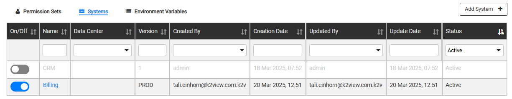

# Environment Systems Tab

A [TDM System](05_tdm_gui_product_window.md) (product) represents a system or application installed in a source or target environment. Each Testing environment must have at least one system, which can be added, edited or deleted from the environment by either an Admin user or the [Environment Owner](08_environment_window_general_information.md#environment-owners).  

An environment's systems are displayed in the Environment window's **Systems tab**:

- To add a system to an environment, click **Add System**, populate the system's settings and then click **Add**.
- To open a selected system, click the **Name** of the system. Edit it if required and then click **Save Changes**. 
- To delete a system, click the  icon in the right corner of the System window.

## Environment System Window 

The System window holds the following settings:

- **System Name**: Select a system from the drop-down list.
- **System Version**: The version of the installed system in the environment. For example, the Production environment has CRM V1 and the Dev1 environment has CRM V1.5. Select a version from the drop-down list. Note that the **synthetic** version is set on each system that is added to the **Synthetic and AI environments**. 

  Click for more information about [supporting multiple system versions via TDM](/articles/TDM/tdm_implementation/13_tdm_implementation_supporting_different_product_versions.md).

  Note that the connection details of the data sources (interfaces) of a system in an environment are populated and saved in Fabric.

### Affinity and Maximum Number of Workers

- From **TDM 9.5** onwards, TDM supports configuring **affinity** and/or the **maximum number of workers** at both the **TDM environment level** and the **task level**. These settings provide greater control over resource allocation and workload distribution during task execution.
- **Affinity**: This optional setting can be populated either with the **Data Center** where the system is physically located in the environment or with a **logical ID**. For example, *ENV1* may have CRM in NY and Billing in TX. Select an affinity from the drop-down list.
- **Maximum number of workers**: This optional setting is populated by default with the value defined in the [Fabric config.ini](/articles/02_fabric_architecture/05_fabric_main_configuration_files.md#configini) or in the [TDM_GENERAL_PARAMETERS table](/articles/TDM/tdm_configuration/02_tdmdb_general_parameters.md). You can override this value at the environment level. Note that the maximum number of workers cannot exceed the value defined in the Fabric `config.ini` file.
- Both attributes—**Affinity** and **Maximum number of workers**—are passed to the [batch process](/articles/20_jobs_and_batch_services/12_batch_sync_commands.md) initiated by the task execution process for the system.

### Disabling the Environment's Systems

One or multiple systems may be temporarily disabled in an environment, e.g., disabling the CRM for UAT environment. TDM 9.3 has added the ability to disable the environment's systems in the TDM portal and as a result, disable executing tasks on the disabled systems.

By default, the environment's systems are enabled. Set the system's toggle to **Off** in order to disable a system and click the **Save Changes** button to save the change in the TDM DB. 

As you can see in the below example, the CRM system is disabled:

 
