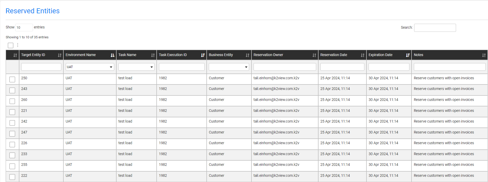
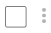
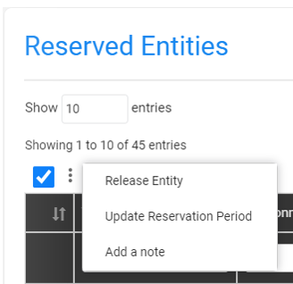

# Reserved Entities Window

The Reserved Entities window enables a management of the [reserve entities](/articles/TDM/tdm_architecture/08_entity_reservation.md).

Each user can view the list of reserved entities on their environments:

- Admin user can view the full list of reserved entities on all environments.
- Environment owners can view the list of reserved entities on their environments.
- Testers can view the list of reserved entities on the environments that they are attached to. A tester can view the full list of reserved entities on their environment even if these entities are reserved by other users to avoid running functional tests on entities reserved by other users.

The Reserved Entities window enables the user to view, update, or release the selected entities. The user can search for an entity or filter the entities by their attributes. For example- view entities of a selected environment:

## Limit the Number of the Reserved Entities in the Window

By default, the TDM GUI displays all the reserved entities on the user's environments. It is possible to limit the number of the entities in the window by populating a number in the  **GET_RESERVED_ENTITIES_LIMIT** shared Global imported from the TDM Library (by default, it is populated with zero). 

## Selecting Entities for Update or Release

You can check a list of entities or click the icon to select all entities. Note that if you filter the displayed entities, the select all option will only select the displayed entities.

#### Tester Users

Users that are attached to TDM environments as testers can release the entities, reserved them.

#### Environment Owners

The environment owners can release all entities in their environment even if the entities have been reserved by other users.

#### Admin Users

Admin users can release all entities in all the TDM environments.

## Reserved Entities - Activities

Click the three dots next to three dots icon and select one of the following activities:

### Release Entity

Release the reserved entity to be available for all users. The entity release deletes the entity from the [reserve entities TDM table](/articles/TDM/tdm_architecture/08_entity_reservation.md#reserved-entitys-attributes).

### Update the Reservation Period

The user can set a new end date of the reservation period.

Note that if the user is attached to the environment as a tester, the updated reservation period is validated to verify that it does not exceed the [maximum reservation period](/articles/TDM/tdm_architecture/08_entity_reservation.md#who-can-reserve-entities), allowed for a tester.

### Add a Note on the Reserved Entities

The user can add a note (free text) to the selected entities.

 

