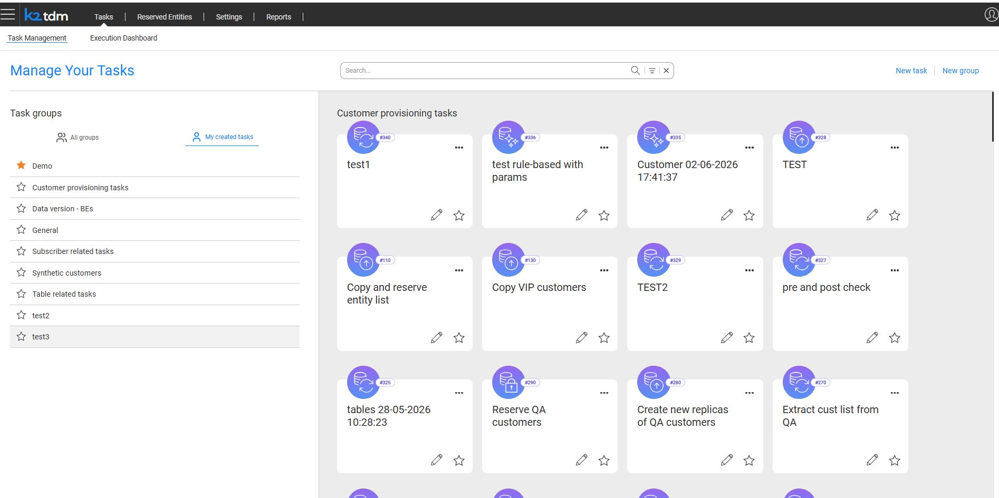
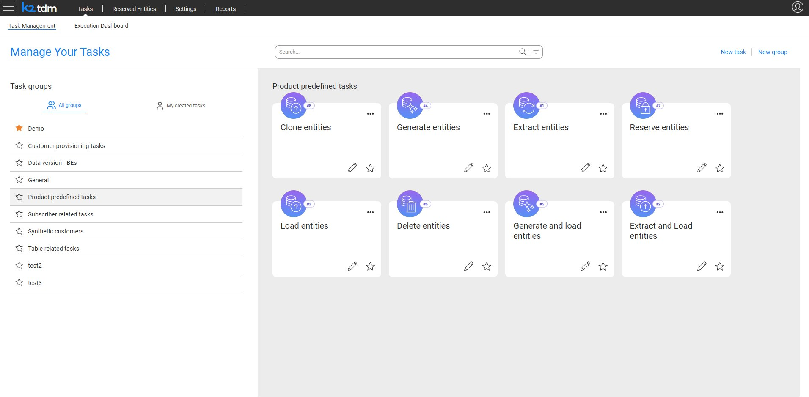
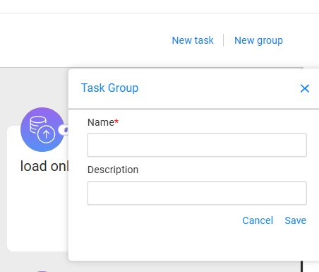
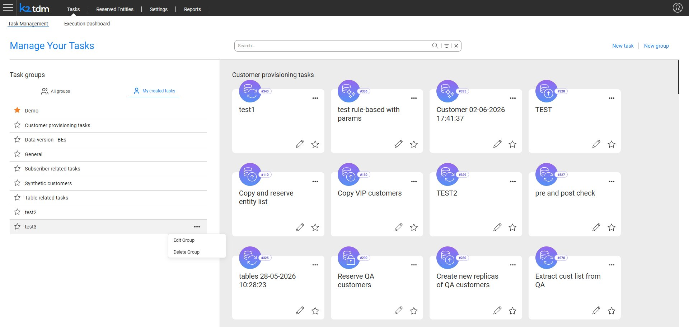
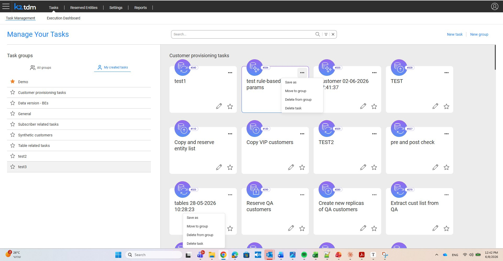
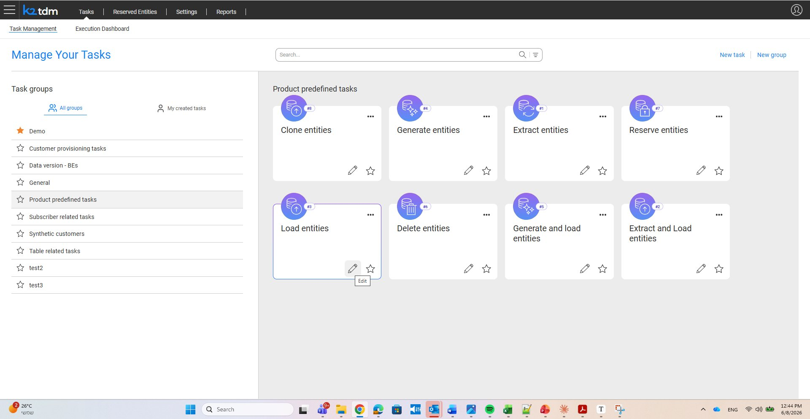
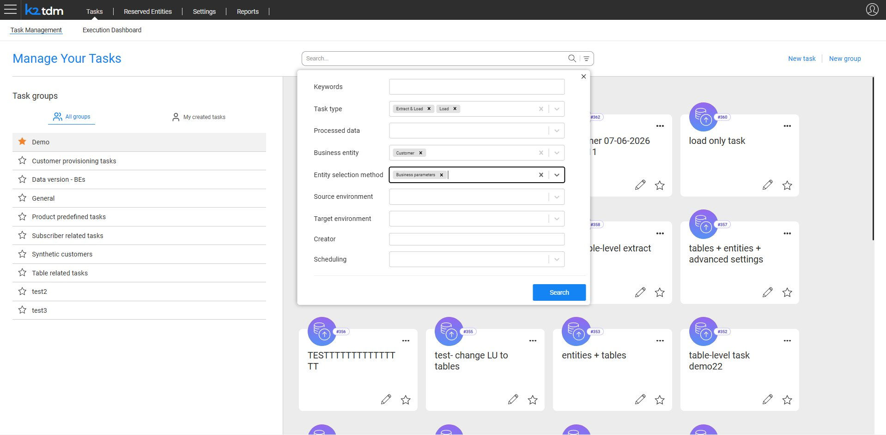

# Task Management Window

The Task Management window is the home page of the TDM App. It is the central hub for browsing, organizing, and acting on TDM tasks. The window opens when the user clicks **Tasks** in the top navigation bar and selects the **Task Management** tab.

## Window Layout

The Task Management window is divided into two panels:

- **Left panel — Task Groups**: Lists all available task groups. Users can toggle between **All groups** and **My created tasks** to filter the view.
- **Right panel — Task Cards**: Displays the tasks that belong to the selected group, presented as cards in a grid layout.

The header bar provides a **Search** field, and the top-right corner provides the **New task** and **New group** actions.

## Task Groups

Tasks are organized into logical groups by domain, team, or use case. Grouping helps task runners find the right task quickly without navigating a flat list.

The left panel displays all available task groups. Clicking a group name filters the right panel to show only the tasks belonging to that group.

Groups marked with a star (★) are pinned to the top of the list as favorites.

### Viewing Tasks

- **All groups** — shows tasks across all groups the user has access to.
- **My created tasks** — filters the view to show only tasks created by the logged-in user.

### Product Predefined Tasks

The **Product predefined tasks** group contains a set of built-in tasks provided out of the box, covering the standard TDM actions: Extract entities, Extract and Load entities, Load entities, Clone entities, Generate entities, Generate and load entities, Reserve entities, and Delete entities.

These generic tasks are created with an empty Business Entity (BE) and environments. They can be executed as-is when the task runner populates the required information in the task execution window, or edited by a TDM Admin user to better fit the organization's business needs.

### Creating a New Group

Click **New group** in the top-right corner of the window. A **Task Group** dialog opens, where you can enter a group **Name** (required) and an optional **Description**. Click **Save** to create the group.

### Managing Groups

Hovering over a group name in the left panel reveals a **⋯** menu with the following options:

- **Edit Group** — update the group name or description.
- **Delete Group** — remove the group. Tasks assigned to the group are not deleted.

## Task Cards

Each task is displayed as a card in the right panel. The card shows the task name and a task-type icon with the task ID number. The following actions are available on each card:

- **Edit** (pencil icon) — opens the task for editing.
- **Favorite** (star icon) — marks the task as a favorite. Favorited tasks are pinned to the top of their group.
- **⋯ menu** — opens additional options:
  - **Save as** — creates a copy of the task as a new task.
  - **Move to group** — moves the task to a different group or adds it to an additional group.
  - **Delete from group** — removes the task from the current group without deleting it.
  - **Delete task** — permanently deletes the task.

A task card can also be dragged from one group to another directly in the left panel, as an alternative to using the **Move to group** option.

To open a task for execution, click the task card.

> **Note:** Hovering over the pencil icon on a task card displays an **Edit** tooltip confirming the action.

## Search and Filtering

The Search bar at the top of the window supports both quick text search and structured filtering.

- **Keyword search** — type any keyword to filter tasks by name.
- **Advanced filters** — click the filter icon (≡) next to the search field to open the advanced filter panel.

### Advanced Filter Panel

The advanced filter panel provides the following filter fields:

<table>
  <thead>
    <tr>
      <th>Filter</th>
      <th>Description</th>
    </tr>
  </thead>
  <tbody>
    <tr>
      <td><strong>Keywords</strong></td>
      <td>Free-text search across task names and descriptions</td>
    </tr>
    <tr>
      <td><strong>Task type</strong></td>
      <td>Filter by task action type, such as Extract &amp; Load or Load</td>
    </tr>
    <tr>
      <td><strong>Processed data</strong></td>
      <td>Filter by the type of data the task processes</td>
    </tr>
    <tr>
      <td><strong>Business entity</strong></td>
      <td>Filter by business entity, such as Customer</td>
    </tr>
    <tr>
      <td><strong>Entity selection method</strong></td>
      <td>Filter by the entity selection method, such as Business parameters</td>
    </tr>
    <tr>
      <td><strong>Source environment</strong></td>
      <td>Filter by the task's source environment</td>
    </tr>
    <tr>
      <td><strong>Target environment</strong></td>
      <td>Filter by the task's target environment</td>
    </tr>
    <tr>
      <td><strong>Creator</strong></td>
      <td>Filter by the user who created the task</td>
    </tr>
    <tr>
      <td><strong>Scheduling</strong></td>
      <td>Filter by scheduling configuration</td>
    </tr>
  </tbody>
</table>

Click **Search** to apply the selected filters. Click **✕** in the search bar to clear active filters and return to the full task list.

### AI-Assisted Task Search

In addition to manual search and filters, the TDM App includes an optional AI assistant for task discovery. Task runners can describe what they need in plain language, and the AI agent finds the matching task and pre-populates execution parameters automatically — reducing setup time and errors for non-expert users.

## Creating a New Task

Click **New task** in the top-right corner of the window to open the task creation flow. See [Task Components](14_task_conponents.md) for details on creating and configuring tasks.

## Who Can Access the Task Management Window?

All TDM users — Admin, Owner, and Tester — can access the Task Management window. The tasks displayed depend on the user's permission group and the execution permissions set by each task's creator.

