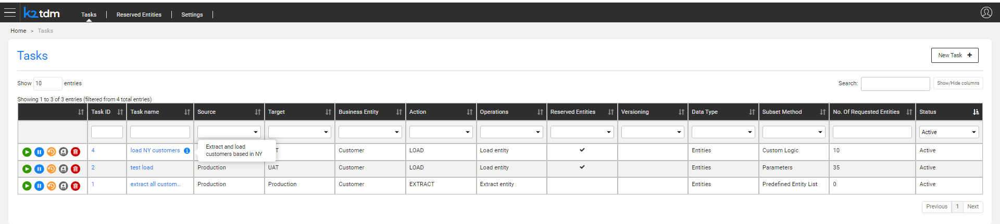
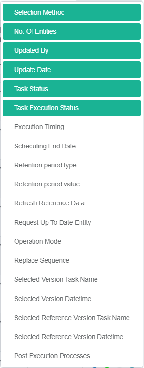
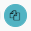

# TDM Task Overview

Data provisioning and entity reservation are implemented by creating and executing TDM tasks. 

A TDM task is created in the TDM GUI. It holds a list of instructions and settings that define the type and subset of processed entities, the source and target environments and additional information. For example, create a task to copy 5 customers with small and medium business plans from Production into the UAT1 target environment.

The actual data provisioning and/or entity reservation is performed by the task execution where each task can be executed multiple times.

## Task Types

The following task types are supported by TDM:

- **Extract**, extracts the selected entities and/or Reference tables from the selected source environment and saves this data in Fabric for later use.
- **Load**,  provisions  the selected entities and/or Reference tables to the selected target environment.
- **Delete**, deletes the selected entities from the target environment.
- **Reserve**, reserves the selected entities in the target environment.

A TDM task can have a combination of multiple task types.

The following table describe the valid combinations of task types on a TDM task: 

<table width="900pxl">
<tbody>
<tr>
<td width="300pxl">

<strong>Combination</strong>

</td>
<td width="600pxl">

<strong>Description</strong>

</td>
</tr>
<tr>
<td width="300pxl">

Extract

</td>
<td width="600pxl">
<ul>
<li>Extract the data from the source environment into the TDM warehouse.</li>
</ul>
</td>
</tr>
<tr>
<td width="300pxl">

Extract + Load

</td>
<td width="600pxl">
<ul>
<li>Refresh all data from the source and provision(load) the data to the target environment.</li>
</ul>
</td>
</tr>
<tr>
<td width="300pxl">

Extract + Load + Reserve

</td>
<td width="600pxl">
<ul>
<li>Extract the data from the source environment.</li>
<li>Provision (load) the data to the target environment and mark the entities as reserved.</li>
</ul>
</td>
</tr>
<tr>
<td width="300pxl">

Extract + Load + Delete

</td>
<td width="600pxl">
<ul>
<li>Extract the data from the source environment.</li>
<li>Delete and reprovision (reload) the data to the target environment.</li>
</ul>
</td>
</tr>
<tr>
<td width="300pxl">

Extract + Load + Delete + Reserve

</td>
<td width="600pxl">
<ul>
<li>Extract the data from the source environment.</li>
<li>Delete and reprovision (reload) it to the target environment.</li>
<li>Mark the entities as reserved.</li>
</ul>
</td>
</tr>
<tr>
<td width="300pxl">

Load

</td>
<td width="600pxl">
<ul>
<li>Get the data from the TDM warehouse and provision it to the target environment.</li>
</ul>
</td>
</tr>
<tr>
<td width="300pxl">

Load + Reserve

</td>
<td width="600pxl">
<ul>
<li>Get the data from the TDM warehouse and provision it to the target environment.</li>
<li>Mark the provisioned entities as reserved.</li>
</ul>
</td>
</tr>
<tr>
<td width="300pxl">

Load + Delete

</td>
<td width="600pxl">
<ul>
<li>Get the data from the TDM warehouse.</li>
<li>Delete and reprovision (reload) it to the target environment.</li>
</ul>
</td>
</tr>
<tr>
<td width="300pxl">

Load + Delete + Reserve

</td>
<td width="600pxl">
<ul>
<li>Get the data from the TDM warehouse.</li>
<li>Delete and reprovision (reload) it to the target environment.</li>
<li>Mark the entities as reserved.</li>
</ul>
</td>
</tr>
<tr>
<td width="300pxl">

Delete

</td>
<td width="600pxl">
<ul>
<li>Delete (clean) the entities from the target environment.</li>
</ul>
</td>
</tr>
<tr>
<td width="300pxl">

Reserve

</td>
<td width="600pxl">
<ul>
<li>Reserve entities in the target environment.</li>
</ul>
</td>
</tr>
</tbody>
</table>

## Who Can Create a Task?
-  Admin users.
-  Environment owners can create a TDM task for their environment.
-  Testers who can create a TDM task for the environments they are attached to by a [TDM Environment Permission Set](10_environment_roles_tab.md):
   - Source environment, testers must be attached to the source environment by a role with [Read](10_environment_roles_tab.md#read-and-write-and-number-of-entities) access.
   - Target environment, testers must be attached to the target environment by a role with [Write](10_environment_roles_tab.md#read-and-write-and-number-of-entities) access.

## TDM Tasks List Window

The TDM Task List displays the following:

- Task ID.
- Task Title: task name.
- Task's source and target environments.
- BE name.
- Task Type: Extract, Load, Delete, or Reserve.
- Task's Operation mode. An additional information about the task when multiple task types are set in the task. For example: Delete and load entity..
- Reserve Ind: indicates if the task [reserves](/articles/TDM/tdm_architecture/08_entity_reservation.md) the entities.
- [Data Versioning](15_data_flux_task.md), true / false.
- Data Type: Entities and/or Reference 
- Selection Method: selection criteria for entities.
- Number of processed entities.
- General parameters like created by user and update date. 

The following screenshot shows an example of the TDM Task List. 

  

  

1. Click **Show/Hide Columns** to open a popup window displaying the list of available fields for each task. Fields in green are displayed by default. 

2. To display additional fields, click the fields.

3. To remove a field from the display, click the field:

   

4. To find a field, click **Search** and filter the displayed tasks using the filters.

The TDM GUI displays a list of icons next to each task record:

- [Execute Task](26_task_execution.md). 
-  [Hold Task](26_task_execution.md#holding-task-execution), set the task on-hold temporarily.
-  Save As, copy the task into a new task.
- [Task Execution History](27_task_execution_history.md), display the execution history of the selected task.

## How Do I Create or Edit a Task?

1. Click **New Task** in the right corner of the Tasks List window.
2. To open a selected task, click the **Task Title** (task name) of the task.
3. Click the **Back** of **Next** buttons to move between the tabs. 
4. Click **Finish** in the last tab to create the task.
Once the task has been edited a new version with a new task_id is created. The old version is saved in the TDM DB for tracking purposes and its status is set to Inactive.

## Task Tabs 

### Mandatory Tabs

#### 1. [General](14a_task_general_tab.md)

Main task's information: 

- Task title (name)
- Task type(s)
- Business Entity
- Environment(s)

#### 2. Additional Execution Parameters

Data type (Entities and/or Reference tables), Data Versioning, Reservation/Retention Period, Post Execution Processes, etc..

The list additional execution parameters are set based on the selected task types and the user's permissions.

#### 3. Requested Entities

Entities' selection method.The Requested Entities tab is opened if the task processes entities.

#### 4. [Execution Timing](22_task_execution_timing_tab.md) 

Execution by request or Scheduled Execution.

### Optional Tabs

#### [Task Variables](23_task_globals_tab.md)

Set the value of variables on the task level.

#### [Reference](24_task_reference_tab.md)

Select reference table(s) if the task includes reference tables.

 

