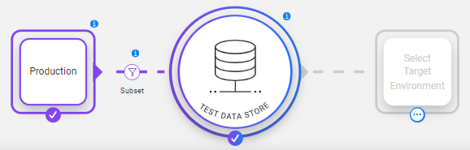
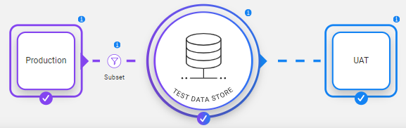
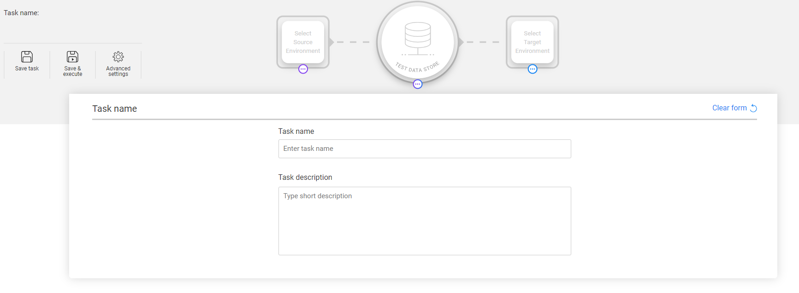

# TDM Task Overview

Data generation or extract, provisioning, and entity reservation are implemented by creating and executing TDM tasks. 

A TDM task is created in the TDM Portal. It holds a list of instructions and settings that define the data source, task actions, subset of processed entities and/or tables, the target environments and additional information. For example, extract 5 customers with small and medium business plans from Production and load them into the UAT target environment.

The actual data processing and/or entity reservation is performed by the task execution, where each task can be executed multiple times.

## Task Actions

The following task actions are supported by TDM:

- **Extract** - extracts the selected entities and/or tables from the selected source environment. The data can be saved in the Test Data Store (Fabric) for a later use.
- **Generate** - generates synthetic entities. Either one of the entities' generation methods can be applied: rule-based data generation or AI-based data generation. 
- **Load** - provisions the selected entities and/or tables to the selected target environment. The target environment can be **AI training** to run AI-based training on a subset of entities. 
- **Delete** - deletes the selected entities from the target environment.
- **Reserve** - reserves the selected entities in the target environment.

## Task Architectural Widget

TDM 9.0 redesigns the task creation flow in order to simplify the task creation or edit and make it more intuitive. A **graphic architectural widget** guides the user on the task’s related component:

- [Source](14a_task_source_component.md) – defines the data source of task’s entities and/or tables. The data source can be either a source environment or a synthetic data generation.

- [Subset](15_task_subset_component.md) – defines the entities’ subset or the tables’ filter. For example, select 50 customers that live in NY and have a Gold status.

- [Test Data store](16_task_test_data_store_component.md) – this is Fabric that can be used as a staging DB to save the task’s entities and/or tables.

- [Target](17_task_target_component.md) – defines the target environment for the task, which can be either a testing environment or AI training to create a training model for AI-based synthetic entities’ generation.
  

**The task actions are set by components that are selected and set by the user**. The **Test Data Store must be set for all tasks**.

Examples: 

- The user wishes to extract entities from Production and save them in the Test Data Store (Fabric) for a later use. The user needs to select the Source component:

  

  

- The user wishes to extract entities from Production and load them into the UAT environment. The user needs to select both - Source and Target components:

  

The user can click on each one of the components to open its form and update its settings. The task also has *Save task*, *Save & execute* and *Advanced settings* icons.

## Who Can Create a Task?

-  Admin users.
-  Environment owners can create a TDM task for their environment.
-  Testers who can create a TDM task for the environments they are attached to by a [TDM Environment Permission Set](10_environment_roles_tab.md):
   - Source environment, testers must be attached to the source environment by a permission set with [Read](10_environment_roles_tab.md#read-and-write-and-number-of-entities) access.
   - Target environment, testers must be attached to the target environment by a permission set with [Write](10_environment_roles_tab.md#read-and-write-and-number-of-entities) access.

## TDM Tasks List Window

The TDM Task List displays, by default, the list of all Active tasks in the TDM. 
It displays a list of settings on each task and these settings can also be used for filtering the displayed tasks.

The following screenshot shows an example of the Tasks window: 

  

  

1. Click **Show/Hide Columns** to open a pop-up window, which displays the list of available fields for each task. 

2. To display additional fields, click the fields.

3. To remove a field from the display, click the field.

4. To find a field, populate the **Search** box in order to filter the tasks by the searched value.

5. If the task has a description, an information icon is displayed next to the task name. Hover over the information icon to view the task description.

The TDM Portal displays a list of icons next to each task record:

- [Execute Task](26_task_execution.md). 
-  [Hold Task](26_task_execution.md#holding-task-execution), set the task temporarily to On Hold.
-  Save As, copy the task into a new task.
- [Task Execution History](27_task_execution_history.md), display the execution history of the selected task.
-   Delete the task.

## How Do I Create or Edit a Task?

1. Click **New Task** in the right corner of the Tasks List window.
2. To open a selected task, click the **Task Name** of the task.
3. Click the **Back** or **Next** buttons to move between the tabs. 
4. Click **Finish** in the last tab to create the task.
Once the task has been edited, a new version with a new task_id is created. The old version is saved in the TDM DB for tracking purposes and its status is set to Inactive.

## Task Components

### Task Name

When creating a new task or opening a task, the Task name form opens. Populating the Task name and Task description fields is optional. If no Task name is set, a default Task name is generated with some basic information about the task.

You can exit each form, including the Task name form, by clicking any task component. You can re-open the Task Name form by clicking the Task Name in upper the left corner of the window.

### Task Architectural Widget

Each task must include the [Test Data Store] (Fabric) and at least one environment: [Source](14a_task_source_component.md) or [Target]. A task can include Source only, Target only, or both environments.

Click on each one of the components to open and update its form.

### Advanced Settings

The advanced settings include **optional** task settings:

- [Pre and post execution processes]
- [Task variables](23_task_globals_tab.md)
- [Scheduler](22_task_execution_timing_tab.md)

### Save or Save & Execute

The Save icon saves the task in the TDM DB.

The Save & execute icon saves the task in the TDM DB and executes the task.

 

