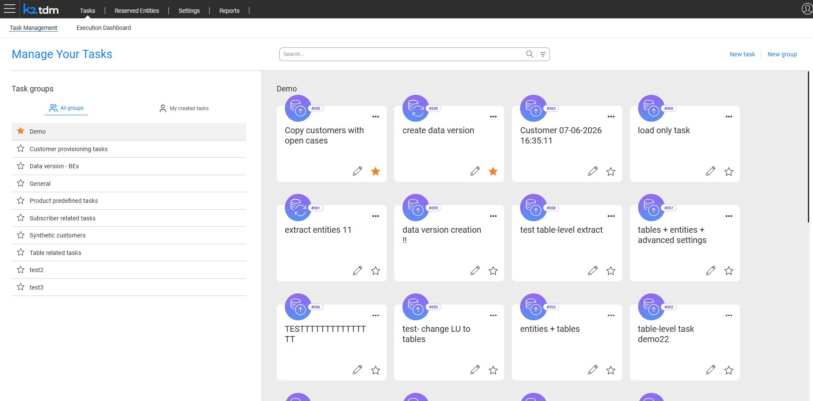

# TDM Task Overview

Data generation or extract, provisioning, and entity reservation are implemented by creating and executing TDM tasks.

A TDM task is created in the TDM App and holds a list of instructions and settings that define the data source, task actions, subset of processed entities and/or tables, the target environments and additional information. For example, a TDM task might: Extract 5 customers with small and medium business plans from Production and load them into the UAT target environment.

The actual data processing and entity reservation are performed during task execution, where each task can be executed multiple times.

## TDM 10: Simplified Task Management and Execution

### Overview

TDM 10 introduces a revolutionary simplified way to provision and manage test data — one that makes it easier for testers, developers, and business users to run tasks independently, with confidence, and without needing deep TDM expertise.

The classic TDM workflow remains fully supported: users can continue creating and executing tasks as they always have. TDM 10 adds a complementary model on top of that — one where expert engineers define governed tasks that can be used as templates, and task runners run them through a clean, guided UI, editing only the attributes the creator has explicitly allowed.

The result is a **governed self-service model that enables non-experts to run approved tasks safely while allowing experts to retain full control over task behavior**.

### A Simpler Way to Execute Tasks

The simplified execution model is designed around two goals: making life easier for testers, and giving task creators better control over what each user group can do.

Rather than requiring every task runner to understand the full scope of a task's configuration, TDM 10 lets qualified engineers set that up once — and then hand off a streamlined execution experience to the people who need it. Task runners get a guided window tailored to their role, with sensible defaults already in place and only the relevant parameters exposed.

This means:

- Testers and business users can run tasks without technical assistance
- Creators retain full control over governance, scope, and defaults
- Each user group sees only the tasks they are permitted to execute
- Only attributes the creator has explicitly unlocked can be changed at runtime

### Key Capabilities in TDM 10

TDM 10 delivers several new capabilities that together make up the simplified task execution experience:

**Tasks as Templates** — Pre-defined tasks can be used as templates. The creator sets the purpose, scope, and default values once; task runners run from that baseline every time. The task itself acts as a reusable template. **Runtime changes apply only to the current execution** and never modify the saved task definition.

**Creator Controls** — Task creators decide, attribute by attribute, what task runners may change. Everything else stays locked, ensuring governance and defaults are preserved across every execution.

**Self-Service UI** — Execution is available directly in the TDM Self-Service portal. A guided window walks task runners through only the parameters relevant to them — no API calls, no technical background required.

**Expanded Parameter Overrides** — A broad set of attributes can now be marked as editable by the creator, giving task runners meaningful flexibility exactly where it's appropriate.

**Task Groups** — Tasks are organized into logical groups by domain, team, or use case, with collapsible group navigation that makes it fast to find the right task without sifting through a flat list.

**Execution Dashboard** — A unified operations center gives each user a complete view of their task activity — history, in-progress runs, and scheduled executions — with the **ability to rerun any previous execution directly from the UI**.

### How Simplified Tasks Work

The model is built on a clear separation of roles.

#### Task Creator

The creator is a qualified engineer or data expert who:

1. Sets the task's purpose, scope, and default parameter values
2. Marks each attribute as either editable (task runner may override) or locked (task runner cannot change)
3. Optionally leaves editable attributes empty, so the task runner provides the value at runtime
4. Assigns which users or Fabric roles are permitted to execute the task

Only users with the appropriate Fabric roles can create tasks.

#### Task Runner

The task runner — a developer, tester, or business user — works in a simple, guided execution window:

1. Sees all task parameters, with a clear visual indication of which are editable
2. Edits only the attributes the creator has unlocked
3. Runs the task without modifying the underlying template
4. Can view and rerun previous executions from the dashboard

Execution never alters the task itself. The template remains intact for future runs.

### Attributes Available for Runtime Override

When defining a task, the creator selects which of the following attributes task runners may adjust at runtime. Anything not marked editable is locked and cannot be changed.

<table>
  <thead>
    <tr>
      <th>Attribute</th>
      <th>What the Task Runner Can Do</th>
    </tr>
  </thead>
  <tbody>
    <tr>
      <td><strong>Business Entity (BE)</strong></td>
      <td>Select a BE at runtime if left empty in the template; locked if populated by the creator</td>
    </tr>
    <tr>
      <td><strong>Source Environment</strong></td>
      <td>Pick a different source environment per run</td>
    </tr>
    <tr>
      <td><strong>Target Environment</strong></td>
      <td>Pick a different target environment per run</td>
    </tr>
    <tr>
      <td><strong><a href="/articles/TDM/tdm_gui/15a_entity_subset.md">Selection Method</a></strong></td>
      <td>The following attributes can be overridden:
        <ol>
          <li>The selection method itself</li>
          <li>Selection method attributes. For example: edit the business parameter values, edit the custom logic flow and/or input parameter values</li>
          <li>Number of entities</li>
        </ol>
      </td>
    </tr>
    <tr>
      <td><strong>Synthetic Data Generation Parameters</strong></td>
      <td>Edit the parameter values and/or add new parameters</td>
    </tr>
    <tr>
      <td><strong>Task Globals (Variables)</strong></td>
      <td>Provide or override values for Fabric Global variables defined in the task</td>
    </tr>
    <tr>
      <td><strong>Entity Reservation</strong></td>
      <td>Enable or disable entity reservation, and set how long reserved entities are held (units and value)</td>
    </tr>
    <tr>
      <td><strong>Data Version (Snapshot)</strong></td>
      <td>Select an existing snapshot to load (load tasks), or set the retention period for a newly extracted data version (extract tasks)</td>
    </tr>
    <tr>
      <td><strong>Per-LU Settings</strong></td>
      <td>Override per-LU execution settings: maximum number of workers, source affinity, and target affinity</td>
    </tr>
    <tr>
      <td><strong>Table Filters</strong></td>
      <td>Adjust filter values applied to reference tables included in the task</td>
    </tr>
    <tr>
      <td><strong>Pre-Execution Process Inputs</strong></td>
      <td>Supply input parameter values for pre-execution processes</td>
    </tr>
    <tr>
      <td><strong>Post-Execution Process Inputs</strong></td>
      <td>Supply input parameter values for post-execution processes</td>
    </tr>
    <tr>
      <td><strong>Execution Note</strong></td>
      <td>Attach a free-text note to the execution for tracking or documentation purposes</td>
    </tr>
  </tbody>
</table>

### Access Control and Task Groups

Task creators control not just *what* task runners can change, but *who* can execute at all.

During task creation, the creator can restrict execution to:

- The creator only
- The creator's user group
- Specific named users or Fabric roles
- All users who are assigned to TDM environments with permission sets that allow task execution.

This permission model integrates directly with Fabric roles, so access follows the same identity framework used across the K2View platform.

Tasks are also assigned to **task groups** — logical collections organized by domain, team, or use case. Task runners browse tasks through collapsible group navigation rather than a flat list, making it much faster to find the right task.

### Simplified Execution at a Glance

<table>
  <thead>
    <tr>
      <th>Capability</th>
      <th>Classic Execution (still supported)</th>
      <th>Simplified Execution — TDM 10</th>
    </tr>
  </thead>
  <tbody>
    <tr>
      <td>Parameter overrides</td>
      <td>Limited UI support; primarily through APIs or task updates</td>
      <td>Full UI support</td>
    </tr>
    <tr>
      <td>Override scope</td>
      <td>Limited set of attributes</td>
      <td>Configurable per attribute by the creator</td>
    </tr>
    <tr>
      <td>Self-service execution</td>
      <td>Requires technical knowledge</td>
      <td>Guided UI, no expertise needed</td>
    </tr>
    <tr>
      <td>Execution permissions</td>
      <td>Open to all permitted users</td>
      <td>Creator controls who can execute</td>
    </tr>
    <tr>
      <td>Rerun previous execution</td>
      <td>Not available in UI</td>
      <td>Supported via Execution Dashboard</td>
    </tr>
    <tr>
      <td>Editable vs. locked parameters</td>
      <td>Not available</td>
      <td>Per-attribute, creator-defined</td>
    </tr>
    <tr>
      <td>Task discovery</td>
      <td>Full task list</td>
      <td>Groups + enhanced search + AI agent</td>
    </tr>
  </tbody>
</table>

## Summary

TDM 10's simplified task execution model makes it easy for any team member to run test data tasks confidently — without needing to understand the full configuration behind them. Expert engineers define the template and the guardrails once. Testers, developers, and business users execute from a clean, guided interface, with exactly the flexibility they need and nothing more.

The classic TDM workflow is still there for those who want it. Simplified execution is an additive capability — a better experience for the teams that need it most.

 
