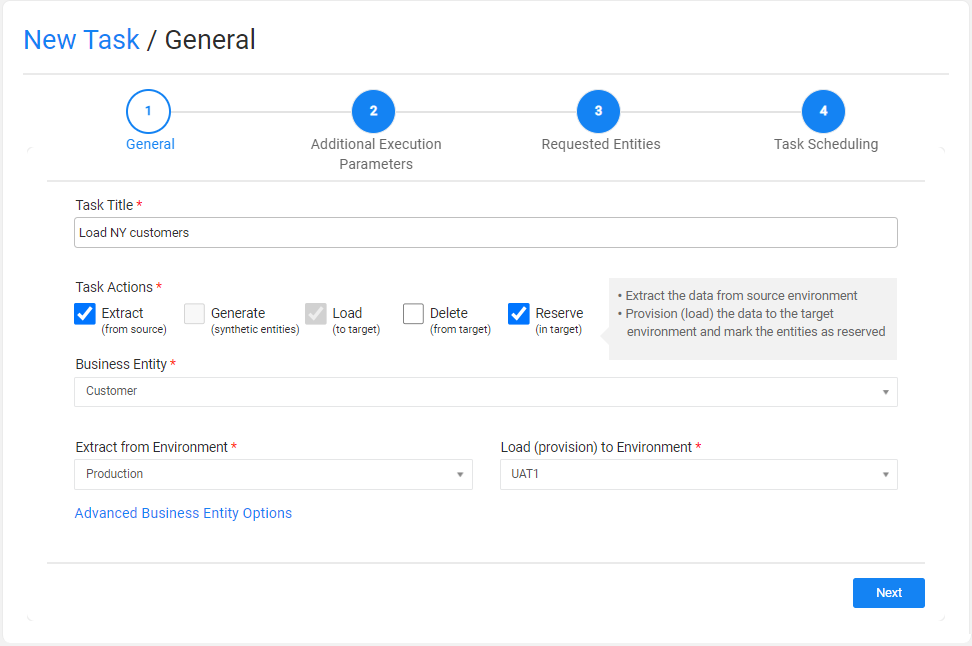
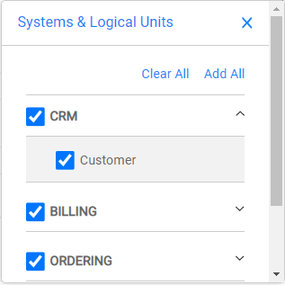

# Task - General Tab

This is the first task tabs and defines the main information on the task. The following information is populated in the General tab:

1. **Task title (name)**. A free text. Note that the task title must 

2. [Task Types](14_task_overview.md#task-types): 

   The following task types are supported by TDM:

   - **Extract**, extracts the selected entities and/or Reference tables from the selected source environment and saves this data in Fabric for later use.
   - **Load**, provisions the selected entities and/or Reference tables to the selected target environment.
   - **Delete**, deletes the selected entities from the target environment.
   - **Reserve**, reserves the selected entities in the target environment.

   At least one task type must be set on the task.

3. 

   - Extract
   - Load
   - Delete
   - Reserve

4. **Business Entity**: the task's [BE](04_tdm_gui_business_entity_window.md). Select a BE from the dropdown list of all the TDM BEs.

5. **Environments**: the environments that need to be set depend on the selected task types:

   <table width="700pxl">
   <tbody>
   <tr>
   <td width="300pxl">
   
<strong>Task Type</strong>

   </td>
   <td width="400pxl">
   
<strong>Selected Environments</strong>

   </td>
   </tr>
   <tr>
   <td width="312">
   
The task types include <strong>Load</strong> (provisioning)

   </td>
   <td width="312">
   <ul>
   <li>Extract from Environment</li>
   <li>Provision to Environment</li>
   </ul>
   </td>
   </tr>
   <tr>
   <td width="312">
   
<strong>Extract</strong> only

   </td>
   <td width="312">
   <ul>
   <li>Extract from Environment</li>
   </ul>
   </td>
   </tr>
   <tr>
   <td width="312">
   
<strong>Delete</strong> only

   </td>
   <td width="312">
   <ul>
   <li>Delete from Environment</li>
   </ul>
   </td>
   </tr>
   <tr>
   <td width="312">
   
<strong>Reserve</strong> only

   </td>
   <td width="312">
   <ul>
   <li>Reserve in Environment</li>
   </ul>
   </td>
   </tr>
   </tbody>
   </table>

   On each environment, the user needs to select one TDM environment from the dropdown list. The dropdown list displays the list of available environments for the user. Only environments that contain [systems with the select task's BE](11_environment_products_tab.md) are displayed.   

6. **Advanced Business Entity Options**, this is an **optional** setting that enables a partial selection of the systems or LUs in the task. The following popup window is opened when clicking this setting:

   

   

The popup window displays the list of systems that are attached to the task's environments and have the task's BE. You can clear the checkbox next to a system to remove all its LUs from the task, or click the expand icon next to the system to view it LUs and clear the LUs that need to be removed from the task. 

Note that is the **Advanced Business Entity Options** is not edited, then the task includes all the LUs that are related to the environments' systems with the task's BE.

 

