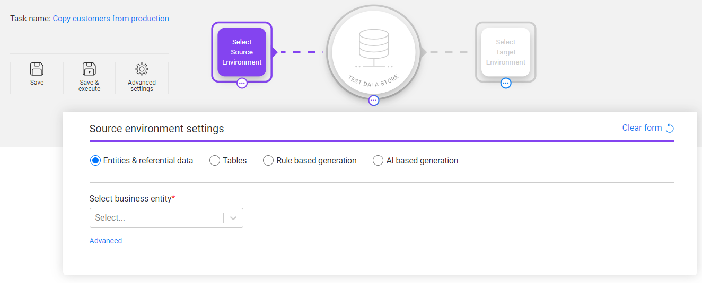

# Task - Source Component

The Source component contains the data source settings: from where the entities and/or tables are taken.

The Source component is mandatory for all tasks except delete-only or reserve-only tasks.

When clicking the Source component, the Source form is opened:

There are 4 options to select the data source for the task:

- [Entities & referential data](14b_task_source_component_entities.md)  - extract Business entities from a source environment. The user can select tables related to the Business entities.  This is the default option.
- [Tables](14c_task_source_component_tables.md) - select a list of tables from a source environment.
- Synthetic entities generation - the user can select either one of the synthetic data generation methods to generate entities: 
  - [Rule-based generation](14d_task_source_rule_based_generation.md)
  - [AI-based generation](14e_task_source_ai_based_generation.md)  

Click the Clear form to reset the form if needed.

 

