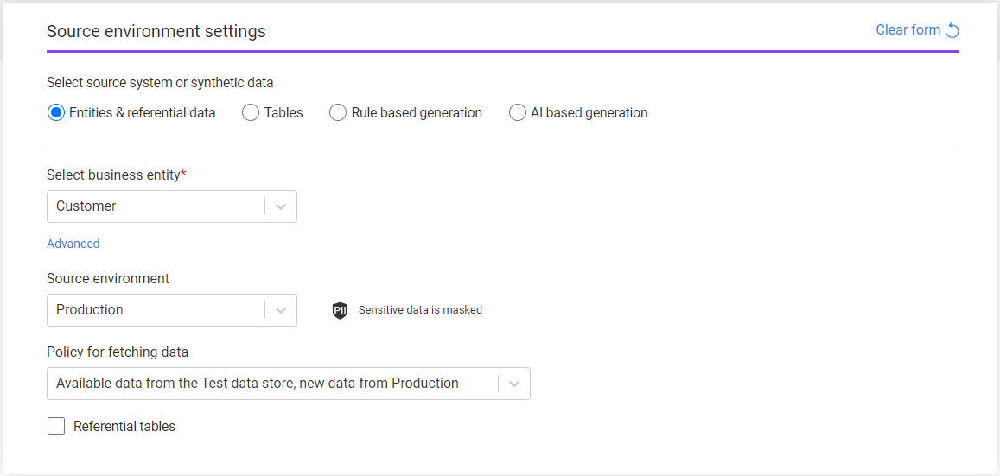
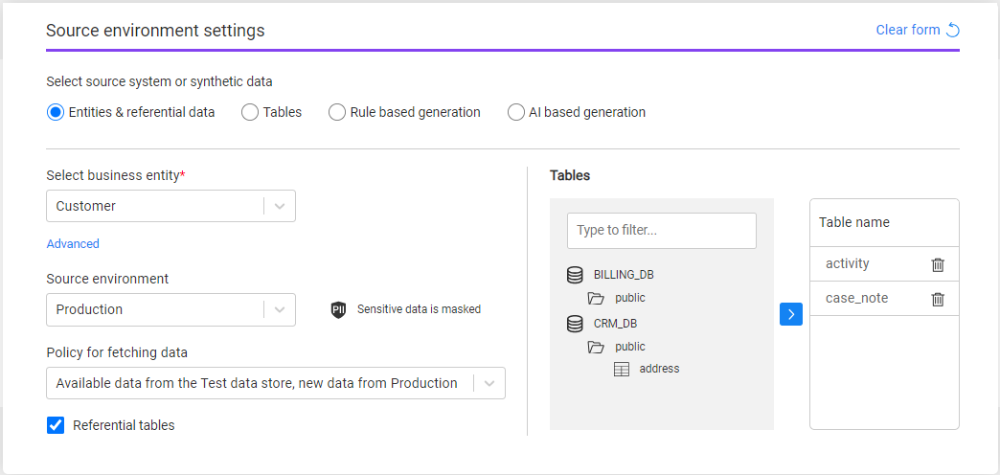

# Task - Source Component - Entities and Referential Data

This option enables to extract Business entities from a source environment. The user can select tables related to the Business entities. This is the default option.

The following information needs to be set for *Entities & referential data*:

### Business entity

The task's [BE](04_tdm_gui_business_entity_window.md). Select a BE from the drop-down list of all the TDM BEs. The **Advanced** setting is **optional** and it enables a partial selection of the systems or the LUs in the task. Click the Advanced option to open a pop-up window with the selected BE's systems and LUs. Note that if the selected source environment does not contain all the BE's systems and LUs, the TDM portal automatically removes the LUs that are not included in the source environment and gives a warning to the user.  

### Source environment

Select one TDM environment from the drop-down list. The drop-down list displays the list of available source environments for the user. Only environments that contain [systems with the select task's BE](11_environment_products_tab.md) are displayed. If the source environment is defined as containing sensitive data in the [Environment window](08_environment_window_general_information.md#mask-sensitive-data), the TDM task window display the PII icon to indicate to the user that the source sensitive data is masked. 

### Policy for fetching data

This setting defines whether the data needs to be extracted from the source environment or whether it can be retrieved from the Test Data Store (Fabric). The following options are available:

1. **Available data from the Test data store, new data from [source environment name]** - this is the default option. When it is selected, new entities will be synced from the source environments. Entities that are already stored in the Test Data Store will be taken from the Test Data Store, unless the sync policy - defined in the LU implementation - states that they need to be synced from the source environment.
2. **All data from [source environment name]** - always sync the data from the source environment. 
3. **Available [source environment name] data in the Test data store** - get the data from the Test Data Store, if exists (extracted from the source environment by previous task executions). The task execution does not access the source environment directly.  
4. **Selected snapshot (version)** - get a selected [data snapshot (version)](15_data_flux_task.md) created in the Test Data Store by previous task executions. The task execution does not access the source environment directly.  

  Notes:

  - Options 1 and 2 are not available if the source environment is set with [Do not Sync](08_environment_window_general_information.md#do-not-sync) option.
  - Option 2 (always sync) is available only for [permitted users](10_environment_roles_tab.md#refresh-all-data-from-source).

​		Click [here](/articles/TDM/tdm_architecture/04_task_execution_overridden_parameters.md#overriding-the-sync-mode-on-the-task-execution) for more information about the task's data sync modes. 

### Referential tables

Check this checkbox to add related tables to the task's entities:

​	Note that the list of available tables must be defined in the TDM implementation.

 

