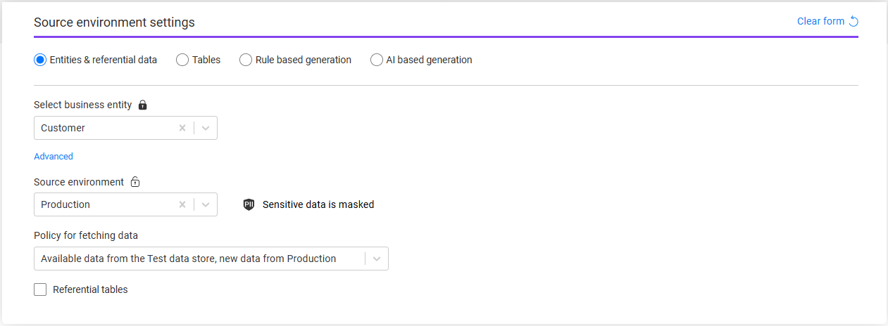
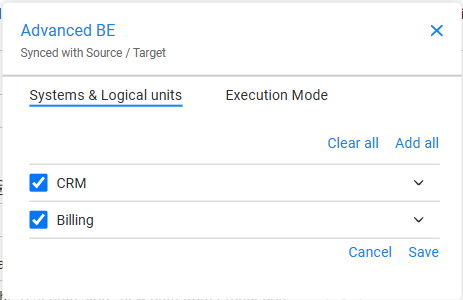
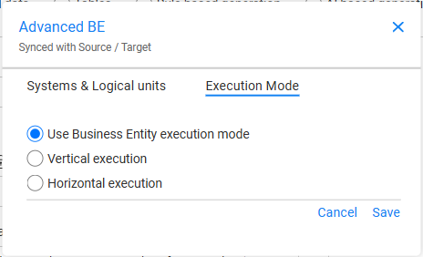
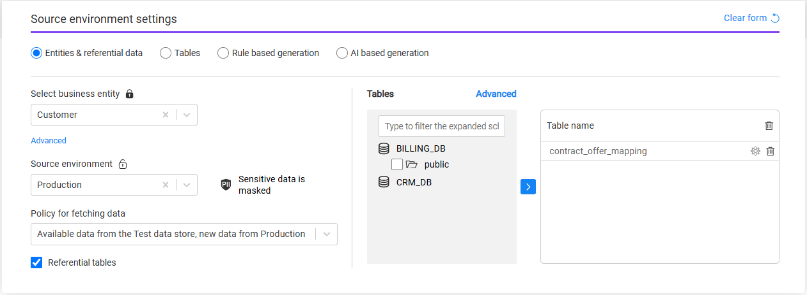

# Task - Source Component - Entities and Referential Data

The Business Entities & referential data option enables to extract Business Entities from a source environment. This is the default option. It also enables the user to add selected tables to the Business Entities.

The following information needs to be set for the *Entities & referential data* option:

### Business Entity

This is the task's [BE](04_tdm_gui_business_entity_window.md). Select a BE from the drop-down list that contains all TDM BEs. The **Advanced** setting is **optional** and it enables either a partial selection of the systems or/and the LUs in the task, or overriding the [task execution mode](04_tdm_gui_business_entity_window.md#task-execution-mode) for the task. When clicking **Advanced**, a pop-up window opens:

#### Advanced BE - Systems & Logical units Tab

This tab displays the selected BE's systems and LUs. Note that if the selected source environment does not contain all the BE's systems and LUs, the TDM portal automatically removes the LUs that are not included in the source environment and gives a warning to the user.  You can remove a System or one of its LUs from the task.

#### Advanced BE - Execution Mode Tab

This tab enables to change the task execution mode:

By default, the task execution mode is taken from the task's Business Entity (BE). However, you can set the task's execution mode to be independent to the BE's execution mode. The following options are available:

- Vertical execution - executing the entire LU hierarchy for each root entity before moving on to the next root entity. Note that this mode is not available for a task that generates [entity clones](17a_task_target_component_entities.md#generate-clones-for-an-entity).
- Horizontal execution - executing the task system by system (LU by LU) where all entities are processed in one LU before moving on to the next system.

The Vertical execution mode can be beneficial when running TDM tasks on a large scale of entities as it ensures better cross-systems data consistency and data alignment.

### Source Environment

Select one TDM environment from the drop-down list. The drop-down list displays the list of available source environments for the user. Only environments that contain [systems with the select task's BE](11_environment_products_tab.md) are displayed. If the source environment is defined as containing sensitive data in the [Environment window](08_environment_window_general_information.md#mask-sensitive-data), the TDM task window displays a message stating that the sensitive data is masked. 

### Policy for Fetching Data

This setting defines whether the data needs to be extracted from the source environment or whether it can be retrieved from the Test Data Store (Fabric). The following options are available:

1. **Available data from the Test data store, new data from [source environment name]** - this is the default option. When selected, new entities will be synced from the source environments. Entities that are already stored in the Test Data Store will be taken from the Test Data Store, unless the sync policy - defined in the LU implementation - states that they need to be synced from the source environment.
2. **All data from [source environment name]** - always sync the data from the source environment. 
3. **Available [source environment name] data in the Test data store** - get the data from the Test Data Store, if exists (extracted from the source environment by previous task executions). 
4. **Selected snapshot (version)** - get a selected [data snapshot (version)](15_data_flux_task.md) created in the Test Data Store by previous task executions. 

  Notes:

  - Options 1 and 2 are not available if the source environment is set with the [Do not Sync](08_environment_window_general_information.md#do-not-sync) option.
  - Option 2 (always sync) is available only for [permitted users](10_environment_roles_tab.md#refresh-all-data-from-source).
  - The task execution does not access the source environment directly when options 3 or 4 are selected.  

​		Click [here](/articles/TDM/tdm_architecture/04_task_execution_overridden_parameters.md#overriding-the-sync-mode-on-the-task-execution) for more information about the task's data sync modes. 

### Referential Tables

Check this checkbox to add related tables to the task's entities:

​	Note that the list of available tables must be defined in the TDM implementation.

 

