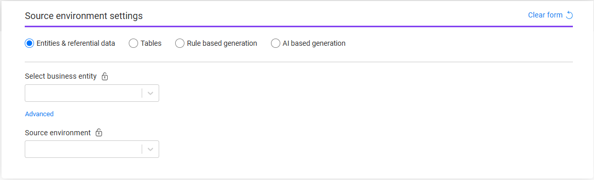
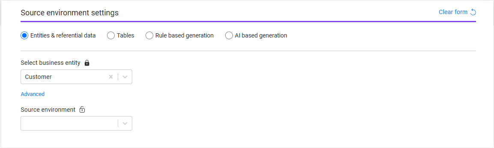
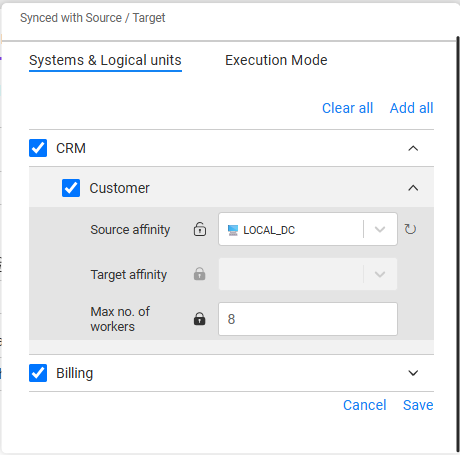

# Task — Source Component — Entities and Referential Data

The Business Entities & referential data option enables the extraction of Business Entities from a source environment. This is the default option. It also enables the user to add selected tables to the Business Entities.

The following information needs to be set for the *Entities & referential data* option:

## Lock Icons

Task fields that support runtime override have a lock icon next to their label. By default, these fields are **locked** — the task creator can click the lock icon to unlock a field and allow the task runner to set or override its value at execution time. See the [full list of attributes available for runtime override](14_task_overview.md#attributes-available-for-runtime-override).

## Business Entity

This field defines the task's [Business Entity (BE)](04_tdm_gui_business_entity_window.md). Select a BE from the drop-down list, which includes all TDM BEs.

The Business Entity field is an exception to the default locking behavior — the lock is **open** by default:

- If the Business Entity is **not populated**, the lock must remain open so the task runner can populate it at execution:

  

- If the Business Entity is **populated** by the task creator, the field becomes locked automatically and cannot be unlocked:

  

The **Advanced** option is **optional** and allows you to:

- Select only specific **systems** and/or **Logical Units (LUs)** for the task.
- Define the **affinity** and **maximum number of workers** per LU. The affinity and maximum number of workers can be defined after populating the Source environment.
- Override the task's default [execution mode](04_tdm_gui_business_entity_window.md#task-execution-mode)

When you click **Advanced**, a pop-up window opens:

### Advanced BE - Systems & Logical units Tab

This tab is available for both **Source** and **Target** components and displays the systems and LUs associated with the selected BE. Advanced BE attributes are synchronized between the Source and Target components.

#### Selected Systems and/or LUs

- If the selected **source environment** does not contain all systems or LUs defined in the BE, the Task window automatically removes the missing LUs and displays a warning.
- You can manually remove an entire **system** or specific **LUs** from the task.

If the selected environment includes [disabled systems](11_environment_products_tab.md#disabling-the-environments-systems) and the **Policy for Fetching Data** extracts data from the source environment, those disabled systems are automatically excluded from the task. 

#### System & Logical Units Tab - Affinity and Max Number of Workers

Starting with **TDM 9.5**, each LU in the **Advanced BE** view supports configuration of:

- **Affinity**
- **Maximum number of workers**

You can expand each LU and configure these values **after selecting an environment**.

By default, each LU inherits its values from:

1. The environment's system settings (if defined), or
2. The TDM and Fabric configuration values

You can **override these values per LU** to control and **optimize task execution** behavior:

The **Source affinity**, **Target affinity**,  and **Max no. of workers** fields each have a lock icon. The task creator can unlock them to allow the task runner to override these values at execution.

The **Target affinity** field is only enabled once the task creator has populated the Target attributes for the task.

When both **Source** and **Target** components are defined for the task (Load, Extract & Load, Generate & Load):

- **Affinity**
  - The task execution process runs using the **target** affinity
  - The entity extraction runs using the **source** affinity
- **Max number of workers**
  - The task execution process uses the maximum number of workers

Click [here](/articles/TDM/tdm_architecture/03b_task_execution_affinity_and_workers_configuration.md) for detailed information on how task execution determines the effective affinity and maximum number of workers.

### Advanced BE - Execution Mode Tab

This tab enables changing the task execution mode:

By default, the task execution mode is taken from the task's [Business Entity (BE)](04_tdm_gui_business_entity_window.md#task-execution-mode). However, you can set the task's execution mode to be independent to the BE's execution mode. The following options are available:

- Vertical execution - execution of the entire LU hierarchy for each root entity before moving on to the next root entity. Note that this mode is not available for a task that generates [entity clones](17a_task_target_component_entities.md#generate-clones-for-an-entity) or synthetic entities generation.
- Horizontal execution - execution of the task system by system (LU by LU) where all entities are processed in one LU before moving on to the next system in the hierarchy.

The Vertical execution mode can be beneficial when running TDM tasks on a large scale of entities as it ensures better cross-systems data consistency and data alignment.

### Source Environment

Select one TDM environment from the drop-down list. The drop-down list displays the list of available source environments for the user. Only environments that contain [systems with the select task's BE](11_environment_products_tab.md) are displayed. If the source environment is defined as containing sensitive data in the [Environment window](08_environment_window_general_information.md#mask-sensitive-data), the TDM task window displays a message stating that the sensitive data is masked.

The Source Environment field has a lock icon. The task creator can unlock it to allow the task runner to select or override the source environment at execution. The source environment can be left empty if its lock icon is open.

### Policy for Fetching Data

This setting defines whether the data needs to be extracted from the source environment or whether it can be retrieved from the Test Data Store (Fabric). The following options are available:

1. **Available data from the Test data store, new data from [source environment name]** - this is the default option. When selected, new entities will be synced from the source environment. Entities that are already stored in the Test Data Store will be taken from the Test Data Store, unless the sync policy - defined in the LU implementation - states that they need to be synced from the source environment.
2. **All data from [source environment name]** - always sync the data from the source environment. 
3. **Available [source environment name] data in the Test data store** - get the data from the Test Data Store, if exists (extracted from the source environment by previous task executions). 
4. **Selected snapshot (version)** - get a selected [data snapshot (version)](15_data_flux_task.md) created in the Test Data Store by previous task executions. 

  Notes:

  - Options 1 and 2 are not available if the source environment is set with the [Do not Sync](08_environment_window_general_information.md#do-not-sync) option.
  - Options 1 and 2 are not available if the tester user does not have a [Read permission set](10_environment_roles_tab.md#read-and-write-and-number-of-entities) on the source environment.
  - Option 2 (always sync) is available only for [permitted users](10_environment_roles_tab.md#refresh-all-data-from-source).
  - The task execution does not access the source environment directly when options 3 or 4 are selected.  

​		Click [here](/articles/TDM/tdm_architecture/04_task_execution_overridden_parameters.md#overriding-the-sync-mode-on-the-task-execution) for more information about the task's data sync modes. 

### Referential Tables

Check this checkbox to add related tables to the task's entities:

​	Note that the list of available tables must be defined in the TDM implementation.

 
