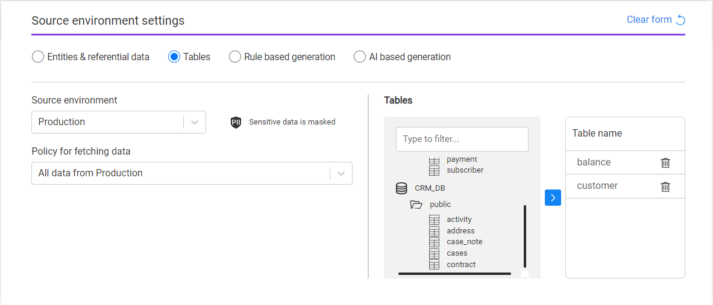
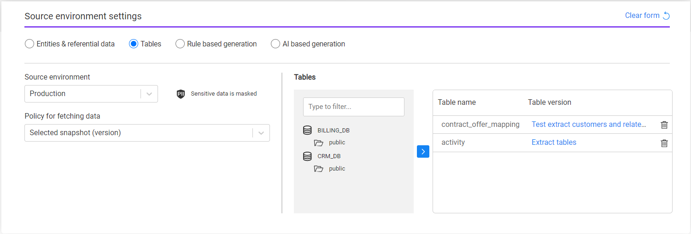
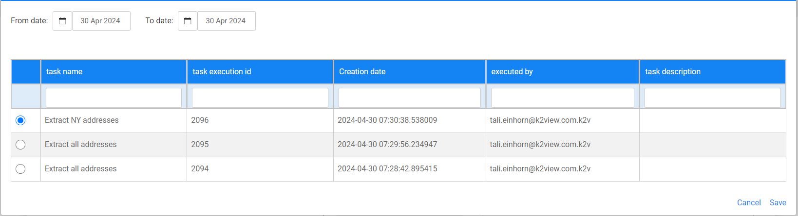

# Task - Source Component - Tables

**Tables** is a data selection option that enables the user to create a TDM task on **tables** only **without a relation to a Business entity**. The user can select all or some tables that are included in the DB interfaces of the selected source environment.

The following information needs to be set for Tables: 

- **Source environment** - select one TDM environment from the drop-down list. The drop-down list displays a list of available source environments for the user. If the source environment is defined as containing sensitive data in the [Environment window](08_environment_window_general_information.md#mask-sensitive-data), the TDM task window display the PII icon to indicate to the user that the source sensitive data is masked. 

- **Policy for fetching data** - this setting defines whether the data needs to be extracted from the source environment or whether it can be retrieved from the Test Data Store (Fabric). The following options are available:

1. **All data from [source environment name]** - extract the tables from the source environment. 
2. **Selected snapshot (version)** - get a selected [data snapshot (version)](15_data_flux_task.md) created in the Test Data Store by previous task executions. The task execution does not access the source environment directly.  

  Note:

  - Option 1 is not available if the source environment is set with [Do not Sync](08_environment_window_general_information.md#do-not-sync) option.

    

- **Tables** - the task displays the source environment's active DB interfaces. On each DB interface, the task displays the related DB schemas and the tables in each schema. Select one or multiple tables and click the blue arrow to include the selected tables in the task. To remove a selected table from the task, click the trash icon next to the selected table. If the **Policy for fetching data** is set to **Select snapshot (version)**, each selected table displays its latest data version:

  

  

  - The **Table version** (shown in the above image) is the name of the task that extracted the table's snapshot. When clicking on it, a pop-up window opens with the list of all available versions (below image), allowing the user to select a different table's version, if needed:

    

  - Note that the Source component defines the tables list. However, a filter on the extracted records for each selected table can be added in the [Subset](15_task_subset_component.md) component.

    

 

