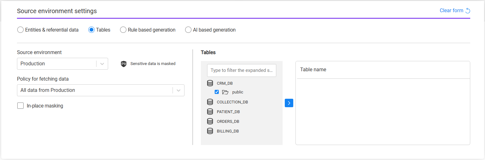
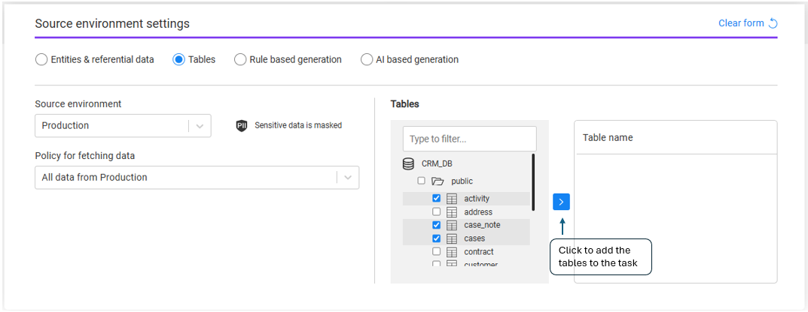
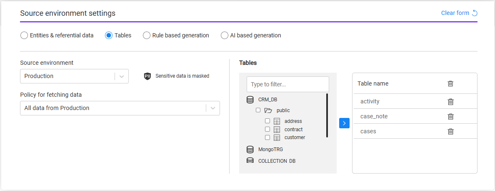
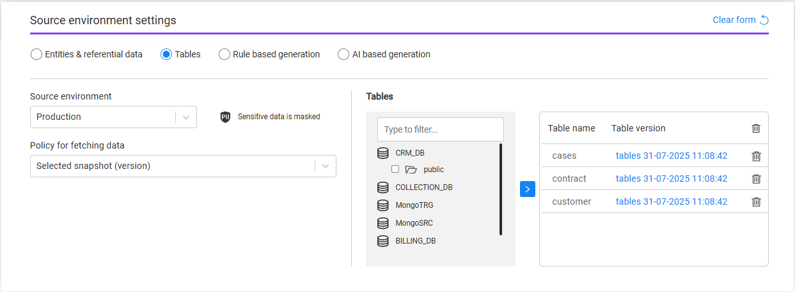
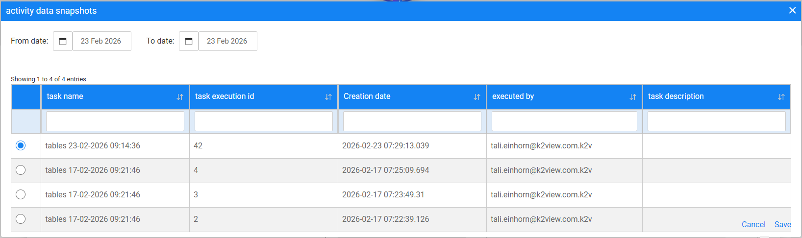
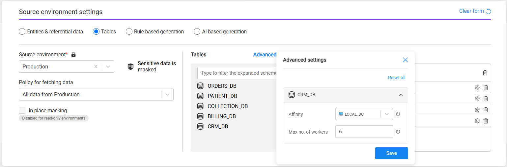
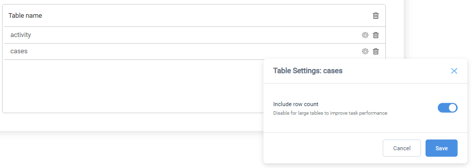

# Task — Source Component — Tables

**Tables** is a data selection option that allows the creation of TDM tasks on **tables** only, **without any association to a Business Entity**. Users can select all or specific tables that are included in the DB interfaces of the chosen **source environment**.

The following information needs to be set for the **Tables** data selection option: 

**Source environment** — select a TDM environment from the drop-down list that displays available source environments. If the selected source environment is defined as containing sensitive data in the [Environment window's settings](08_environment_window_general_information.md#mask-sensitive-data), a PII icon will appear next to the selected source environment, indicating that its 'Sensitive data is masked'. 

**Policy for fetching data** — this setting defines whether the data needs to be extracted from the source environment or can be retrieved from the Test Data Store (Fabric). The following options are available:

1. **All data from [source environment name]** — extract the tables from the source environment. 

2. **Selected snapshot (version)** — retrieve a selected [data snapshot (version)](15_data_flux_task.md) created in the Test Data Store by previous task executions. The task execution does not access the source environment directly.  

   Note that option 1 is not available if the source environment is set with [Do not Sync](08_environment_window_general_information.md#do-not-sync) option.

**Tables** — the task displays the source environment's active interfaces. Click the required interface to view its schemas. If needed, click a schema to view its tables. You can select tables in the task using one of the following methods:

1. Check the checkbox next to the schema to select all of its tables, and click the blue arrow icon to move these tables to the *Table name* area:

2. Click the schema to view its tables, check the checkboxes of the required tables, and click the blue arrow icon to move these tables to the *Table name* area:

Note that the Source component defines the table list. However, a filter on the extracted records for each selected table can be added in the [Subset](15_task_subset_component.md) component.

- Removing selected tables: Click the trash icon next to *Table name* to remove all selected tables from the task, or click the trash icon next to a specific table to remove only that table from the task:

  

- Loading pre-extracted tables: If the **Policy for fetching data** field is set to **Select snapshot (version)**, each selected table displays its latest data version:

​		

The **Table version** (shown in the above image) is the name of the task that extracted the table's snapshot. Upon clicking, a pop-up window appears showing all available versions (see image below), enabling the user to select an alternative table version if required:

## Tables - Advanced Settings

### Affinity and Maximum number of Workers configuration

- Starting with **TDM 9.5**, each **interface** of the selected tables supports configuration of:

  - **Affinity**

  - **Maximum number of workers**

- By default, each interface gets its values from:

  1. The environment’s system settings, if defined and if the [interface is attached to the environment's system](11_environment_products_tab.md#affinity-and-maximum-number-of-workers_) or
  2. The TDM and Fabric configuration values

  You can **override these values per interface** to better control and **optimize task execution behavior**:

#### Source and Target execution behavior

You can configure **Affinity** and **Maximum number of workers** on the **Target** component as well.

When both **Source** and **Target** components are defined for the task (Load, Extract & Load), the task execution uses the **Target** affinity and **Target** maximum number of workers.

Click [here](/articles/TDM/tdm_architecture/03b_task_execution_affinity_and_workers_configuration.md) for more details on how task execution determines the effective affinity and maximum number of workers.

### Disable Table Row Count

Starting with **TDM 9.5**, you can **disable table row count calculation** during task execution to improve performance when row counts are not required.

To configure this setting, click the **settings** icon for the selected table to open the configuration pop-up:

**Note:** You can disable or re-enable table row count only for tables that are eligible for row count, as defined in the [TDM implementation](/articles/TDM/tdm_implementation/09_tdm_reference_implementation.md).

 

