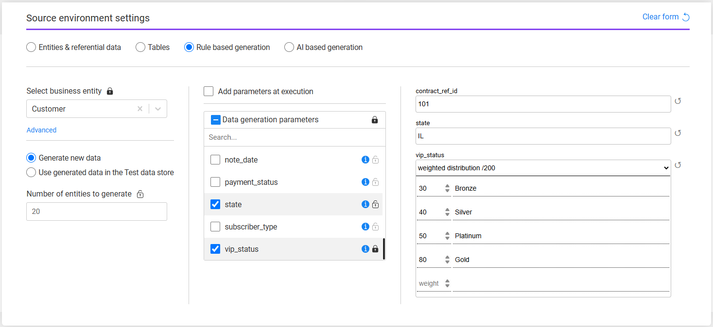
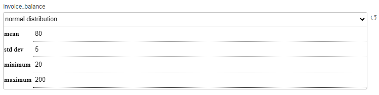
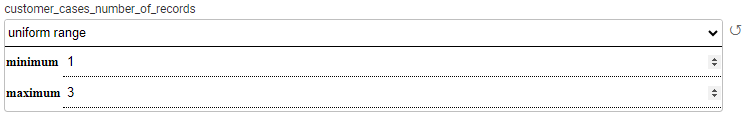
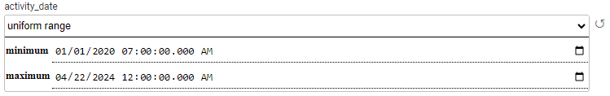
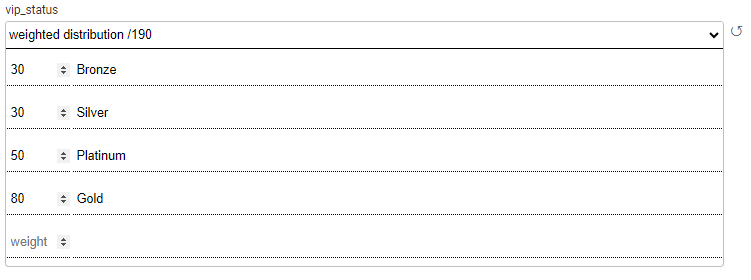
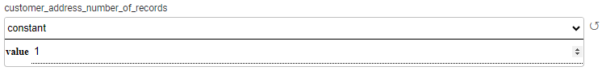

# Task — Source Component — Rule-Based Generation

K2view's TDM supports two modes of generating synthetic entities:

- Rule-based generation
- AI-based generation

The user can select either one of these methods to generate synthetic entities by the task.

The following information needs to be set for **Rule-based generation**:

## Lock Icons

Task fields that support runtime override have a lock icon next to their label. By default, these fields are **locked** — the task creator can click the lock icon to unlock a field and allow the task runner to set or override its value at execution time. See the [full list of attributes available for runtime override](14_task_overview.md#attributes-available-for-runtime-override).

## Business Entity

The task's [BE](04_tdm_gui_business_entity_window.md). Select a BE from the drop-down list of all the TDM BEs. The Business Entity field has a lock icon and follows the same locking behavior described in the [Entities & Referential Data](14b_task_source_component_entities.md#business-entity) article.

The **Advanced** setting is **optional** and enables a partial selection of the systems or LUs in the task. When clicking **Advanced**, a pop-up window opens with the selected BE's systems and LUs.

## Data Generation Options

- **Generate new data** — new entities are generated and stored in the Test Data Store (Fabric). The [Target](17_task_target_component.md) component can optionally be added to load the generated entities into a target environment.
- **Use generated data in the Test data store** — retrieve pre-generated synthetic entities from the Test Data Store and load them into the target environment. Set the entity subset in the Subset component and the target environment in the Target component.

## Generate New Data

The following attributes need to be set in order to generate new entities:

### Number of Entities to Generate

This is a mandatory attribute. The number of entities populated by the tester user is [limited by the tester's environment's permission set](10_environment_roles_tab.md#read-and-write-and-number-of-entities) in the Synthetic environment.

The **Number of entities to generate** field has a lock icon. The task creator can unlock it to allow the task runner to set or override the number of entities at execution time.

### Data Generation Parameters

Data generation parameters are optional. The task creator can select which parameters to include in the task and configure their values.

Each parameter in the list has a lock icon. The task creator can unlock individual parameters to allow the task runner to override their values at execution. The entire **Data generation parameters** section also has a lock icon on its header, which locks or unlocks all parameters at once.

#### Add Parameters at Execution

The **Add parameters at execution** checkbox, when checked, allows the task runner to add data generation parameters at execution time — beyond those already selected by the task creator.

#### Adding/Removing Data Generation Parameters

Check/uncheck the checkbox next to the parameter name to select or remove it. A search field is available to filter parameters. When a parameter is selected, it appears in the right panel with its default values, if set.

Click the information icon next to a parameter to view additional details about it.

#### Resetting a Parameter's Value

Click the refresh icon next to a parameter's editor to reset your changes and return to the previous value. The previous value can be either the default value or the last saved value for that parameter.

### Data Generation — Distribution Parameters

The distribution parameter generates random values according to input distribution settings. The supported distribution types are **normal**, **uniform**, **weighted**, and **constant**.

The user can edit the distribution type and its related settings:

- **Normal** distribution (gaussian) works using **mean** and **stddev** (standard deviation), and can be bound by **minimum** and **maximum** values, both inclusive.

  Example:

  

  In the above example, invoices are generated for the customers, with balances ranging from 20 to 200. Most customers receive an invoice balance of around 80 with a standard deviation of 5.

   

- **Uniform** distribution returns a random value between the **minimum** and **maximum** values.

  Examples:

  i. Each customer will have between 1 and 3 cases for every generated activity:

  

  ii. The generated activities are created with an activity date between 1-Jan-2020 and 22-Apr-2024:  

  

- **Weighted** distribution returns a value from the list, based on the value's weight. Weighted distribution uses a 'weights' map, where the keys are the results and the values are positive numbers indicating the entry's weight as a proportion of the whole list. Both the distributed values and the weights need to be populated manually.

  Example:

  

  In the above example, 16% (30/190) of the generated subscribers get a Bronze status, 16% (30/190) get a Silver status, 26% (50/190) get a Platinum status, and 42% (80/190) get a Gold status.

  

- **Constant** distribution returns the populated value. For example, set the number of generated addresses to one address for each synthetic customer:

  

  

