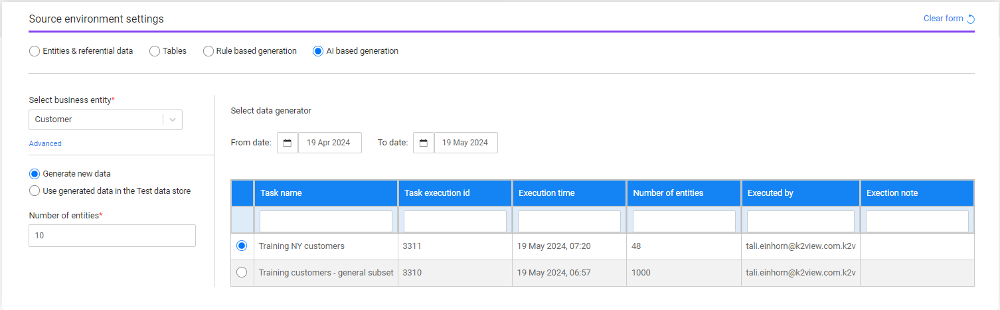
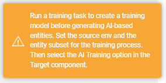

# Task - Source Component - AI-Based Generation

K2view's TDM supports 2 modes of synthetic entities' generation:

- Rule-based generation
- AI-based generation

The user can select either one of these methods to generate synthetic entities by the task.

The following information needs to be set for **AI-based generation**:

- **Business entity** - the task's [BE](https://github.com/k2view-academy/K2View-Academy/blob/Academy_8.0_TDM_9.0/articles/TDM/tdm_gui/04_tdm_gui_business_entity_window.md). Select a BE from the drop-down list of all the TDM BEs. The **Advanced** setting is **optional** and it enables a partial selection of the systems or the LUs in the task. When clicking **Advanced**, a pop-up window opens with the selected BE's systems and LUs. Note that **you can select only one LU for AI-based generation** tasks.

  

- **Data generation options**:

  - Generate new data - new entities are generated. The generated entities are stored in the Test Data Store (Fabric). It is possible to populate also the [Target](17_task_target_component.md) component in the task to load the generated entities to the target environment.
  - Use generated data in the Test data store - get pre-generated synthetic entities from the Test Data Store and load them into the target environment (set in the Target component). Set the entities subset in the Subset component and set the target environment in the target environment.

## Generate New Data 

The following attributes need to be set in order to generate new entities:

- Number of entities to generate - this is a mandatory attribute. The number of entities populated by the tester user is limited by the tester's environment's Read permissions in the [AI environment](/articles/TDM/tdm_gui/10_environment_roles_tab.md#ai-environment---permission-set). 

- Data generator - select a pre-created training model created by a [Training task] for the AI-based generation. The TDM portal displays a warning message to the user if no training model is available for selection:

  

  

