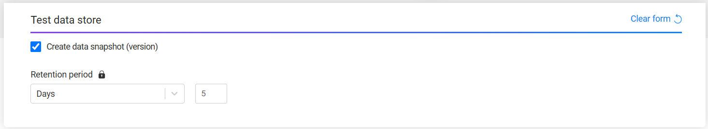

# TDM Data Snapshot (Version) Tasks

K2view's TDM enables saving backup snapshots (versions) of data during the functional testing and then reloading the latest saved snapshot (version) to the target environment, if needed. Once created, the snapshot creation task can be executed multiple times to create different data versions where each version is saved in Fabric.   

This functionality is useful when running a complex testing calendar in a testing environment. Backing up data every X steps or every X times enables testers to reload the latest version to their environment and repair data without returning to the original state and losing their updates. 

Note that the testing environment is often used as a source as well as a target environment for Data Versioning tasks. Therefore, the [Environment Type](/articles/TDM/tdm_gui/08_environment_window_general_information.md#environment-type) must be set to **Both** to enable Data Versioning in an environment.

## How do I Create a Data Snapshot Task?

Check the [Create Data Snapshot](16_task_test_data_store_component.md#create-data-snapshot-checkbox) checkbox in the [Test Data Store](16_task_test_data_store_component.md) task component.

When the **Create data snapshot (version)** checkbox is checked, a **Retention period** field appears. This field defines how long the snapshot is retained in the Test Data Store. The Retention period field has a lock icon — the task creator can unlock it to allow the task runner to set or override the retention period at execution time.

Notes:
- Each task execution generates [new LUIs](/articles/TDM/tdm_implementation/01_tdm_set_instance_per_env_and_version.md#data-versioning-tasks) when creating a data snapshot (version).
- When the task processes tables, each table is saved as a separate version in the Test Data Store.

## Who Can Create a Data Snapshot Task?

The following users can create a data snapshot task:

1. Admin users.
2. Environment owner users.
3. Testers who can create a TDM task for environments with **Data Versioning** permissions that are attached to their [TDM Environment permission set](10_environment_roles_tab.md).

## How do I Load a Data Snapshot?

To load a data snapshot, open the [Subset](15a_entity_subset.md) form. In addition to the standard subsetting settings, the form includes a **Select data version to load** section with a lock icon.

Use the **From date** and **To date** fields to filter the list of available snapshots by date range. The table below displays all matching snapshots with the following details:

- **Version Name** — the name of the task that created the snapshot.
- **Task ID** — the ID of the task.
- **Exec ID** — the execution ID.
- **Version number** — the sequential version number.
- **Logical Unit** — the LU associated with the version.
- **Date** — the date and time the snapshot was created.
- **Notes** — any notes recorded at execution time.
- **Created by** — the user who ran the task.
- **Processed Entities** 
- **Completed Entities**
- **Failed Entities** 

Select the required snapshot from the list to load it. The **Select data version to load** field has a lock icon — the task creator can unlock it to allow the task runner to select a different snapshot at execution time.
