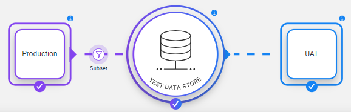
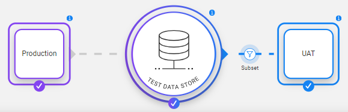
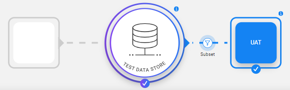

# Task - Subset Component

The Subset component is displayed by the following icon  and contains either of the following:

- [Entity subset](15a_entity_subset.md) -  defines the entity subset for the task when the task extracts entities from the source environment or gets the pre-extracted/pre-generated entities from the Test Data Store. 
- [Table subset](15b_table_subset.md) - an optional setting when the task runs on [tables only](14c_task_source_component_tables.md). It enables the user to filter the extracted records for the task's tables. 

The entity subset is **mandatory** when the task extracts **entities** or from the source environment or gets the pre-extracted/pre-generated entities from the Test Data Store.  

The table subset is **optional** for tasks that are created for **tables only**. Note that the TDM does not support a table subset when selecting [Entities & referential data](14b_task_source_component_entities.md) in the task's Source component.

In general, the Subset component is located between the [Source](14a_task_source_component.md) and [Test data store] components to reflect the data subset extracted from the source or synthetically generated:

However, when the data is not extracted from the source, the subset moves and is located between the [Test data store] and the [Target] components:  

- Getting pre-extracted or pre-generated data from the TDM test data store:

  

- [Delete only](17b_task_target_component_entities.md#delete)  and [Reserve only](17b_task_target_component_entities.md#reserve) tasks - the Source component is disabled:

  

 
