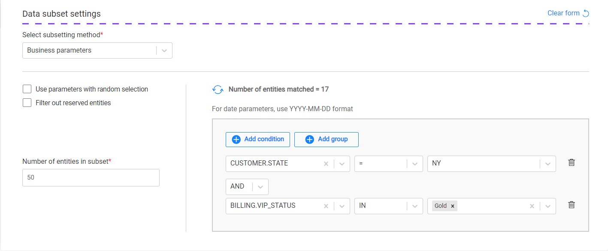
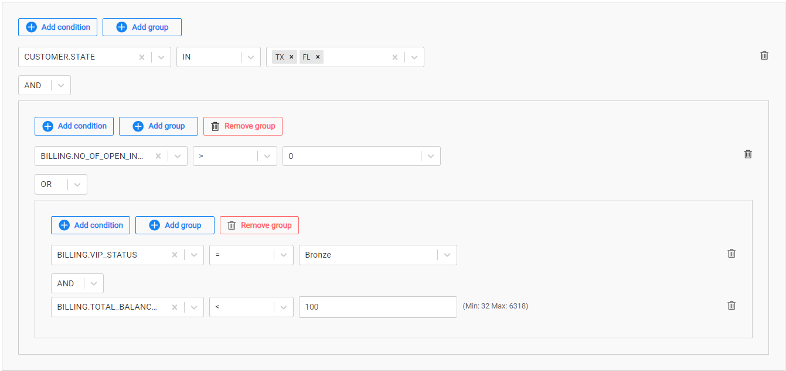
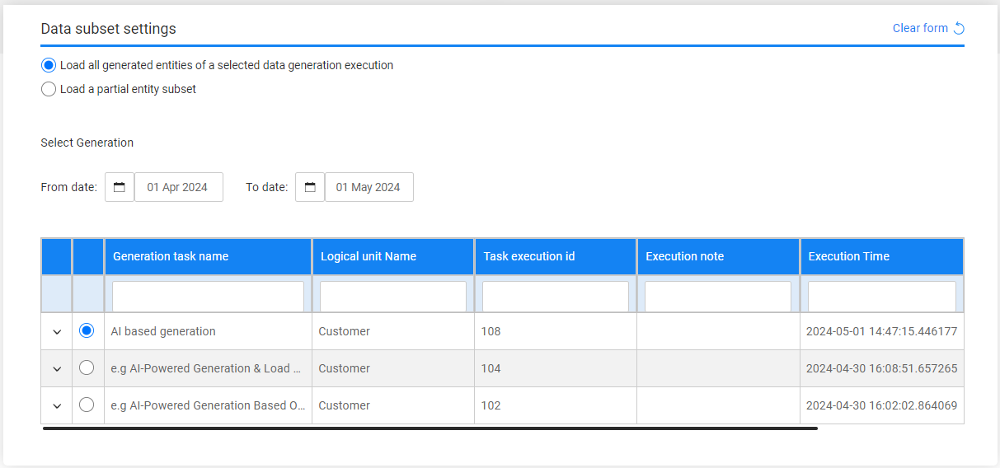
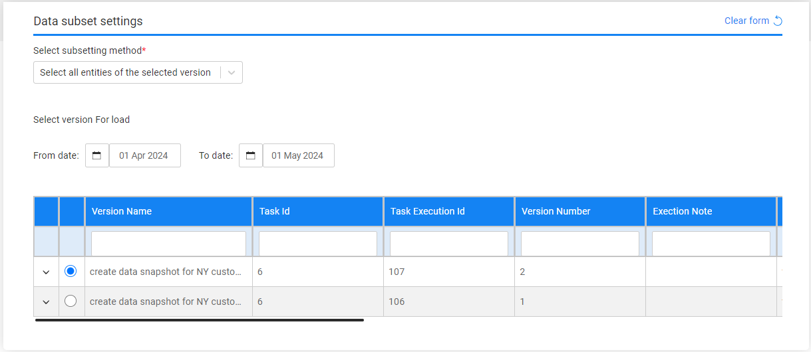
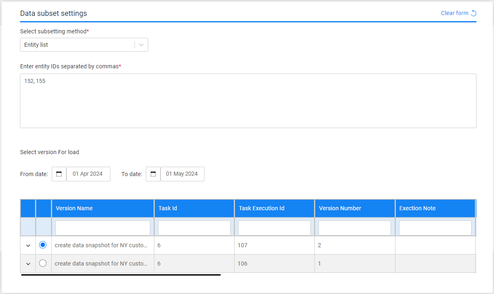

# Task - Entity Subset

The entity subset must be defined for any task that extracts entities from the source environment or that gets the pre-extracted/pre-generated entities from the Test Data Store. The subset defines the **entities selection method**. 

The following selection methods are available:

<table width="900pxl">
<tbody>
<tr>
<td width="200pxl">

<strong>Data source option</strong>

</td>
<td width="200pxl">

<strong>Source &ndash; Policy for Fetching data</strong>

</td>
<td width="500pxl">

<strong>Available entity selection methods</strong>

</td>
</tr>
<tr>
<td width="200pxl">

Entities &amp; referential data

</td>
<td width="200pxl">

All policies except Selected snapshot (version)

</td>
<td width="500pxl">
<ul>
<li>Entity list (default option)</li>
<li>Predefined entity list</li>
<li>Predefined custom logic</li>
<li>Business parameters</li>
<li>Random</li>
</ul>
</td>
</tr>
<tr>
<td width="200pxl">

Entities &amp; referential data

</td>
<td width="200pxl">

Selected snapshot (version)

</td>
<td width="500pxl">
<ul>
<li>Load all entities in the select a data version (snapshot)</li>
<li>Load an entity list from the selected data version (snapshot)</li>
</ul>
</td>
</tr>
<tr>
<td width="200pxl">

Synthetic entities Rule-based/AI-based generation

</td>
<td width="200pxl">

Use generated data in the Test Data Store

</td>
<td width="500pxl">
<ul>
<li>Load all generated entities of a selected data generation execution</li>
<li>Load a partial entity subset:
<ul>
<li>Predefined custom logic</li>
<li>Business parameters</li>
<li>Random</li>
</ul>
</li>
</ul>
</td>
</tr>
</tbody>
</table>

## Entity List

Populate the list of entities for the task. The populated entities should be separated with a comma.

## Predefined Entity List

Run the SQL query or the [Broadway flow](https://github.com/k2view-academy/K2View-Academy/blob/Academy_8.0_TDM_9.0/articles/TDM/tdm_implementation/11_tdm_implementation_using_generic_flows.md#step-6---optional---get-the-entity-list-for-an-extract-all-task-using-a-broadway-flow) defined in the [MigrateList MTable](https://github.com/k2view-academy/K2View-Academy/blob/Academy_8.0_TDM_9.0/articles/TDM/tdm_implementation/04_fabric_tdm_library.md#migratelist) object for the task's Business Entity. This option is available only for Admin and Environment owner users.

## Predefined Custom Logic

Select a predefined [Broadway flow](https://github.com/k2view-academy/K2View-Academy/blob/Academy_8.0_TDM_9.0/articles/TDM/tdm_implementation/11_tdm_implementation_using_generic_flows.md#step-7---optional---build-broadway-flows-for-the-custom-logic--selection-method) in order entity list for the task. Set the maximum number of entities to be retrieved by the flow. Populate the input parameters for the selected flow if needed.

## Business Parameters

Select entities from a predefined list of parameters. Set the **parameters and their values** and the **number of entities** for the task.

Select one or several parameters. Additionally, you can add the same parameter multiple times with different values.

Notes:

- The list of parameters should be [predefined for each LU in the task BE](/articles/TDM/tdm_implementation/07_tdm_implementation_parameters_handling.md) in the Fabric project.
- The parameters and their values must be populated in the TDM DB. It is recommended to run a task to extract a large subset of entities from the source environment in order to populate the TDM DB parameters' tables and enable creating TDM tasks with business parameters. The [Retention period] for the initial extract task can be set to **Do not retain** if there is no need to store the extracted subset in the TDM Test Data Store.

#### Use Parameters with Random Selection Checkbox

The Parameters selection has 2 modes:

- When checked (default), TDM randomly selects - from the list of all entities - entities that match the selected parameters. Each task execution gets different lists of entities that match the selected parameters. The **Selection Method** displayed in the Tasks List window is **Parameters - selection based on parameters with random selection**.

  Example:

  - Creating a task to load 5 customers using selected parameters. There are 800 customers that match the selected parameters. The task execution gets a random list of 5 customers from the list of 800 customers that match the selected parameters.

- When unchecked, it gets the first entities that match the selected parameters. Each task execution gets the same list of entities that match the selected parameters. The **Selection Method** displayed in the Tasks List window is **Parameters - selection based only on Parameters**.

  Example:

  - Create a task to load 5 customers with selected parameters. There are 800 customers that match the selected parameters. The task execution gets the first 5 customers that match the selected parameters.

#### Filter out Reserved Entities Checkbox

The **Filter out Reserved Entities** checkbox indicates whether entities that are reserved for other users in the target environment, must be filtered out from the task's entity list. If checked, these entities are filtered out from the task's entity list and from the **Number of entities matched** setting. Note that this checkbox can be checked only after the selection of the task's target environment in the [Target] component.

For example:

- There are 500 customers with VIP Status 'Gold' and 10 of them are reserved for other users on the task's target environments.
- If the Filter out Reserved Entities checkbox is checked, the *Entities Matched* result is 490.
- If the Filter out Reserved Entities checkbox is unchecked, the *Entities Matched* result is 500.

#### How Do I Add a Condition?

To add a parameter:

- Click **Add Condition**.
- Select the parameter and the operator from the drop-down lists and populate their values. Note that from TDM 8.1 onwards it is possible to select the IN or NOT IN operators on combo parameters and on text parameters.
- Set the value on the parameter. You can set multiple values on a parameter if the selected operator is either IN or NOT IN:
  - Combo parameters - click on the value field to select a required value from the drop-down list; this can be done multiple times as more than one value can be selected in this field.
  - Free text parameters - populate the values separated by a comma. For example: NY, CA.
- Add the **AND/OR** operator to connect the parameter to the previous parameters or group. The TDM Portal displays the SQL query, which is built based on the selected parameters.

#### How Do I Populate a Parameter's Value?

There are several types of parameters:

- **Combo** - parameters with a limited number of values. The Task window displays a drop-down list of the parameters' values; select one of them.

  Click for more information about [setting a parameter as a combo parameter](https://github.com/k2view-academy/K2View-Academy/blob/Academy_8.0_TDM_9.0/articles/TDM/tdm_implementation/07_tdm_implementation_parameters_handling.md#tdm-parameters-implementation-guidelines).

- **Number** - the TDM Portal displays the minimum and maximum values of this parameter. If the populated values exceed a parameter's range, an error message is displayed.

- **Date** - populate the value using the following format: **YYYY-MM-DD**.

  - Notes:

    - The date format is defined in **DATETIME_FORMAT** parameter of the [config.ini](https://github.com/k2view-academy/K2View-Academy/blob/Academy_8.0_TDM_9.0/articles/02_fabric_architecture/05_fabric_main_configuration_files.md#configini) Fabric file. The default format is 'yyyy-MM-dd HH:mm:ss.SSS'.

    - The parameter's search may be based on either a Date (removing the time from the Date format) or a Datetime.

      Examples:

      - 2023-12-28
      - 2024-04-03 10:00:00

    - The date value is set without quotation marks.

- **Text** - populate the value using a free text.

  

#### How Do I Add a Group of Parameters?

- Click **Add Group**.

- Note that nested groups of parameters can be added, for example, in order to define an inner group in an outer group:

  

  

#### How Do I Remove a Parameter or a Parameters Group?

1. Click the trash icon next to the parameter in order to delete it.

2. Click **Remove Group** to remove a parameter's group.

   

#### Getting the Number of Matching Entities

Click Refresh next to the **Number of entities matched** in order to calculate the number of entities that match the selected parameters. The Business parameters selection supports the parent-child hierarchy relationship between the LUs of the selected BE. It can cross-check the matching entities of a selected combination of parameters and take into consideration parameters from different LUs in the same BE hierarchy. For example, selecting customers based on their number of open cases, subscriber_type, and vip_status (as seen in the above image).

- Click  to display the number of matching entities according to the parameters’ conditions.

Click for more information about the [TDM parameters tables and View](/articles/TDM/tdm_architecture/07_tdm_parameters_handling.md) created by TDM in the TDM DB to display a hierarchical view of TDM parameters.

## Random

Get a random list of entities from the [LU Params](/articles/TDM/tdm_architecture/02_tdm_database.md#lu_name_params) table created in the TDM DB for the root LU of the task's BE. Entities that are reserved for other users are excluded from the selected entities.

Testers can select this option only if they are permitted to do so in the task's source environment.

## Synthetic Entities - Load all Generated Entities of a Selected Data Generation Execution

The Subset form displays all available rule-based/AI-based data generation executions. Select an execution to load its generated entities to the target environment: 

## Select and Load Data Snapshot (version) Task

When the **Policy for Fetching data** in the [Source component](14b_task_source_component_entities.md) is set to **Selected snapshot (version)**, you need to select a data snapshot (version) to be loaded to the target environment. The Subset form displays a list of available data snapshots (versions) that can be selected and reloaded to the target environment. By default, the TDM Portal displays a list of the data versions created during the last month. To set a different period, edit the **From Date** and **To Date** settings.

The following options are available:

#### Select all entities of the selected version

#### Entity List

Populate the list of entities separated by a comma in the **Entities List** setting.

The TDM displays all available versions created in the source environment for the task's LUs and the selected entities.

Each update on the entities list may change the list of available versions for the task. 

