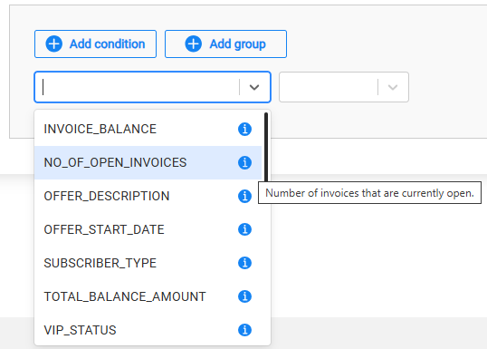

# Task — Entity Subset

The **Subset** component defines how entities are selected for task processing. An entity subset must be configured for any task that extracts entities from a source environment or retrieves pre-extracted or generated entities from the Test Data Store.

The following **selection methods** are available:

<table width="900pxl">
<tbody>
<tr>
<td width="200pxl">

<strong>Data source option</strong>

</td>
<td width="200pxl">

<strong>Source &ndash; Policy for Fetching data</strong>

</td>
<td width="500pxl">

<strong>Available Selection methods</strong>

</td>
</tr>
<tr>
<td width="200pxl">

Entities &amp; referential data

</td>
<td width="200pxl">

All policies except Selected snapshot (version)

</td>
<td width="500pxl">
<ul>
<li>Entity list (default option)</li>
<li>Predefined entity list</li>
<li>Predefined custom logic</li>
<li>Business parameters</li>
<li>Random</li>
</ul>
</td>
</tr>
<tr>
<td width="200pxl">

Entities &amp; referential data

</td>
<td width="200pxl">

Selected snapshot (version)

</td>
<td width="500pxl">
<ul>
<li>Load all entities from the selected data version (snapshot)</li>
<li>Load an entity list from the selected data version (snapshot)</li>
</ul>
</td>
</tr>
<tr>
<td width="200pxl">

Synthetic entities Rule-based/AI-based generation

</td>
<td width="200pxl">

Use generated data in the Test Data Store

</td>
<td width="500pxl">
<ul>
<li>Load all generated entities of a selected data generation execution</li>
<li>Load a partial entity subset:
<ul>
<li>Predefined custom logic</li>
<li>Business parameters</li>
<li>Random</li>
</ul>
</li>
</ul>
</td>
</tr>
</tbody>
</table>

## Lock Icons

Task fields that support runtime override have a lock icon next to their label. By default, these fields are **locked** — the task creator can click the lock icon to unlock a field and allow the task runner to set or override its value at execution time. Unlocked fields may be left empty in the task and populated by the task runner at execution. See the [full list of attributes available for runtime override](14_task_overview.md#attributes-available-for-runtime-override).

Example: A task creator can lock the Selection Method as Business Parameters while leaving specific parameters unlocked, allowing task runners to modify only those parameters' operator and/or value during execution.

The **Selection method** field can be empty if it is unlocked. If the Selection method is unlocked, then its related attributes are also unlocked.

The table below details the editable attributes in the Subset component, their applicable Selection methods, and the rules governing when they can be unlocked:

<table>
<thead>
<tr>
<th>Selection method attribute</th>
<th>Applicable to</th>
<th>Can be unlocked when Selection method is <strong>locked</strong>?</th>
<th>Can be empty when unlocked?</th>
</tr>
</thead>
<tbody>
<tr>
<td><strong>Entity list</strong></td>
<td>Entity list</td>
<td>Yes</td>
<td>Yes</td>
</tr>
<tr>
<td><strong>Custom logic (CL) flow name</strong></td>
<td>Predefined custom logic</td>
<td>Yes</td>
<td>Yes</td>
</tr>
<tr>
<td><strong>CL flow input parameters' values</strong></td>
<td>Predefined custom logic</td>
<td>Yes</td>
<td>Yes</td>
</tr>
<tr>
<td><strong>Business parameters' values</strong></td>
<td>Business parameters</td>
<td>Yes — individual condition values can be unlocked</td>
<td>Yes</td>
</tr>
<tr>
<td><strong>Add parameters at execution</strong> (checkbox)</td>
<td>Business parameters, Predefined custom logic</td>
<td>N/A</td>
<td>N/A</td>
</tr>
<tr>
<td><strong>Max number of entities/Number of entities</strong></td>
<td>All methods</td>
<td>Yes</td>
<td>Yes — and uniquely, this is the only attribute that can also be locked while empty, since an empty value means that all matching entities will be processed.</td>
</tr>
</tbody>
</table>

## Entity List

Populate the list of entity IDs for the task. Separate multiple entities with commas.

## Predefined Entity List

Retrieves entities using the SQL query or  [Broadway flow](/articles/TDM/tdm_implementation/11c_predefined_entity_list.md) defined in the [MigrateList MTable](/articles/TDM/tdm_implementation/04_fabric_tdm_library.md#migratelist) object for the task's Business Entity. This option is available for admin users, environment owners, and testers with [unlimited entities permission set](10_environment_roles_tab.md#number-of-entities) on the task's environment.

## Predefined Custom Logic

Select a predefined [Broadway flow](/articles/TDM/tdm_implementation/11d_custom_logic.md) to extract an entity list for the task. 

Set the **Max number of entities** field to limit the number of entities retrieved by the flow, or leave it empty to process all retrieved entities. Note that you can leave the **Max number of entities** field empty if you are an admin user, the environment owner, or a tester user with the [**Unlimited entities** permission set](10_environment_roles_tab.md#number-of-entities) on the task's environment.

### Custom Logic Parameters

The custom logic flow may have input parameters. 

Required parameters (marked with an asterisk) are always included and cannot be deselected. Optional parameters can be selected or cleared.

Check the **Add parameters at execution** checkbox to allow the task runner to add custom logic parameters at execution time — beyond those already selected by the task creator.

## Business Parameters

Select one or more parameters. The same parameter can be added multiple times with different values. An information icon next to each parameter displays its description.

Hovering over the information icon displays the parameter description, helping to identify the relevant business parameters for the task:

Each condition has a lock icon. The task creator can lock or unlock individual parameter conditions. When a condition is locked, its operator and value cannot be modified at execution time. When a condition is unlocked, the task runner can modify the operator and/or value.

Check the **Add parameters at execution** checkbox to allow the task runner to add new business parameter conditions at execution time — beyond those already defined by the task creator.

Notes:

- The list of parameters should be [predefined for each LU in the task BE](/articles/TDM/tdm_implementation/07_tdm_implementation_parameters_handling.md) within the Fabric project.
- The parameters and their values must be populated in the TDM DB. It is recommended to run a task that extracts a large subset of entities from the source environment in order to populate the TDM DB parameter tables and enable the creation of TDM tasks based on Business parameters. When there is no need to store the extracted subset in the TDM Test Data Store, the [retention period](/articles/TDM/tdm_gui/16_task_test_data_store_component.md#retention-period) for the initial extract task can be set to **Do not retain**.
- You can leave the **Max number of entities** field empty if you are an admin user, the environment owner, or a tester user with [**Unlimited entities** permission set](10_environment_roles_tab.md#number-of-entities) on the task's environment.

#### 'Use Parameters with Random Selection' Checkbox

Note that the parameter selection is relevant only when the **Max number of entities** field is populated.

There are two modes for parameter selection:

- **Parameters – random selection** - When the **Use parameters with random selection** checkbox is checked (default), TDM randomly selects entities from the full list, filtering only those that match the specified parameters. Each task execution retrieves a different list of entities that match the selected parameters. The **Selection Method** displayed in the Tasks List window is **Parameters - selection based on parameters with random selection**.

  Example:

  - Creating a task to load 5 customers using selected parameters. There are 800 customers that match the selected parameters. The task execution randomly retrieves a list of 5 customers from the 800 that match the selected parameters.

- **Parameters – ordered selection** - When this checkbox is unchecked, the task execution retrieves the first entities that match the selected parameters. Each task execution retrieves the same list of entities that match the selected parameters. The **Selection Method** displayed in the Tasks List window is **Parameters - selection based only on Parameters**.

  Example:

  - Create a task to load 5 customers with selected parameters. There are 800 customers that match the selected parameters. The task execution retrieves the first 5 customers that match the selected parameters.

#### How Do I Add a Condition?

Adding a parameter:

- Click **Add condition**.
- Select the parameter and operator from the drop-down lists and populate their values. Note that starting from TDM V8.1, it is possible to select the **IN** or **NOT IN** operators on combo parameters and on text parameters.
- Set the value on the parameter. Multiple values can be set on a parameter if the selected operator is either **IN** or **NOT IN**:
  - Combo parameters — click on the value field to select a required value from the drop-down list; this can be done multiple times as more than one value can be selected in this field.
  - Free text parameters — populate the values with a separating comma. For example: NY, CA.
- Add the **AND/OR** operator to connect the condition (parameter) to the previous conditions or group. The TDM Portal displays the SQL query, which is built based on the selected parameters.

#### How Do I Populate a Parameter's Value?

There are several types of parameters:

- **Combo** — parameters that offer a limited set of possible values. The Task window displays a drop-down list of values for each parameter; select one of them.

  Click for more information about [setting a parameter as a combo parameter](/articles/TDM/tdm_implementation/07_tdm_implementation_parameters_handling.md#tdm-parameters-implementation-guidelines).

- **Number** — the TDM Portal displays the minimum and maximum values (i.e., the range) of the parameter. If the populated values exceed this range, an error message is displayed.

- **Date** — populate the value using the following format: **YYYY-MM-DD**.

  - Notes:

    - The date format is defined in the **DATETIME_FORMAT** parameter of the [config.ini](/articles/02_fabric_architecture/05_fabric_main_configuration_files.md#configini) Fabric file. The default format is 'yyyy-MM-dd HH:mm:ss.SSS'.

    - The parameter's search criteria can be based on either a Date (with the time value removed) or a Datetime.

      Examples:

      - 2023-12-28
      - 2024-04-03 10:00:00

    - The date value is set without quotation marks.

- **Text** — populate the value using a free text.

  

#### How Do I Add a Group of Parameters?

- Click **Add group**.

- Note that nested groups of parameters can be added, for example, to define an inner group within an outer group:

  

  

#### How Do I Remove a Parameter or a Group of Parameters?

1. Click the trash icon next to the parameter to delete it.

2. Click **Remove group** to remove a group of parameters.

   

#### Getting the Number of Matching Entities

Click **Refresh** next to **Number of entities matched** to calculate how many entities satisfy the selected parameters to calculate the number of entities that match the selected parameters. The Business parameters selection supports the parent-child hierarchy relationship between the LUs of the selected BE. It can cross-check the matching entities of a selected combination of parameters and take into consideration parameters from different LUs in the same BE hierarchy. For example, selecting customers based on their number of open cases, subscriber_type, and vip_status (as seen in the above image).

- Click  to display the number of matching entities according to the parameters' conditions.

Click for more information about the [TDM parameter tables](/articles/TDM/tdm_architecture/07_tdm_parameters_handling.md) — created by TDM in the TDM DB — that display a hierarchical view of TDM parameters.

## Random

Retrieves a random list of entities from the parameter tables stored in the TDM DB for the root LU of the task's Business Entity.

Testers can select this option only if they are permitted to do so in the task's source environment.

## Filter out Reserved Entities 

- The **Filter out reserved entities** setting allows the user to decide which reserved entities will be excluded from task execution: 

  - **Reserved by others** (default option) — excludes entities that are currently reserved by users other than the task creator or executor, while allowing task execution on entities reserved by the task creator or executor.

  - **All reserved entities** — excludes all reserved entities, including those reserved by the task creator or executor. This option ensures that no overlap occurs with any of the reserved entities, regardless of who reserved them.

- The reserved entities are excluded when running the following tasks:

  - [Load tasks](17a_task_target_component_entities.md#load) when both the **Replace IDs for the copied entities** and the **Generate clones for an entity** checkboxes are unchecked, i.e., the task loads the entities with their source IDs.
  - [Delete tasks](17a_task_target_component_entities.md#delete)
  - [Reserve tasks](17a_task_target_component_entities.md#reserve)

- Notes:

  - Set the target environment in the [Target component](17a_task_target_component_entities.md) in order to exclude reserved entities when calculating the **Number of entities matched** based on the selected **Business parameters** in the Subset component.

  - The **Filter out Reserved Entities** radio buttons are disabled in tasks when:

    - Either the **Replace IDs for the copied entities** or the **Generate clones for an entity** checkbox is checked in the Target component, i.e., the task creates new replicas of the copied entities.

    - Creating an [AI-based Training task](19_task_synthetic_data_generation.md#how-to-create-an-ai-training-task), i.e., the **Destination of test data** in the Target component is set to **AI training**.
      
    - The Selection method is **Predefined entity list**.

      

## Synthetic Entities - Load all Generated Entities of a Selected Data Generation Execution

The Subset form (below) displays all available rule-based/AI-based data generation executions. Select an execution to load its generated entities into the target environment: 

## Load Data Snapshot (version) Task

When the **Policy for Fetching data** in the [Source component](14b_task_source_component_entities.md) is set to **Selected snapshot (version)**, a data snapshot (version) must be selected to be loaded into the target environment. The Subset form (below) displays a list of available data snapshots (versions) that can be selected and reloaded into the target environment. By default, the TDM Portal displays a list of the data versions created during the last month. To set a different period, edit the **From date** and **To date** settings.

The following options are available:

#### Select all entities of the selected version

#### Entity List

Populate the list of entity IDs separated by a comma in the **Entity IDs** setting.

Each update of this list may change the list of available versions for the task.

K2view's TDM displays all available versions created in the source environment for the task's LUs and the selected entities.

**Notes:**

- Both the **Entity List** and the selected **Data Version** can be unlocked, allowing the task runner to modify them at execution time.
- The **Data Version** is always unlocked when the source environment is unlocked, as the task runner may select a different source environment during execution. In this case, the task runner must select a data version that was created for the selected execution source environment.
