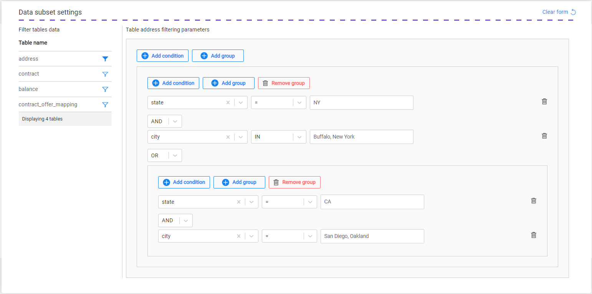

# Task - Table Subset

The table subset enables an optional filtering on the records extracted for the task's tables. The table subset is available when selecting the [Tables](14c_task_source_component_tables.md#task---source-component---tables) option in the Source component, i.e., creating a task on tables only.

A filter can be added to one, several, or all task's table.

Click the filter icon next to the table and populate the filtering parameters for the table:

Select a table column, operator, and populate the value or values. The values must be typed manually.

Several conditions and/or groups can be defined as in the definition of a group of entities according to [business parameters](15a_entity_subset.md#business-parameters).

