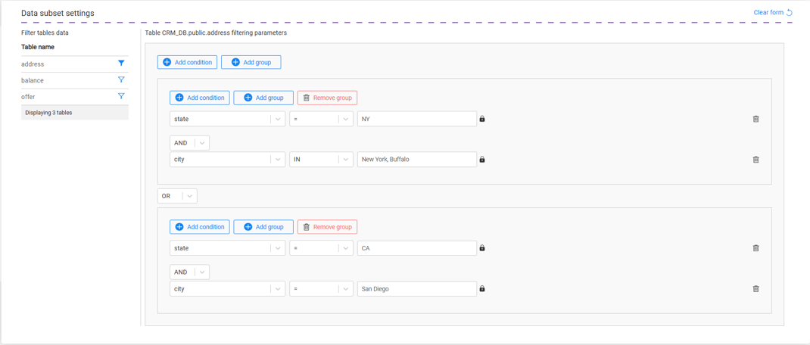

# Task — Table Subset

The table subset enables an optional filtering of the records extracted for the task's tables. The table subset is available when selecting the [Tables](14c_task_source_component_tables.md#task---source-component---tables) option in the Source component, i.e., creating a task on tables only.

A filter can be added to one, several, or all of the task's tables.

Click the filter icon next to a table to open the **Data subset settings** window:

The window is split into two panels:

- **Left panel** — lists all the task's tables. A filled filter icon next to a table indicates that a filter has already been set for it. Click a table name to view or edit its filtering parameters in the right panel.
- **Right panel** — displays the filtering parameters for the selected table, identified by its full name (e.g., *CRM_DB.public.address*).

To define a filter, select a table column, an operator, and enter a value. Multiple conditions and/or groups can be added using the **Add condition** and **Add group** buttons.

Click **Clear form** to remove all filters across all tables.

## Lock Icons

Each condition has a lock icon. The task creator can lock or unlock individual conditions to control whether the task runner can modify them at execution time:

- **Locked** — the condition's operator and value are fixed and cannot be changed by the task runner at execution.
- **Unlocked** — the task runner can modify the condition's operator and/or value when executing the task.

At execution time, all filter conditions are displayed, but the task runner can only edit the unlocked ones.
