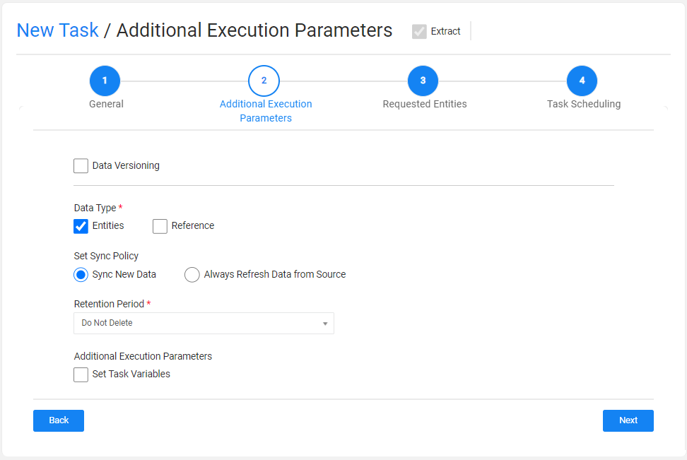
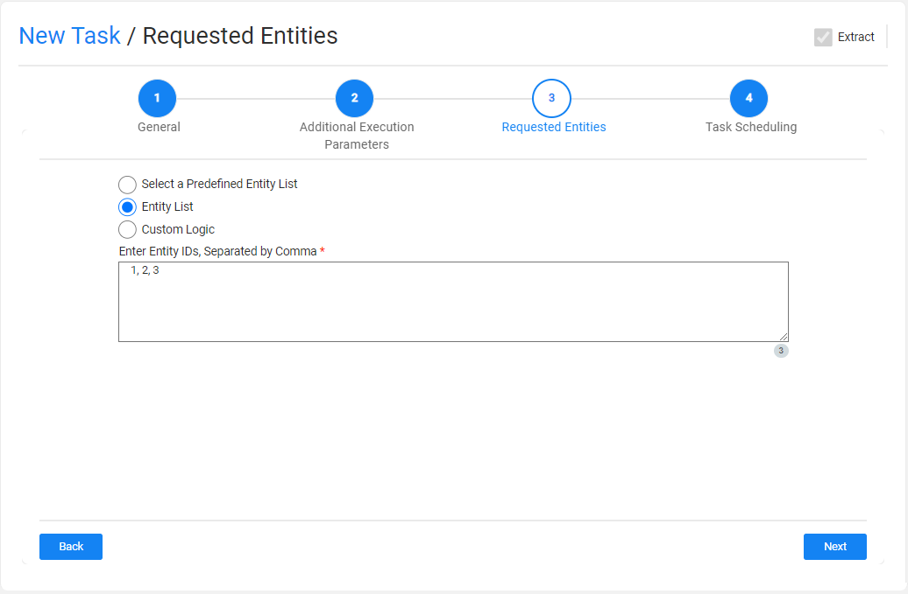
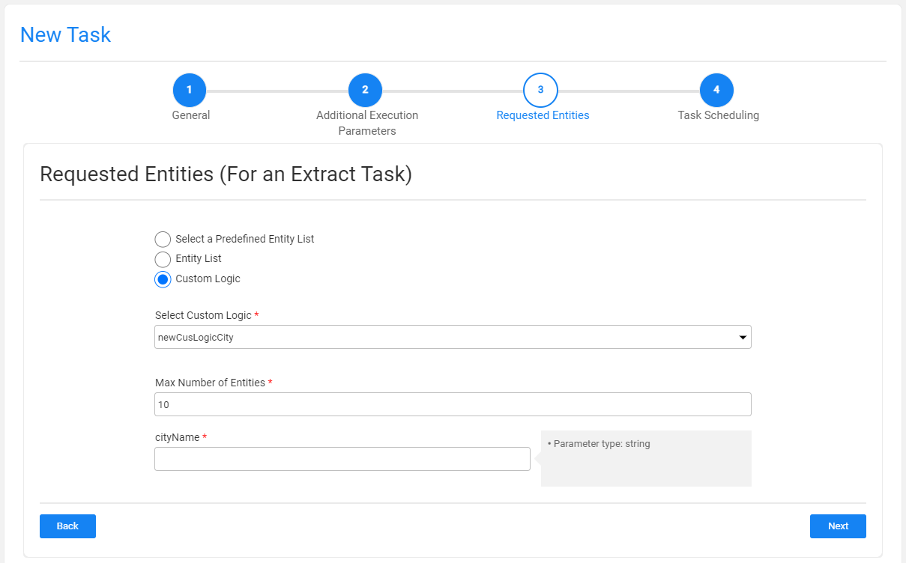

# TDM Extract Task

An Extract task extracts the selected entities and/or Reference tables from the selected source environment and saves this data in Fabric for later use.

An Extract task contains the following tabs:

- [General](14a_task_general_tab.md)
- [Additional Execution Parameters](#additional-execution-parameters)
- [Requested Entities](#requested-entities) - opened if the Data Type contains entities.
- [Task Scheduling](22_task_execution_timing_tab.md)

When checking the **Set Task Variables** setting, a new [Task Variables](23_task_globals_tab.md) tab opens.

When setting the **Data Type** by checking the **Reference** setting, a [Reference tab](24_task_reference_tab.md) opens.

## Additional Execution Parameters Tab

The following execution parameters are set on **Extract tasks**:

### Data Versioning

- Check to set the task mode to [Data Versioning](15_data_flux_task.md). 
- Leave the Data Versioning unchecked to create a regular mode task.

### Data Type

Check **Entities** to extract the selected entities and/or **Reference** to extract the selected reference tables into the TDM warehouse (Fabric).

Click [here](24_task_reference_tab.md) for more information about the reference handling. 

### Set Sync Policy

This setting enables the user to change the [default LUI sync mode](/articles/14_sync_LU_instance/02_sync_modes.md) (Sync ON) and extract the LUI from the data source whenever the task is executed (Sync FORCE).

Note that **this setting is only available when the Data Versioning checkbox is cleared (regular task)**.  If Data Versioning *is* checked, each task execution extracts the data from the data source and creates a new LUI.

### Retention Period

This is the retention period set on the extracted LUIs. When this period ends, the LUIs are **automatically deleted** from Fabric and are no longer available. 

Note that when the Retention Period is set to zero, no retention period is set on the extracted LUIs.

**A retention period must be set on a Data Versioning extract task**, i.e. the retention period must be set to a value greater than zero when the Data Versioning is checked.

**The retention period is optional on a regular extract task.**

The start date of the retention period is the task's execution time. The **retention period** can be set in **minutes**, **hours**, **days**, **weeks**, or **years**.

**Example:** 

The **defaultPeriod** parameter is set to **5 days** and the **maxRetentionPeriod** parameter is set to **90 days**.

The Retention Period window displays the following options:

- When Data Versioning is checked, the period is set by default to five days.
- When Data Versioning is cleared, the period is set by default to zero, i.e. no retention period is set for the extracted data. 
- The maximum retention period can be set to 90 days or 12 weeks.  The Years option is not available since the maximum retention period is 90 days.

### Additional Execution Parameters

#### Set Task Variables 

Check to open the Task Variables tab and [set the variable value on a task level](23_task_globals_tab.md).

### Post Execution Processes

Select all, partial, or one [post execution process](04_tdm_gui_business_entity_window.md#post-execution-processes-tab) of the selected BE.

## Requested Entities Tab

This tab opens when the task's Data Type includes entities. This tab defines the subset of entities for the task:

The following selection methods are available on extract tasks: 

- **Select a predefined entity list**: run the SQL query or the [Broadway flow](/articles/TDM/tdm_implementation/11_tdm_implementation_using_generic_flows.md#step-6---optional---get-the-entity-list-for-an-extract-all-task-using-a-broadway-flow) defined in the [trnMigrateList](/articles/TDM/tdm_implementation/04_fabric_tdm_library.md#trnmigratelist) translation object for the LU.  This option is available only for the Admin and Environment owner users.
- **Entity list**: this is the **default option**. Populate the list of entities for the task. The entities populated should be separated with a comma. 
- **Custom logic**: select a [Broadway flow](/articles/TDM/tdm_implementation/11_tdm_implementation_using_generic_flows.md#step-7---optional---build-broadway-flows-for-the-custom-logic--selection-method) in order to both get the entity list for the task and to set the maximum number of entities for the task:

TDM 7.5 supports the creation of external input parameters on a Custom Logic Flow. In this case, the TDM GUI displays the input parameters in the task window, enabling the user to send values for these parameters. See example:

Notes:

- The maximum number of entities populated by the tester user is [limited by their environment's permission set](10_environment_roles_tab.md#read-and-write-and-number-of-entities). This is the maximum number of entities of the task. If the custom logic selects a smaller number of entities, the number of entities will be set by the custom logic flow. For example: the maximum number of entities in the task is 50, but the customer logic only selects 30 entities. The task will process 30 entities.
- It is possible to set an array value in a Custom Logic's parameter. The values are populated as a String with the delimiter, which is set in the Custom Logic Broadway flow. For example: 1,2,3 or CA,NY. 
- Populate the Entity ID as populated in the source environment. For example, populate the Entities List with 1, 2 in order to extract Customers 1 and 2. The TDM execution process  [concatenates the required components](/articles/TDM/tdm_implementation/01_tdm_set_instance_per_env_and_version.md) to each Entity ID when building its LUI.

 

