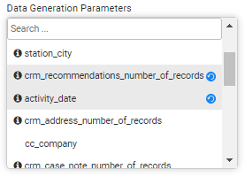

# TDM Generate Task

A Generate task generates synthetic entities. The synthetic entities can either be generated and saved in Fabric in order to be loaded later into the testing environment, or be generated and loaded into the target environment in one single task if the Load task action is checked with the Generate task action.

A Generate task can also include Load or Load + Reserve task actions and it contains the following tabs:

- [General](14a_task_general_tab.md)
- [Additional Execution Parameters](#additional-execution-parameters-tab)
- [Requested Entities](#requested-entities-tab)
- [Task Scheduling](22_task_execution_timing_tab.md)

When checking the **Set Task Variables** setting, a new [Task Variables](23_task_globals_tab.md) tab opens.

## Additional Execution Parameters Tab

The following execution parameters are set on **Generate tasks**:

### Data Type

The data type supported for Generate task is **Entities**. 

### Reservation Settings

The [Reservation Period](17_load_task_regular_mode.md#reservation-period) and [Reservation Note](17_load_task_regular_mode.md#reservation-note) are displayed if the Reserve task action is checked in the task.

### Retention Period

This is the retention period set on the generated entities. When this period ends, the entities are **automatically deleted** from Fabric and are no longer available. 

#### Retention Period Values

- **Do not Delete** - do not delete from Fabric. This is the default value.

- **Do not Retain** - avoid saving the entities in Fabric (instead of saving and deleting). This option can be used, for example, to generate and load synthetic entities without saving the entities into Fabric.

- Set unit of measure (Minutes, Hours, Days ...) and value. For example, save the data in Fabric for 2 days. After 2 days the data is automatically deleted from Fabric.

  Note that the **retention period** can be set in **minutes**, **hours**, **days**, **weeks**, or **years**, depends on the maximum retention period set in the TDM DB. Both parameters - default retention period and maximum retention period - are set in the [TDM DB](/articles/TDM/tdm_configuration/02_tdmdb_general_parameters.md).

### Additional Execution Parameters

#### Set Task Variables 

Check to open the Task Variables tab and [set the variable value on a task level](23_task_globals_tab.md).

### Post Execution Processes

Select all, partial, or one [post execution process](04_tdm_gui_business_entity_window.md#post-execution-processes-tab) of the selected BE.

## Requested Entities Tab

This tab defines the number of generated entities. The user can also set data generation parameters. For example, generate customers that live in Chicago. 

TDM 8.0 added an integration of Broadway editors into the TDM portal when populating either the data generation parameters in the Requested Entities task’s tab.

This integration enables the user to select a valid value from a list, set dates and to set distributed parameters:

Note that the number of entities populated by the tester user is [limited by their environment's permission set](10_environment_roles_tab.md#read-and-write-and-number-of-entities). This is the maximum number of entities of the task. 

### Adding Data Generation Parameters to the Task 

Select a parameter from the data generation parameter's list. You can ass a search value to get the required parameter. The selected parameter is added to the window with the default values if set.

The selected parameters are marked by grey and get a blue Refresh icon next to the selected parameter's name:

### Removing Data Generation Parameters from the Task 

Click the blue Refresh icon next to the parameter's name in the data generation parameters list. The remove parameter returns back to its default value if set.

### Reset the Data Generation Parameter's Value

Click the black Refresh icon next to the parameter's editor to reset your updates and get back to the previous value if set. The previous value can be the default value or the previous value set by the user when opening and updating a Generate task.

### Data Generation - Distribution Parameters

The distribution parameter generates random values according to input distribution settings. The supported distribution types are **normal**, **uniform**, **weighted** and **constant** (return one value).

The user can edit the distribution type and the related distribution parameters. The distribution parameters are set based on the selected distribution type:

- **Normal** distribution (gaussian) works using **mean** and **stddev** (standard deviation), and can be bound by **minimum** and **maximum** values, both inclusive.

  Example:

  

  In the example above the generated customers will get a score between 10-90. Most of the generated customers will get a score around 80 with a standard deviation of 5.

   

- **Uniform** distribution returns a random value between the **minimum** and **maximum** values.

  Example:

  

 

​		In the example above the generated customers will have 1-3 cases for each generated activity.

- **Weighted** distribution returns a value from the list, based on the value's weight. Weighted distribution uses a 'weights' map where the keys are the results and the values are positive numbers indicating the weight of the entry of the whole. Both, the distributed values and the weights need to be populated manually.

  Example:

  

  In the example above 42% (50/120) of the generated customers will be attached to a station in New York, 25% (30/120) will be attached to a station in Los Angeles and 33% (40/120) will be attached to a station in Miami.

  

- **costant** distribution returns the populated value. For example: set the number of generated addresses to 1 address per customer.

  Example:

  

​	In the example above the generated customers have only one address.

 

