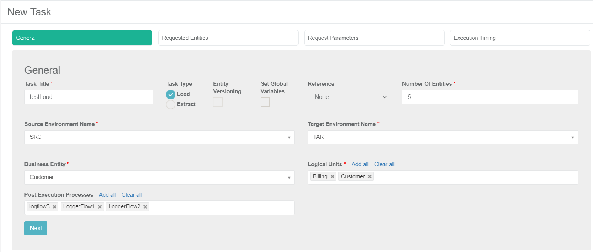

# TDM Load Task - Regular Mode

A Load task extracts entities or Reference tables from a source environment and loads them to a target environment. A load task can also delete entities from target environments.

A Load task has the following tabs:

- [General](#general)
- [Requested Entities](18_load_task_requested_entities_regular_mode.md)
- [Request Parameters](19_load_task_request_parameters_regular_mode.md)
- [Execution Timing](22_task_execution_timing_tab.md), this tab is displayed for all task types and modes. The following options are available  for the task's execution:

  - **Execution by Request**, default option.
  - **Scheduled execution**, set scheduling parameters to automatically execute the task based on the scheduling parameters. Note that testers can select this option only if their role has a scheduling permission.

Check **Set Global Variables** to open the [Task Globals](23_task_globals_tab.md) tab.

Set **Reference** to **Reference Only** or **Both - reference and entities** to open the [Reference](24_task_reference_tab.md) tab.

## General Tab

The first tab in the TDM Task window which holds general information about a task. 

### Task Title

The task name. (Mandatory). Note that only one active task can have a specific Task Title. An error is displayed when an attempt is made to create several tasks with the same Task Title.

### Task Type

Load or Extract. Set the Task Type to **Load**.

### Entity Versioning

- Check to set the Task Mode to [Data Flux](15_data_flux_task.md). 
- Uncheck to create a regular mode task.

### Set Global Variables 
Check to [override Globals on a task level](23_task_globals_tab.md).

### Reference 

[Reference handling](24_task_reference_tab.md). Select a value from the dropdown list:

- **None**, default value. Do not include Reference tables in the task.
- **Reference Only**, create a task to extract Reference tables only into Fabric. Do not include entities in the task.
- **Both - reference and entities**, create a task to extract both entities and Reference tables into Fabric.

### Number of Entities 

This setting is displayed only for a regular mode task, that is when Entity Versioning is unchecked. 

- Populate the Number of Entities with the number of entities processed by the task:

  - Admin and Environment owners are set any number.

  - Testers can set the number of entities that do not exceed the limited minimum number set for their TDM Environment roles for the selected source and target environments. For example, if a tester can read up to 100 entities from the source environment and write up to 5 entities into the target environment, then the maximum number of entities that can be set by the tester is 5. 

  - To validate the Number of Entities set by testers, click **Next** to move to the next tab. If the tester exceeds their limitation, an error message is displayed.

  

### Environment Names

- Select a **source environment** from the dropdown list of active TDM environments with [environment type](08_environment_window_general_information.md#environment-type) **Source** or **Both**. 
- Select a **target environment** from the dropdown list of active TDM environments with [environment type](08_environment_window_general_information.md#environment-type) **Target** or **Both**. 
Note that testers can only select a source environment they are attached to by a Read [TDM Environment role](10_environment_roles_tab.md) and target environment they are attached to by a Write [TDM Environment role](10_environment_roles_tab.md). 

### Business Entity

The [BE](04_tdm_gui_business_entity_window.md) of the task. Select a BE from the dropdown list of the [BEs](05_tdm_gui_product_window.md#be-and-lu-product-relationship) included in the [environment’s products](11_environment_products_tab.md). 

### Logical Units

Select all, partial, or one LU of the selected BE. 

The following validations are set on the selected LUs:

The selected LUs must include at least one [root LU](/articles/TDM/tdm_overview/03_business_entity_overview.md#root-lu) of the selected BE. 

An LU cannot be selected without its parent LU. 

**Example:**

A Customer BE has two levels of hierarchy: 
-  The  root LU is Customer Data.
-  Billing LU is a child of Customer Data.
-  Collection LU is a child of Billing LU. 

When creating a task on the Customer BE, to select the Collection LU the Billing LU is also selected.

Click for additional [examples of BE hierarchies](/articles/TDM/tdm_overview/03_business_entity_overview.md).

### Post Execution Processes

Select all, partial, or one [post execution process](04_tdm_gui_business_entity_window.md#post-execution-processes-tab) of the selected BE.

 

