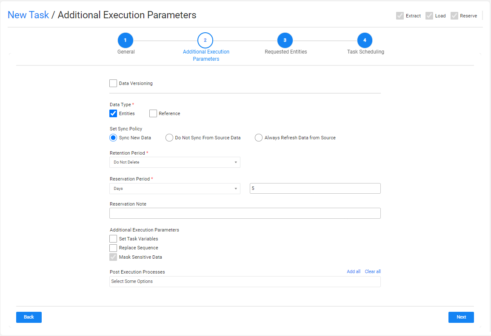
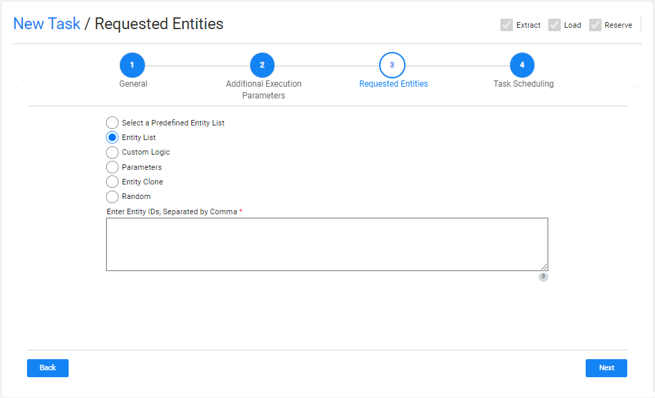
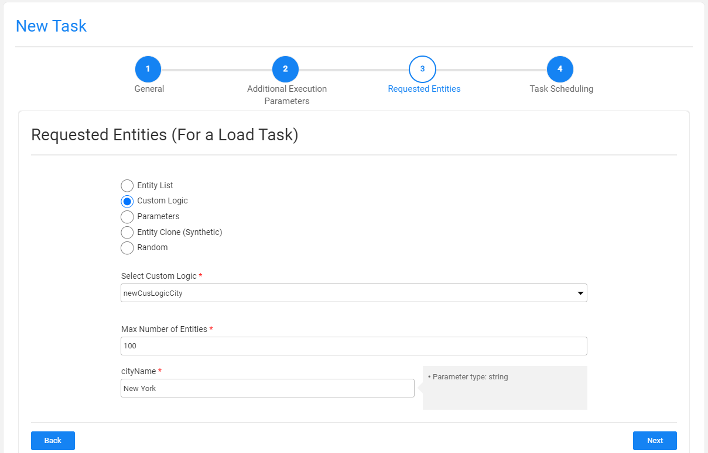
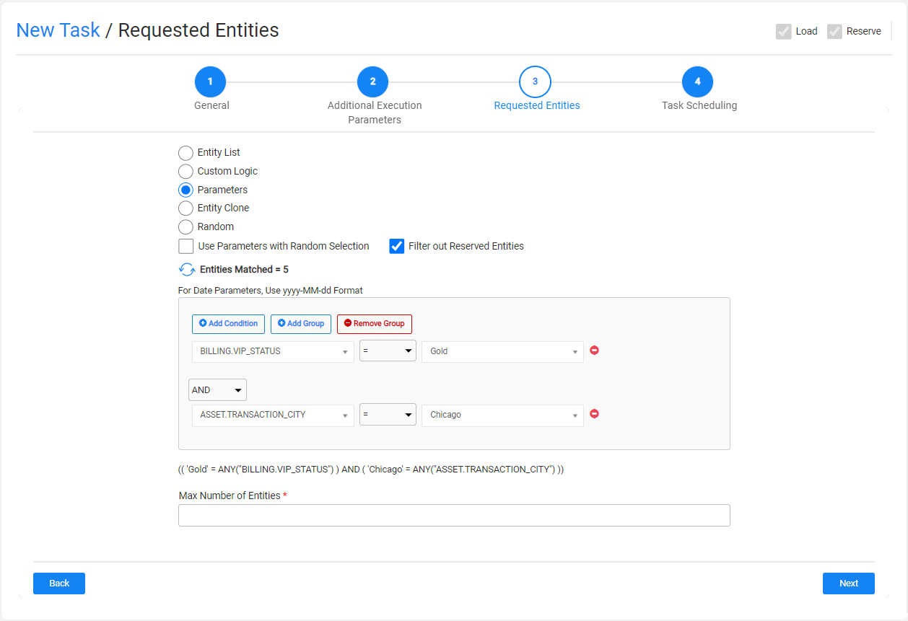
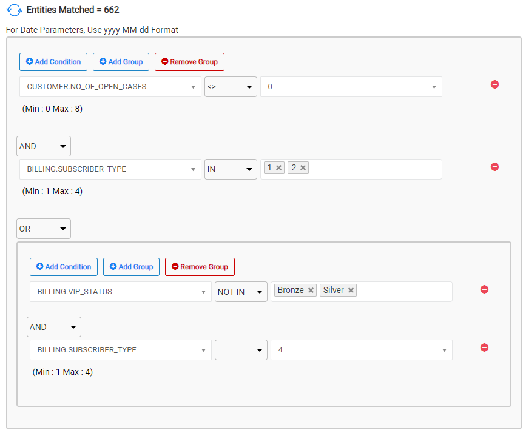
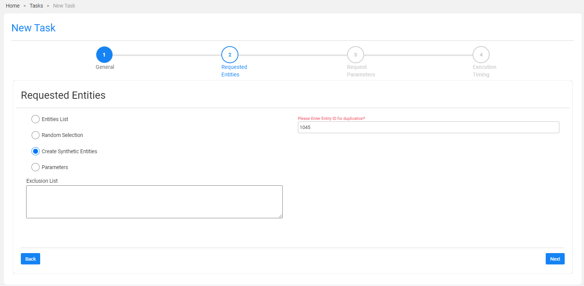

# TDM Load Task - Regular Mode

A Load task contains the **Load** task type and loads (provisions) the task's entities and/or Reference tables to the target environment. A load task can also delete entities from target environments before loading them and/or reserve the target entities in the TDM DB. Note that the Reserve task type is also checked by default when the Load task type is checked.

An Load task contains the following tabs:

- [General](14a_task_general_tab.md)
- [Additional Execution Parameters](#additional-execution-parameters-tab)
- [Requested Entities](#requested-entities-tab) - opened if the Data Type contains entities.
- [Task Scheduling](22_task_execution_timing_tab.md)

When checking the **Set Task Variables** setting, a new [Task Variables](23_task_globals_tab.md) tab opens.

When checking the **Reference** Data Type setting, a [Reference tab](24_task_reference_tab.md) opens.

## Additional Execution Parameters Tab

The following execution parameters are set on **Load tasks**:

### Data Versioning

- Check to set the task mode to [Data Versioning](15_data_flux_task.md). 
- Leave the Data Versioning unchecked to create a regular mode task.

### Data Type

Check **Entities** and/or **Reference** to load them to the target environment selected in the **Provision to Environment** setting.

Note that the Entities must be checked in the task also includes an [entity reservation](/articles/TDM/tdm_architecture/08_entity_reservation.md) (the Reserve task type is checked together with the Load task type).

Click [here](24_task_reference_tab.md) for more information about the reference handling. 

### Set Sync Policy

This setting enables the user to change the [default LUI sync mode](articles/14_sync_LU_instance/02_sync_modes.md) (Sync ON). The following sync policy are available:

- **Sync New Data**: this is the default option (Sync ON).
- **Do Not Sync From Source Data**: get the LUI data from the TDM warehouse (Fabric).
- **Refresh all Data from Source**: extract the LUI from the data source whenever the task is executed (Sync FORCE).

Notes:
- This setting is **only available when the Data Versioning checkbox is cleared (regular task)**.  A Load Data Versioning task gets the data version from the TDM warehouse (Fabric)  and reloads it to the target environment.
- The **Do Not Sync From Source Data** option is not displayed if the user selects a combination of Extract and Load task types.

Click for more information on [how overriding the Sync mode and the Task Operation mode impact the task execution process](/articles/TDM/tdm_architecture/04_task_execution_overridden_parameters.md#overriding-the-sync-mode-on-the-task-execution).

### Reservation Period

The reservation period settings are displayed **if the load task also reserves the loaded entities** on the target environment (the Reserve task type is checked together with the Load task type).

Note that when the Reservation Period is set to zero, the entities are reserved for an unlimited period.  

Only Admin and Environment owner users can reserve entities for unlimited period. Users that are attached to the target environment as testers  must set a reservation period. The maximum number of days of a reservation period is set in the **tdm_general_parameters** TDB DB table in the **MAX_RESERVATION_DAYS_FOR_TESTER** parameter.

The start date of the reservation period is the task's execution time. The **reservation period** can be set in **minutes**, **hours**, **days**, or **weeks**.

### Reservation Note

This setting has been added by TDM 7.5.2. The user can populate it with a free text. The reservation note is displayed in the [Reserved Entities window](13_reserved_entities_window.md) (Notes fields) and can be used for filtering the reserved entities display. The reservation note can be edited using the Reserved Entities window.

### Additional Execution Parameters

#### Set Task Variables 

Check to open the Task Variables tab and [set the variable value on a task level](23_task_globals_tab.md).

#### Replace Sequence

When checked, the task execution process replaces the IDs of all selected entities before loading them into the target. This option is required to avoid key duplications if the testing environment is not empty and contains entities.

Notes:

- The Replace Sequence is not displayed on **Data Versioning** task, since the data version is loaded "as is".
- The Replace Sequence setting is disabled if the tester user does not have permissions to replace the sequence in the **Write** [TDM Environment permission setting](10_environment_roles_tab.md#role-permissions) on the task's target environment.
- The Replace Sequence must be implemented in the [Fabric implementation](/articles/TDM/tdm_implementation/11_tdm_implementation_using_generic_flows.md#step-4---create-the-tdmorchestrator.flow-from-the-template).

### Post Execution Processes

Select all, partial, or one [post execution process](04_tdm_gui_business_entity_window.md#post-execution-processes-tab) of the selected BE.

## Requested Entities Tab

This tab opens when the task's Data Type includes entities. This tab defines the subset of entities for the task:

The following selection methods are available on load tasks: 

### Entity list 

This is the **default option**. Populate the list of entities for the task with entities separated with a comma between them.  Note that a warning is given if the entity list has entities that are reserved for another user.

### Custom Logic

Select a Broadway flow in order to get the entity list for the task and in order to set the maximum number of entities for the task:

TDM 7.5 supports creating external input parameters on a Custom Logic Flow. In this case, the TDM GUI displays the input parameters in the task window, enabling the user to send values for these parameters. See example:

Note:

- It is possible to set an array value in a Custom Logic's parameter. The values are populated as a String with the delimiter, which is set in the Custom Logic Broadway flow. For example: 1,2,3 or CA,NY. 

### Parameters 

Select entities from a predefined list of parameters. You should set the **parameters and their values** and the **maximum number of entities** for the task.

Note that entities reserved for another user in the environment are excluded from the task. You can select one of several parameters. In addition, you can add the same parameter multiple times with different values:

The list of parameters should be [defined for each LU in the task BE](/articles/TDM/tdm_implementation/07_tdm_implementation_parameters_handling.md) in the Fabric project.

#### Use Parameters with Random Selection Checkbox

  The Parameters selection has two modes: 

  - When checked (default), TDM randomly selects the entities from the list of all entities, those that match the selected parameters whereby each task execution gets different lists of entities that match the selected parameters. The **Selection Method** displayed in the Tasks List window is **Parameters - selection based on parameters with random selection**. 

    Example: 

    - Creating a task to load 5 customers using selected parameters. There are 800 customers that match the selected parameters. The task execution gets a random list of 5 customers from the list of 800 customers that match the selected parameters.  

  - When unchecked, it gets the first entities that match the selected parameters whereby each task execution gets the same list of entities that match the selected parameters. The **Selection Method** displayed in the Tasks List window is **Parameters - selection based only on Parameters**. 

    Example:

    - Create a task to load 5 customers with selected parameters. There are 800 customers that match the selected parameters. The task execution gets the first 5 customers that match the selected parameters. 

#### How Do I Add a Condition? 

  To add a parameter:

  -  Click **Add Condition**. 
  - Select the parameter and the operator from the dropdown lists and populate their values.
  - Add **AND/OR** operator to connect the parameter to the previous parameters or group.
The TDM GUI  displays the SQL query built based on the selected parameters.

#### How Do I Populate a Parameter's Value?

There are several types of parameters:

- **Combo**, parameters with a limited number of values. The Task window displays a dropdown list of the parameters' values. Select a value from the dropdown list.
  
  Click for more information about [setting a parameter as a combo parameter](/articles/TDM/tdm_implementation/07_tdm_implementation_parameters_handling.md#tdm-parameters-implementation-guidelines).
  
- **Number**, the TDM GUI displays the minimum and maximum values of this parameter. If the populated values exceed a parameter's range, an error message is displayed.
  
- **Date**, populate the value using the following format: **YYYY-MM-DD**. 
  
  - Notes: 
  
    - The date format is defined in **DATETIME_FORMAT**  parameter of the [config.ini](/articles/02_fabric_architecture/05_fabric_main_configuration_files.md#configini) Fabric file. The default format is  'yyyy-MM-dd HH:mm:ss.SSS'.
  
    - The parameter's search may be based on either a Date (removing the time from the Date format) or a Datetime.  
  
      Examples:
  
      - 2021-12-28
      - 2022-04-03 10:00:00
  
    - The date value is set without quotation marks.
  
- **Text**, populate the value using free text.
#### How Do I Add a Group of Parameters?

Click **Add Group**. 

Note that nested groups of parameters can be added, for example, in order to define an inner group in an outer group.

#### How Do I Remove A Parameter or a Parameters Group?

1.  Click  next to the parameter in order to delete it.
2.  Click **Remove Group** to remove a parameter's group.

#### Getting the Number of Matching Entities

Click Refresh next to the **Entities Matched** in order to calculate the number of entities that match the selected parameters.
The Parameters selection supports the parent-child hierarchy relationship between the LUs of the selected BE. It can both crosscheck the matching entities of a selected combination of parameters and take into consideration parameters from different LUs in the same BE hierarchy. For example, if customers living in New York with scheduled visits (see the screenshot below) are selected, TDM checks the visits of each patient living in New York and then checks their status.

- Click  to display the number of matching entities according to the parameters’ conditions.

Click for more information about the [TDM parameters tables and View](/articles/TDM/tdm_architecture/07_tdm_parameters_handling.md) created by TDM in the TDM DB to display a hierarchical view of TDM parameters. 

### Entity Clone (Synthetic)

Create X clones of the selected entity in the target environment. When selecting this method, the real Entity ID must be populated in order to be replicated. 

For example, if the **Number of Clones** setting is populated with 10 and the **Entity ID** is set to 6559, the task creates 10 clones (replicas) of Entity ID 6559 in the target environment. 

The task replaces the sequences of each replica in order to avoid duplicated sequences in the target environment. 

Testers may select this option only if they are permitted to clone an entity in the task's target environment.

### **Random Selection** 

Get random list entities from the [LU PARAMS](/articles/TDM/tdm_architecture/02_tdm_database.md#lu_name_params) table created  in the TDM DB for the root LU of the task's BE.  Entities that are reserved for another user are excluded from the selected entities. 

Testers can select this option only if they are permitted to do so in the task's target environment.

 

