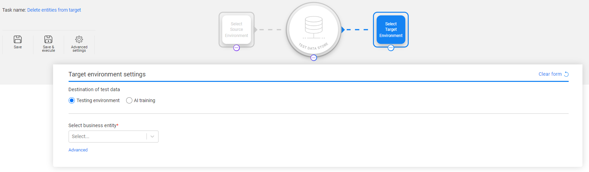
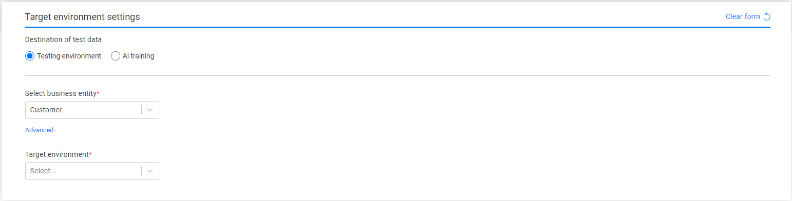
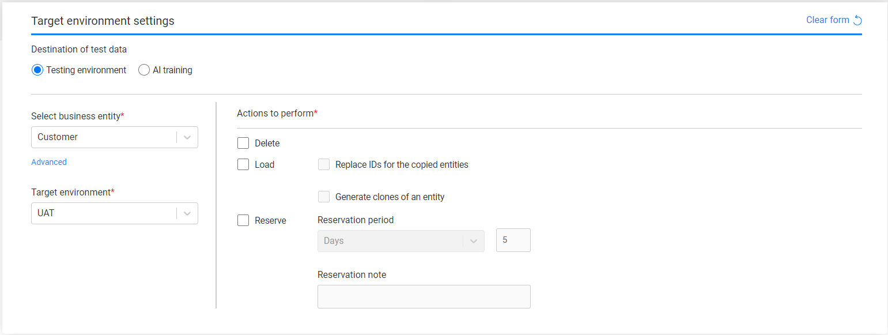
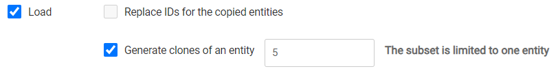

# Task - Target Component - Entities 

The following information needs to be set when the task's data type is Business entities (with or without referential tables):

- Destination of test data: Testing environment or AI training. The **AI training** option creates a [training task](19_task_synthetic_data_generation.md#how-to-create-an-ai-training-task) and is available **only for entities** and only for users that have [Write permissions on the AI environment](10_environment_roles_tab.md#ai-environment---permission-set).
- Business entity - for example, Customer.

The following attributes must be set for **Testing environment** data destination:

- Target environment name.
- Actions to perform on the target environment.

When you start the task creation with the Target component - e.g., a delete task - you must set the task's Business entity:

When you set the Source component before the Target, the selected [Business entity](14b_task_source_component_entities.md#business-entity) is already populated in the Target form:

Note that you can edit the Business entity setting - change the selected Business entity or change the LUs' selection for the task's Business entity, but changing the task's Business entity will reset the Source and Subset components.

## Testing environment

Select one TDM environment from the drop-down list. This list displays the available target environments for the user. Only environments that contain [systems with the select task's BE](11_environment_products_tab.md) are displayed.

## Actions to perform

The following actions can be performed on the selected testing environment. You can select one or multiple actions: 

### Delete

Deletes the selected entities from the testing environment. The Delete action checkbox can be either checked with the Load checkbox, or checked as a single action: delete only. Note that if you select the Delete **only**, the **Source component is disabled** since the task deletes entities only from the target environment.

### Load

Loads the selected entities into the testing environment. The following checkboxes can be set with the Load actions: **Replace IDs for the copied entities** and **Generate clones for an entity**. Only one checkbox can be checked in a task. 

The Load checkboxes are disabled in the following scenarios:

- When the **Delete** checkbox is **checked**, i.e., the entities are deleted before they are loaded to the target environment.
- When the user is **not [permitted](10_environment_roles_tab.md#permissions)** to replace sequences (IDs) or generate entity clones on the task's target environment.
- When the [Policy for fetching data](14b_task_source_component_entities.md#policy-for-fetching-data) in the Source component is set to **Selected snapshot (version)**. 

#### Replace IDs for the copied entities 

When checked, the task execution process replaces the IDs of all selected entities before loading them into the target. This option is required in order to avoid key duplications if the testing environment is not empty and contains entities. The Replace Sequence must be implemented in the [Fabric implementation](/articles/TDM/tdm_implementation/11_tdm_implementation_using_generic_flows.md#step-2---create-sequences).

#### Generate clones for an entity

Create X number of clones of the selected entity in the target environment. If the [entity's Subset](15a_entity_subset.md) selects multiple entities, the first selected entity is cloned (replicated) in the target environment:

The task replaces the sequences (IDs) of each replica in order to avoid duplicated sequences in the target environment.

### Reserve

[Reserves](/articles/TDM/tdm_architecture/08_entity_reservation.md) the entities for the user in the target environment in order to prevent other users from deleting and/or loading the reserved entities to the target environment.

You can check the Reserve action only or check it with the Load action to reserve the loaded entities. Note that if only the **Reserve** action checkbox is checked, then the **Source component is disabled** since the task reserves the entities only for the target environment.

The **reservation period** needs to be set for the reserved entities. The maximum number of days of a reservation period is set in the **tdm_general_parameters** TDB DB table in the **MAX_RESERVATION_DAYS_FOR_TESTER** parameter.

The start date of the reservation period is the task's execution time. The **reservation period** can be set in **minutes**, **hours**, **days** or **weeks**.

#### Reservation note

An optional setting. The user can populate it with a free text. The reservation note is displayed in the [Reserved Entities window](/articles/TDM/tdm_gui/13_reserved_entities_window.md) (Notes fields) and can be used for filtering the reserved entities display. The reservation note can be edited using the Reserved Entities window.

