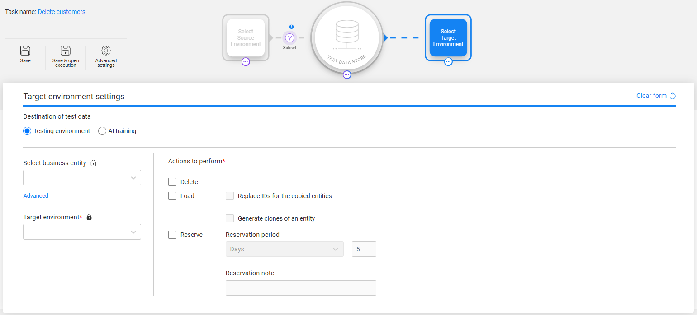
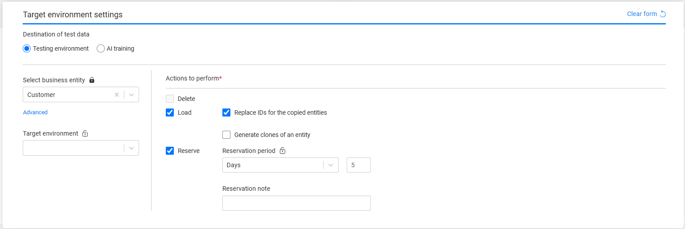
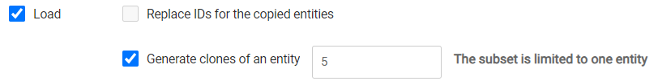

# Task — Target Component — Entities 

The Target component settings are defined in the **Target environment settings** window. Click **Clear form** to reset all settings in this window.

The following information needs to be **set** when the task's data type is Business entities (with or without referential tables):

- **Destination of test data**: Testing environment or AI training. The **AI training** option creates a [training task](19_task_synthetic_data_generation.md#how-to-create-an-ai-training-task) and is available **only for entities** and only for users that have [Write permissions on the AI environment](10_environment_roles_tab.md#ai-environment---permission-set).
- A selected **Business entity** - for example, Customer.

The following attributes must be set for **Testing environment** data destination:

- Target environment name.
- Actions to be performed in the target environment.

When you start the task creation with the Target component - e.g., a delete task - you must set the task's Business entity:

When you set the Source component before the Target, the selected [Business entity](14b_task_source_component_entities.md#business-entity) is already populated in the Target form.

## Business Entity 

The **Business Entity (BE)** and its **Advanced** settings are available for both the **Source** and **Target** components. They display the systems and **Logical Units (LUs)** associated with the selected BE.

When you populate the **Source** before the **Target**, the Source BE and its selected systems and LUs are automatically copied to the Target component.

The **Select business entity** field is an exception to the default locking behavior — the lock icon is **open by default**:

- If the Business Entity is **not populated**, the lock must remain open so the task runner can populate it at execution.
- If the Business Entity is **populated** by the task creator, the field becomes **locked automatically** and cannot be unlocked.

### Important notes

- You can change the BE; however, selecting a different BE for the task **resets the Source and Subset components**.
- Changing the selected **LU and/or system** affects **both the Source and Target components**.
- If the **target environment** contains [disabled systems](11_environment_products_tab.md#disabling-the-environments-systems) and the task performs **load and/or delete** actions on the target environment, you must **clear (uncheck) the disabled systems** before execution.

### Advanced BE - Affinity and Max Number of Workers

Starting with **TDM 9.5**, each LU in the **Advanced BE** view supports configuration of:

- **Affinity**
- **Maximum number of workers**

You can expand each LU and configure these values **after selecting an environment**.

By default, each LU inherits its values from:

1. The environment's system settings (if defined), or
2. The TDM and Fabric configuration values

You can **override these values per LU** to control and **optimize task execution** behavior:

When both **Source** and **Target** components are defined for the task (Load, Extract & Load, Generate & Load):

- **Affinity**
  - The task execution process runs using the **target** affinity
  - The entity extraction runs using the **source** affinity
- **Max number of workers**
  - The task execution process uses the **target** maximum number of workers

Click [here](/articles/TDM/tdm_architecture/03b_task_execution_affinity_and_workers_configuration.md) for detailed information on how task execution determines the effective affinity and maximum number of workers.

## Target environment

Select one TDM environment from the drop-down list. This list displays the available target environments for the user. Only environments that contain [systems with the select task's BE](11_environment_products_tab.md) are displayed.

The **Target environment** field has a lock icon. The task creator can lock or unlock this field to control whether the task runner can change the target environment at execution time.

## Actions to perform

The **Actions to perform** is a required field. The following actions can be performed on the selected testing environment. You can select one or multiple actions. The task actions **cannot** be overridden by the task runner at execution time.

### Delete

Deletes the selected entities from the testing environment. The Delete action checkbox can be either checked with the Load checkbox, or checked as a single action, i.e., Delete only. Note that if you select the Delete **only**, the **Source component is disabled** since the task deletes entities only from the target environment.

### Load

Loads the selected entities into the testing environment. The following checkboxes can be set with the Load actions: **Replace IDs for the copied entities** and **Generate clones of an entity**. Only one checkbox can be checked in a task. 

The Load-related checkboxes are disabled in the following scenarios:

- When the **Delete** checkbox is **checked**, i.e., the entities are deleted before they are loaded to the target environment.
- When the user is **not [permitted](10_environment_roles_tab.md#permissions)** to replace sequences (IDs) or generate entity clones on the task's target environment.
- When the [Policy for fetching data](14b_task_source_component_entities.md#policy-for-fetching-data) in the Source component is set to **Selected snapshot (version)**. 

#### Replace IDs for the copied entities 

When checked, the task execution process replaces the IDs of all selected entities before loading them into the target. This option is required in order to avoid key duplications if the testing environment is not empty and contains entities. The Replace Sequence must be implemented in the [Fabric implementation](/articles/TDM/tdm_implementation/05d_tdm_sequence.md).

#### Generate clones of an entity

Create X number of clones of the selected entity in the target environment. If the [entity's Subset](15a_entity_subset.md) selects multiple entities, the first selected entity is cloned (replicated) in the target environment:

The task replaces the sequences (IDs) of each replica in order to avoid duplicated sequences in the target environment.

### Reserve

[Reserves](/articles/TDM/tdm_architecture/08_entity_reservation.md) the entities for the user in the target environment in order to prevent other users from deleting and/or loading the reserved entities to the target environment.

You can check the Reserve action only or check it with the Load action to reserve the loaded entities. Note that if only the **Reserve** action checkbox is checked, then the **Source component is disabled** since the task reserves the entities only for the target environment.

The **reservation period** needs to be set for the reserved entities. The maximum number of days of a reservation period is set in the **tdm_general_parameters** TDB DB table in the **MAX_RESERVATION_DAYS_FOR_TESTER** parameter.

The start date of the reservation period is the task's execution time. The **reservation period** can be set in **minutes**, **hours**, **days** or **weeks**.

The **Reservation period** field has a lock icon. The task creator can lock or unlock this field to control whether the task runner can change the reservation period at execution time.

#### Reservation note

An optional setting. The user can populate it with free text. The reservation note is displayed in the [Reserved Entities window](/articles/TDM/tdm_gui/13_reserved_entities_window.md) (Notes fields) and can be used for filtering the reserved entities display. The reservation note can be edited using the Reserved Entities window.

## Lock Icons

Task fields that support runtime override have a lock icon next to their label. By default, these fields are **locked** — the task creator can click the lock icon to unlock a field and allow the task runner to set or override its value at execution time.

- **Locked** — the field is fixed and cannot be changed by the task runner at execution.
- **Unlocked** — the task runner can modify the field's value when executing the task.

At execution time, all fields are displayed, but the task runner can only edit the unlocked ones.

Note that the **Select business entity** field is an exception — its lock icon is open by default. See the [Business Entity](#business-entity) section above for its specific locking behavior.

The **Target environment** and **Reservation period** fields follow the standard locking behavior described above.
