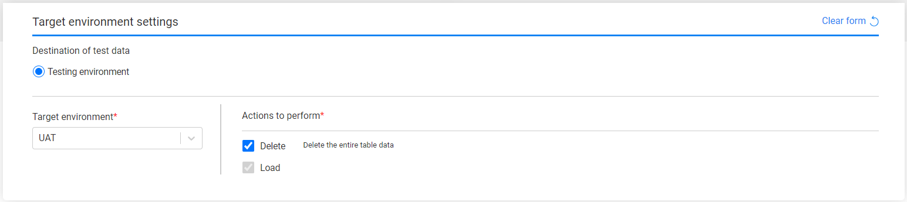

# Task - Target Component - Entities 

The following information needs to be set when the task's data type is [Tables only](14c_task_source_component_tables.md):

- Target environment name - select one TDM environment from the drop-down list. The drop-down list displays the list of available target environments for the user. 
- Actions to perform on the target environment.

By default, both actions, Delete and Load, are checked. The Delete actions **deletes the entire table** in the target environment before loading the table.

You can clear the Delete action, but be aware that loading without a delete may cause data duplication or unique constraint violation when loading the table into the target environment. in the target table. 

