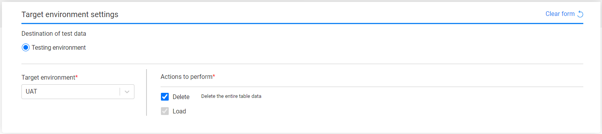
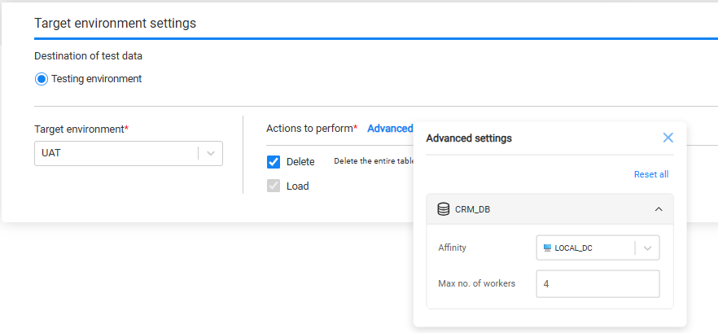

# Task — Target Component — Tables 

The following information needs to be set when the task's data type is [Tables only](14c_task_source_component_tables.md):

- Target environment name - select one TDM environment from the drop-down list. The drop-down list displays the list of available target environments for the user. 
- Actions to perform on the target environment.

By default, both actions, Delete and Load, are checked. The Delete action **deletes the entire table** in the target environment before loading the table.

You can clear the Delete action checkbox, but be aware that loading without a delete action may cause data duplication or unique constraint violation when loading the tables into the target environment. 

## Affinity and Maximum number of Workers configuration

- Starting with **TDM 9.5**, each **interface** of the selected tables supports configuration of:

  - **Affinity**

  - **Maximum number of workers**

- By default, each interface its values from:

  1. The environment’s system settings, if defined and if the [interface is attached to the environment's system](11_environment_products_tab.md#affinity-and-maximum-number-of-workers_) or
  2. The TDM and Fabric configuration values

  

  You can **override these values per interface** to better control and **optimize task execution behavior**. To configure these settings, click **Advanced** next to **Actions to perform** to open the configuration pop-up window:

  

### Source and Target execution behavior

When both **Source** and **Target** components are defined for the task (Load, Extract & Load), the task execution uses the **Target** affinity and **Target** maximum number of workers.

Click [here](/articles/TDM/tdm_architecture/03b_task_execution_affinity_and_workers_configuration.md) for more details on how task execution determines the effective affinity and maximum number of workers.

