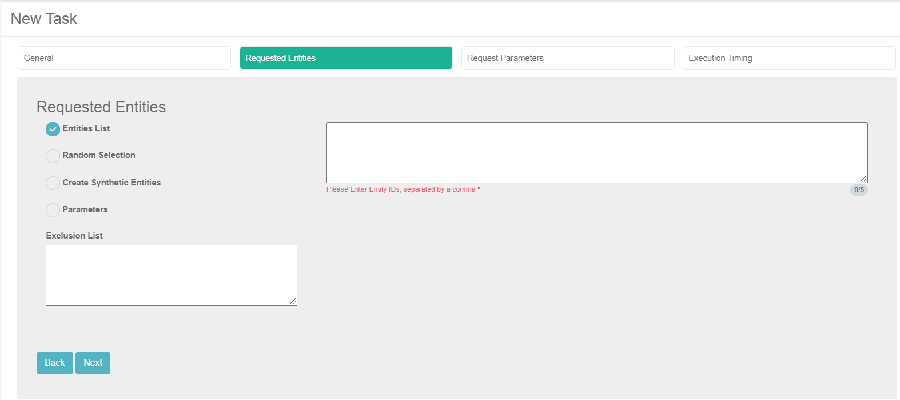

# TDM Load Task - Regular Mode - Requested Entities Tab

This tab is used to define a subset of entities for a task.  

The entities in the task can be selected using one of the following options:

### Entities List

(Default)  Populate a list of Entity IDs separated by a comma. This method is suitable for a limited number of entities. For example, when checking a defect opened on given entities and loading the entities to the testing environment for tests.

Notes:

- Entities in the [exclusion lists](13_environment_exclusion_lists.md) in a task's environment and BE cannot be populated into the entities list. For example, if Customer 1 is excluded from being copied, this customer cannot be populated in the entities list of a task.
- Entities that are populated in the task's **Exclusion List** cannot be populated.
- An entity can be populated in a task even if it does not exist in Fabric. The entity is extracted from the source environment, synchronized into Fabric and loaded from Fabric to the target environment.

### **Random Selection** 

Get random list entities from the [LU PARAMS](/articles/TDM/tdm_architecture/02_tdm_database.md#lu_name_params) table created  in the TDM DB for the root LU of the task's BE.  Entities in the environment or task level exclusion lists are excluded from the task.

Testers can select this option only if their TDM Environment role in the target environment has the relevant permissions.

### Create Synthetic Entities

Create X clones of the selected entity in the target environment. When selecting this method, the real Entity ID must be populated to be replicated. 

For example, if the **Number of Entities** setting is populated by  5 and the **Entity ID** is set to 109, the task creates 5 clones (replicas) of Entity ID 109 in the target environment. 

The task replaces the sequences of each replica to avoid duplicate sequences in the target environment. 

Testers can select this option in the target environment only if their TDM Environment role has permissions.

### Parameters 

Select entities from a predefined list of parameters. Entities in the environment or task level exclusion lists are excluded from the task. You can select one of several parameters. In addition, you can add the same parameter multiple times with different values.

The parameters list must be [defined for each LU in the task BE](/articles/TDM/tdm_implementation/07_tdm_implementation_parameters_handling.md) in the Fabric project.

#### Use Parameters with Random Selection Checkbox

  The Parameters selection has two modes: 

  - When checked (default), TDM randomly selects the entities from the list of all entities that match the selected parameters whereby each task execution gets different lists of entities that match the selected parameters. The **Selection Method** displayed in the Tasks List window is **Parameters - selection based on parameters with random selection**. 

    Example: 

    - Creating a task to load 5 customers using selected parameters. There are 800 customers that match the selected parameters. The task execution gets a random list of 5 customers from the list of 800 customers that match the selected parameters.  

  - When unchecked, gets the first entities that match the selected parameters whereby each task execution gets the same list of entities that match the selected parameters. The **Selection Method** displayed in the Tasks List window is **Parameters - selection based only on Parameters**. 

    Example:

    - Create a task to load 5 customers with selected parameters. There are 800 customers that match the selected parameters. The task execution gets the first 5 customers that match the selected parameters. 

#### How Do I Add a Condition? 

  To add a parameter:

  -  Click **Add Condition**. 
  - Select the parameter and the operator from the dropdown lists and populate their values.
  - Add **AND/OR** operator to connect the parameter to the previous parameters or group.
The TDM GUI  displays the SQL query built based on the selected parameters.

#### How Do I Populate a Parameter's Value?

There are several types of parameters:

- **Combo**, parameters with a limited number of values. The Task window displays a dropdown list of the parameters' values. Select a value from the dropdown list.
  
  Click for more information about [setting a parameter as a combo parameter](/articles/TDM/tdm_implementation/07_tdm_implementation_parameters_handling.md#tdm-parameters-implementation-guidelines).
  
- **Number**, the TDM GUI displays the minimum and maximum values on this parameter. If the populated values exceed a parameter's range, an error message is displayed.
  
- **Date**, populate the value using the following format: **YYYYMMDD**.
  
- **Text**, populate the value using free text.
  
#### How Do I Add a Group of Parameters?

Click **Add Group**. 

Note that nested groups of parameters can be added for example to define an inner group in an outer group.

#### How Do I Remove A Parameter or a Parameters Group?

1.  Click  next to the parameter to delete a parameter.
2.  Click **Remove Group** to remove a parameter's group.

#### Getting the Number of Matching Entities

Click Refresh next to the **Entities Matched** to calculate the number of entities that match the selected parameters.
The Parameters selection supports the parent-child hierarchy relationship between the LUs of the selected BE. It can crosscheck the matching entities of a selected combination of parameters and takes into consideration parameters from different LUs in the same BE hierarchy. For example, if customers living in New York with scheduled visits (see the screenshot below) are selected, TDM checks the visits of each patient living in New York and then checks their status.

- Click  to display the number of matching entities according to the parameters’ conditions.

Click for more information about the [TDM parameters tables and View](/articles/TDM/tdm_architecture/07_tdm_parameters_handling.md) created by TDM in the TDM DB to display a hierarchical view of TDM parameters. 

### Exclusion List

(Optional). Populate Entity IDs separated by a comma to be excluded from the task's entities. These entities are excluded from the task, even if they match selected criteria. This list can be populated for each selection method.

Notes:

- An Entity ID cannot be populated in both the **Entities List** and **Exclusion List** fields.
- [Environment level exclusion lists](13_environment_exclusion_lists.md) are also excluded from the task's entities.

 

