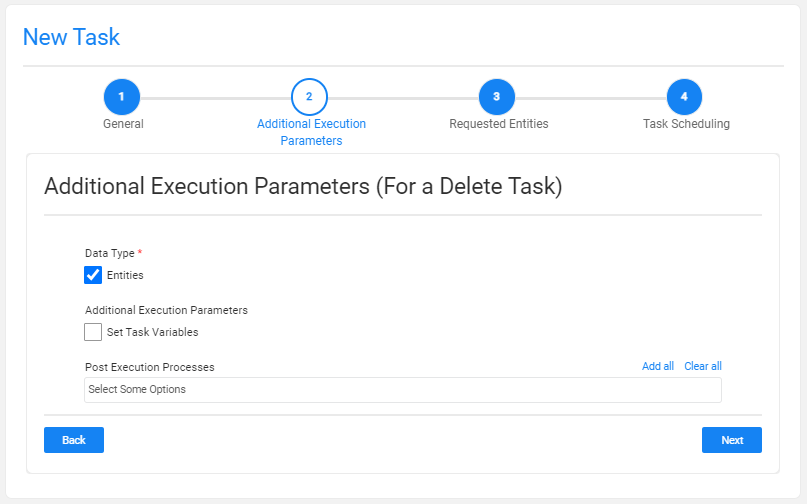
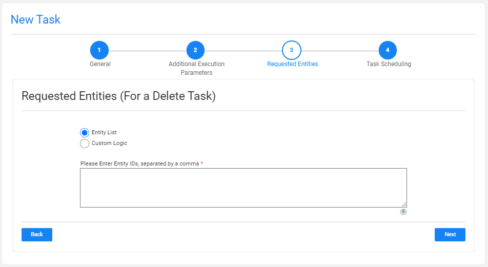
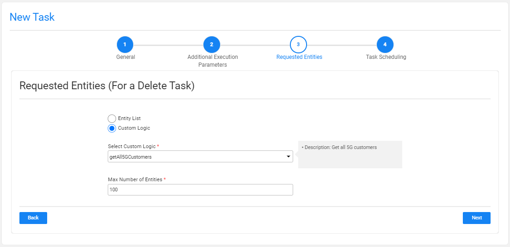

# TDM Delete Task

A Delete task only contains the **Delete** task type and deletes (cleans) the selected entities from the target environment. The delete task also releases the cleaned entities if the entity is reserved.

Note that the deleted flows must be implemented in the Fabric implementation. 

Click for more information about the [delete implementation](/articles/TDM/tdm_implementation/08_tdm_implement_delete_of_entities.md).

A Delete task contains the following tabs:

- [General](14a_task_general_tab.md)
- [Additional Execution Parameters](#additional-execution-parameters-tab)
- [Requested Entities](#requested-entities-tab)
- [Execution Timing](22_task_execution_timing_tab.md)

When checking the **Set Task Variables** setting, a new [Task Variables](23_task_globals_tab.md) tab opens.

## Additional Execution Parameters Tab

The following execution parameters are set on **Delete tasks**:

### Data Type

Check the **Entities** to delete the requested entities from the target environment.

### Additional Execution Parameters

#### Set Task Variables 

Check to open the Task Variables tab and [set the variable value on a task level](23_task_globals_tab.md).

### Post Execution Processes

Select all, partial, or one [post execution process](04_tdm_gui_business_entity_window.md#post-execution-processes-tab) of the selected BE.

## Requested Entities Tab

This tab defines the subset of entities for the task:

The following selection methods are available on load tasks: 

### Entity list 

This is the **default option**. Populate the list of entities to process separated by a comma.  Note that a warning is given if the entity list has entities that are reserved for another user.

### Custom Logic

Select a Broadway flow to get the entity list for the task and set the maximum number of entities for the task:

 
