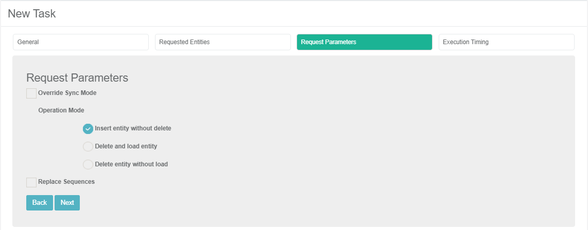
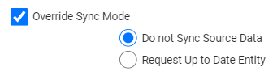

# TDM Load Task - Request Parameters Tab

This tab defines the general parameters set at a task level that impact all processed entities.  

The following task parameters can be set: 

### Override Sync Mode

By default the **Override Sync Mode** setting is unchecked. When checked, the default Sync mode can be overridden when the task is executed:

The following options can be selected to override the Sync mode:

- **Do not Sync Source Data**, get the data from Fabric and do not access the source environment.
- **Request Up to Date Entity**, set the Sync mode of the task's execution to [Force](/articles/14_sync_LU_instance/02_sync_modes.md) to get the most updated data of the processed entities. Testers can select this option only if their **Read** [TDM Environment role](10_environment_roles_tab.md#role-permissions) enables it.

### Operation Mode

Select an Operation Mode from the following options:

#### Insert Entity without Delete

(Default) The selected entities are inserted into the target environment before they are deleted. 
If the processed Entity IDs already exist in the target environment and the task does not replace their sequences, the task's execution will fail due to violation of unique constraints. Therefore it is recommended to use this option if the target environment is empty, or if the task replaces the sequences of the processed entities before loading them to the target.

#### Delete and Load Entity

The selected entities are deleted from the target testing environment and are then reloaded into the environment. This option is required when a tester wishes to repeat a test on specific entities and needs a new copy of them in the target environment.

#### Delete Entity without Load

The selected entities are deleted from the target testing environment without being reloaded to the environment. This option is selected when testers need to clean entities from their environment.

Notes:

- Testers can select a Delete option if their **Write** [TDM Environment role](10_environment_roles_tab.md#role-permissions) enables it.
- Deleted flows must be implemented in the Fabric implementation. Click for more information about the [delete implementation](/articles/TDM/tdm_implementation/08_tdm_implement_delete_of_entities.md).
- Delete options are not displayed for a task with the [Create Synthetic Entities](18_load_task_requested_entities_regular_mode.md#create-synthetic-entities) selection method, since the Synthetic method creates new clones (replicas) of the selected entity. 

Click for more information on [how overriding the Sync mode and the Task Operation mode impact the task execution process](/articles/TDM/tdm_architecture/04_task_execution_overridden_parameters.md#overriding-the-sync-mode-on-the-task-execution).

### Replace Sequences

When checked, the task execution process replaces the sequences of all selected entities before loading them into the target. This option is required to avoid sequence duplications if the testing environment is not empty and contains entities.

Notes:

- The Replace Sequence checkbox is not available when checking the Delete and Load Entity or Delete Entity without Load options.
- Testers can check this setting if their **Write** [TDM Environment role](10_environment_roles_tab.md#role-permissions) enables it.
- The **Replace Sequence** setting is not displayed in the following cases:
  - A task with a [Create Synthetic Entities](18_load_task_requested_entities_regular_mode.md#create-synthetic-entities) selection method, since the Synthetic method creates new clones (replicas) of the selected entity and replaces the sequences on each clone.
  - When selecting **Delete Entity without Load** as an operation mode, since the TDM task only deletes the selected entities and does not load new data into the target environment.
- The Replace Sequence must be implemented in the [Fabric implementation](/articles/TDM/tdm_implementation/11_tdm_implementation_using_generic_flows.md#step-4---create-the-tdmorchestrator.flow-from-the-template). 

 

