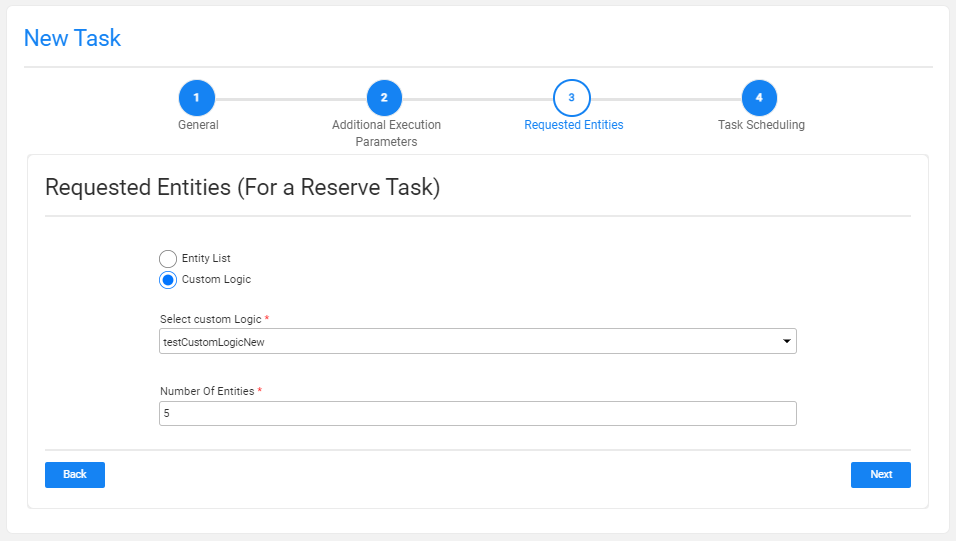

# TDM Reserve Task

A Reserve task only contains the **Reserve** task type and [reserves the selected entities](/articles/TDM/tdm_architecture/08_entity_reservation.md) in the task's environment.

A Reserve task contains the following tabs:

- [General](14a_task_general_tab.md)
- [Additional Execution Parameters](#additional-execution-parameters-tab)
- [Requested Entities](#requested-entities-tab)
- [Execution Timing](22_task_execution_timing_tab.md)

When checking the **Set Task Variables** setting, a new [Task Variables](23_task_globals_tab.md) tab opens.

## Additional Execution Parameters Tab

The following execution parameters are set on **Reserve tasks**:

### Data Type

Check the **Entities** to delete the requested entities from the target environment.

### Reservation Period

The reservation period settings are displayed **if the load task also reserves the loaded entities** on the target environment (the Reserve task type is checked together with the Load task type).

Note that when the Reservation Period is set to zero, the entities are reserved for unlimited period.  

Only Admin and Environment owner users can reserve entities for unlimited period. Users that are attached to the target environment as testers  must set a reservation period. The maximum number of days of a reservation period is set in the **tdm_general_parameters** TDB DB table in the **MAX_RESERVATION_DAYS_FOR_TESTER** parameter.

The start date of the reservation period is the task's execution time. The **reservation period** can be set in **minutes**, **hours**, **days**, or **weeks**.

### Additional Execution Parameters

#### Set Task Variables 

Check to open the Task Variables tab and [set the variable value on a task level](23_task_globals_tab.md).

### Post Execution Processes

Select all, partial, or one [post execution process](04_tdm_gui_business_entity_window.md#post-execution-processes-tab) of the selected BE.

## Requested Entities Tab

This tab defines the subset of entities for the task:

The following selection methods are available on load tasks: 

### Entity list 

This is the **default option**. Populate the list of entities to process separated by a comma.  Note that a warning is given if the entity list has entities that are reserved for another user.

### Custom Logic

Select a Broadway flow to get the entity list for the task and set the number of entities for the task:

 