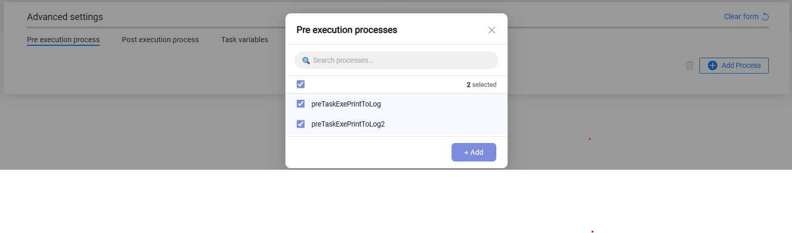
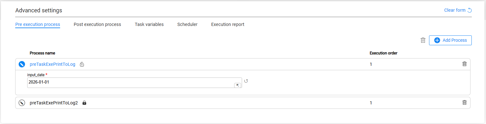

# Task — Pre and Post Execution Processes

The **Pre-execution process** and **Post-execution process** tabs in the task's **Advanced settings** enable adding pre and post execution processes to the task. The pre-execution processes run in the beginning of the task's execution, before all the related LUs have been executed. The post-execution processes run at the end of the task's execution, after all the related LUs have been executed. 

Examples:

- Running a cleanup flow before executing the task's LUs.
- Sending an email to the tester to notify them that the execution of a task has ended.

The pre and post execution processes are **optional**. A task can be created and executed without any post-execution processes.

The pre and post execution processes that are available for tasks, are defined in the task's [Business entity (BE)](/articles/TDM/tdm_overview/03_business_entity_overview.md) and must be [added to the BE by the admin user](04_tdm_gui_business_entity_window.md#pre-and-post-execution-processes-tabs). You can select only pre and post execution processes from the list of processes added to the task's BE. Note that a given flow can be attached to a BE and to a task with this BE as both pre and post execution processes. The execution order of the pre and post execution order is set according to the execution order defined in the BE.

## How to Add a Pre/Post Execution Process?

Click the **Add Process** button in the Pre execution process or Post execution process tab. A pop-up window opens with a searchable list of available processes. Check the processes you want to add and click **+ Add**:

The selected processes are displayed in a table with their execution order as set in the task's BE. The execution order is displayed for view only:

## Lock Icons

Each process in the list has a lock icon. The task runner cannot add or remove pre/post execution processes. The lock icon controls whether the task runner can edit the **parameter values** of a process at execution time:

- **Locked** — the process parameters are fixed and cannot be changed by the task runner at execution time.
- **Unlocked** — the task runner can edit the process parameter values when executing the task.

At execution time, all processes are displayed, but the task runner can only edit the parameter values of the unlocked ones.

## How to Remove a Pre/Post Execution Process?

Click the trash icon next to the selected process to remove it from the task. To remove all processes at once, click the trash icon at the top of the table.
